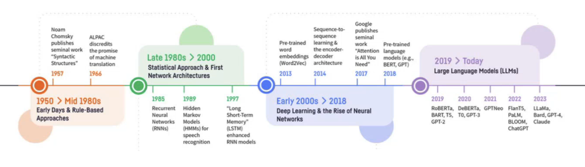

The fundamental goal of studying NLP is to build technologies to solve 'tasks' that require a deep understanding of natural 'language'. NLU (Natural Language Understanding) is a sub-task in NLP.

* TOC
{:toc}

## Introduction

In NLP, "Language" refers to the plain language we humans use to communicate with each other, or human-to-machine language (the programming languages), or sign languages. We need to build systems that process/ interpret/ communicate as well as (or better than) humans. In NLP, any task with text inputs and/or text outputs is in our scope.

<figure markdown="0" class="figure zoomable">
<figcaption>
  <strong>Figure 1.</strong> NLP - A Brief History
  </figcaption>
</figure>

## Challenges in NLP
1. Consider question-answering tasks, the questions can be general, subjective, opinion-based, or temporal-based in nature; there are no constraints in how the question could be. There can be some follow-up questions as well. For a given question, there could be various correct answers possible. In such cases, how do we evaluate the systems to pick the useful one?

Apart from developing a solution to solve the tasks at hand, modelling the problem statement and coming up with better techniques to evaluate the systems (better evaluation metric) are equally essential in NLP.

2. Consider a task of understanding the language. A given sentence can have different interpretations:

* The trophy doesn't fit into the brown suitcase because **it's** too large.
* The trophy doesn't fit into the brown suitcase because **it's** too small.

There is only one word different between these two sentences. In the first sentence, the pronoun 'it' refers to the trophy, and in the second sentence, it refers to the suitcase. The pronoun 'it' needs context to resolve. For humans, this may be easy, but it will be more difficult to build this capability into systems. These are the scenarios in which systems fail quite often.

This task is known as "Schema challenge" which is used as a benchmark to evaluate LLMs. The Winograd Schema Challenge (WSC) is a test for AI designed to assess common-sense reasoning by requiring models to resolve pronoun ambiguity in sentences that rely on real-world knowledge.

3. For NLP tasks, it is impossible for us to include instances/observations for every possible linguistic scenario in our training data. So, what data should the model be trained with?

* Can we create a representative dataset that gives a model that generalizes well?
* Given limited computational resources, can we identify a good subset of the data to train our model?

## Resources

1. Introduction to information retrieval Textbook by Christopher D. Manning, Hinrich Schütze, and Prabhakar Raghavan.  Cambridge UP. Available online at: https://nlp.stanford.edu/IR-book/pdf/irbookonlinereading.pdf

2. Daniel Jurafsky and James H. Martin. 2026. Speech and Language Processing: An Introduction to Natural Language Processing, Computational Linguistics, and Speech Recognition with Language Models, 3rd edition. Available online at https://web.stanford.edu/~jurafsky/slp3/ed3book_jan26.pdf