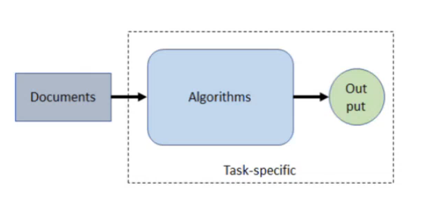
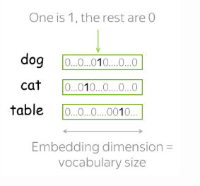
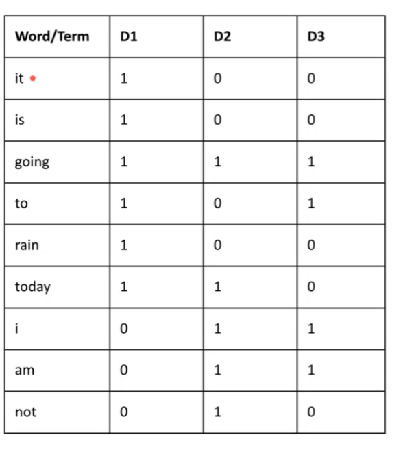

How do we feed text into models? Models cannot understand text. We need numerical (vector) representation of words. Such vectors or word embeddings that are representations of words can then be fed into the model.

* TOC
{:toc}

## Introduction
Vocabulary $V$ is a set of allowed words. It doesn't need to be all the possible words in a language. It can just be a set of words related to a domain. To account for unknown words (the ones which are not in the vocabulary), usually a vocabulary contains a special token 'UNK'.

In practice, we make a vocabulary of words. We come up with a look-up table containing word embeddings, i.e., we represent each word in vocabulary with a vector. But how can we represent the inputs in NLP?

## Input Representation
Suppose there are inputs (documents). The inputs are processed by some algorithms and outputs are produced. In this design, the algorithm (model) and the output will be task-specific. But the input documents can have generic and common representation irrespective of the task at hand. This is because, nowadays, Neural networks are able to learn/extract features themselves. The only thing we need to find is the dimension in which the feature should be represented.

<figure markdown="0" class="figure zoomable">
<figcaption>
  <strong>Figure 1.</strong> Input representation in NLP
  </figcaption>
</figure>

In the NLP community, the idea is to have a common mechanism to get the feature representation of the inputs, and this representation should be task agnostic. The algorithm and the training mechanism can then be task-specific; that is, they must be able to learn to modify these vectors appropriately to get good performance on the task. There are many different ways in which the task-agnostic initial representation of the inputs can be obtained.

## One-Hot Local Representation
The easiest we can do is to represent **words** as one-hot vectors: for the $i$th word in the vocabulary, the vector has 1 on the i-th dimension and 0 on the rest. The length of each vector will be the size of the vocabulary $|V|$. Here the embedding dimension is the vocabulary size.

<figure markdown="0" class="figure zoomable">
<figcaption>
  <strong>Figure 2.</strong> One-hot encoding representation of words
  </figcaption>
</figure>

**Document Representation:**

Suppose there are three documents:

* D1: It is going to rain today.
* D2: Today I am not going outside.
* D3: I am going to watch the season premiere.

One way to represent the document is by a vector of fixed dimension. So, we will be storing each document in the vector space. Before that, we create a vocabulary. The vocabulary is the set of all words appearing in the document collection. We often ignore the case of the words, i.e., Today and today will be treated as the same entity.

* Vocabulary for this document collection: {it, is, going, to, rain, today, i, am, not, outside, watch, the, season, premiere}

The vocabulary is stored in such a data structure whose size can be changed dynamically. Data structures such as set and dictionary can be used. The choice of the data structure has an impact in the performance.

NOTE: The trie data structure can be helpful in auto-completion and related tasks.

Now, our vocabulary has 14 words. We can represent each document as a 14-dimensional vector. Each dimension corresponds to one word. The value 1 in a dimension represents the presence of the corresponding word in the document, and 0 represents absence.

<figure markdown="0" class="figure zoomable">
<figcaption>
  <strong>Figure 3.</strong> One-hot encoding representation of documents
  </figcaption>
</figure>

## Bag-of-Words Representation
The one-hot encoding method works well for small document collections. The other option is to use the raw frequency of the words.

The Bag-of-Words (BoW) model can be used to represent text data as numerical vectors based on word frequency. It builds a vocabulary of all unique words in a corpus and counts their occurrences in each document.

The problem with the raw count is: if there are two documents with the same information, but one is verboser than the other, then the larger document will have higher count values for certain words. This doesn't necessarily mean that these words are more important in one document than the other. So, this leads to noisy capture of relative importance.

## TF-IDF Representation
If the frequency of certain words increases in a document, the importance of these words as indicated by a number should increase, but it shouldn't be linear. The value should increase, and then stay flat or increase slowly ever after. Therefore, instead of using the raw frequency $c$, we can use a function of $c$. Log is a common choice. The term frequency of the term $t$ in a document $d$ is

$$
\text{tf}(t,d)= 1 + \log_{10} c(t,d)
$$

This is a function of a term's frequency in a document $d$.
$c(t,d)$ indicates the number of times the word $t$ appears in document $d$. For a given term $t$, plot the term frequency as a function of $c$. Initially, with each additional mention of $t$, the function value increases, but as the number of times the word appears increases, the rate of increase slows down.

In addition to this, we can also de-emphasize the frequent words such as the stopwords. Suppose we have a collection with $N$ documents. The importance of the term $t$ can be calculated by the inverse document frequency which is

$$
\text{idf}(t) = log_{10}\left( \frac{N}{\text{df}(t)} \right)
$$

This is a function of a term's frequency in the whole collection. $\text{df}(t)$ is the document frequency of $t$ which represents the number of documents containing the term $t$ (regardless of how many times it appears in each document).

But if the collection is domain-specific, we indeed expect certain terms to appear in all the documents. Although they are appearing in all the documents, the importance of such terms should not be decreased. To deal with such cases, we can do some statistical analysis to come up with those kinds of words, and then we will not apply the IDF formula to them. Or, we can devise two components (weighted averaged of the two) in the IDF formula. Then, the IDF value of a term will be high for rare terms or if the term is domain-specific.

$\text{tf}(t,d)$ assigns a higher value if the term is appearing more number of times in a document, but if the term is omnipresent in all the documents, then $\text{idf}(t)$ discounts its importance. Therefore, we can use the combination of these two $\text{tf} * \text{idf}$, and this becomes the representation scheme called the TF-IDF representation.

In the above collection, for document D1, 

* 'it': the TF value is 1 and the IDF value is $\log(3)$.
* 'is': in document D1, TF is 1 and the IDF is $\log(3)$.
* 'going':, TF is 1 and the IDF is 0.
* 'to':, TF is 1 and the IDF is $\log \frac{3}{2}$.

In the place of 1s and 0s in Figure 3, we will now store the TF*IDF value for each word in the document.

### Limitations of these Representation Schemes
The representations one-hot and TF-IDF are vector-space models. The basis vectors of this vector space are the different words in the vocabulary. Each document is represented as a point in this vector space. The drawbacks of this approach are:

* Lot of storage space. Although the number of dimension of the vector can be large, the vectors will be sparse. The set of unique words a document contains will be a small subset of the entire vocabulary.

* A word in the vocabulary has a fixed dimension reserved. But there are words which mean different things in different contexts (Polysemy). For example, the word 'goal' in football and business has different meanings. With the above representations, the word in both these contexts map to the same vector dimension; thereby the different meanings of the word are lost.

* Adding or removing a document can change the vocabulary size and the vector dimension. This can be a costly operation to do.

* The words that are synonyms or related to each other (for e.g., car vs auto) will still be two different axes in the vector space. The angle between them will be 90 degree with each having no projection on the other. They become completely independent and no commonality. Such relationships are lost with these representations. For example, as per these representations, cat is as close to dog as it is to table.

In the representation, we should capture the semantics/ relation of/between the terms, and the representations should be compact.