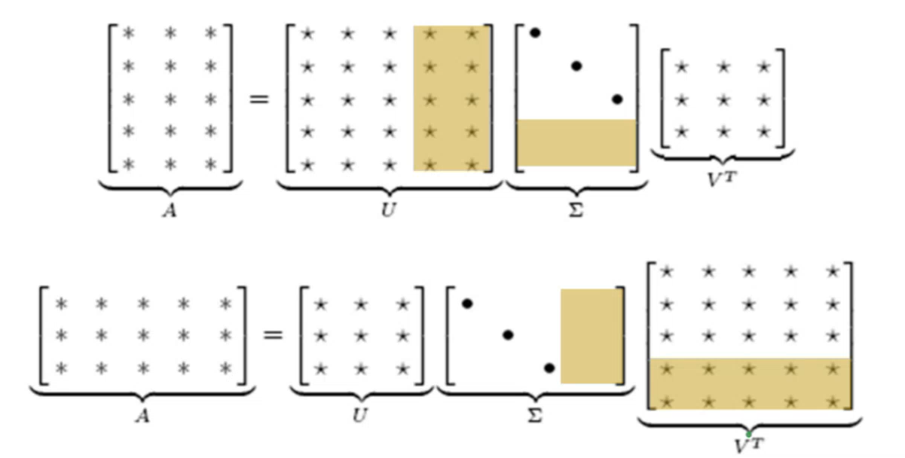
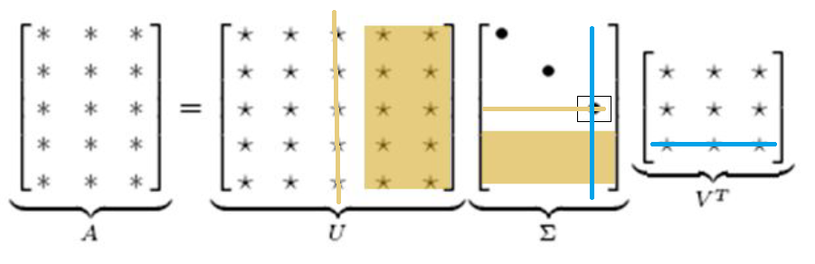
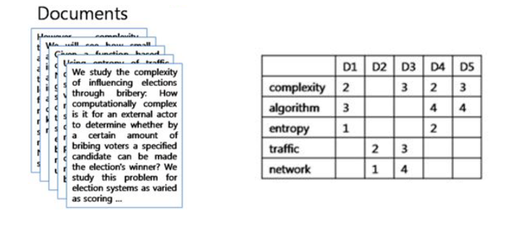

We can represent the words and documents using some statistical techniques.

* TOC
{:toc}

## Representations using Statistical Cues
We can get the representation of words as vectors using some statistical techniques, which are then known as word embeddings. The key idea is to observe the surrounding words of every word. The word similarity is the same as the vector similarity. One of the prominent methods using statistical cues is to use singular value Decomposition (SVD).

### Singular Value Decomposition
The Singular Value Decomposition method states that any rectangular matrix $\mathbf{A}_{m \times n}$ can be uniquely decomposed into:

$$
\mathbf{A} = \mathbf{U} \Sigma \mathbf{V}^{\top}
$$

* The columns of $\mathbf{U}$ are eigenvectors of $\mathbf{AA}^\top$. There will be $m$ orthogonal eigenvectors for $\mathbf{AA}^\top$ matrix. We stack them one after the other to get $\mathbf{U}$.
* The columns of $\mathbf{V}$ are eigenvectors of $\mathbf{A}^\top\mathbf{A}$. There will be $n$ orthogonal eigenvectors for $\mathbf{A}^\top\mathbf{A}$ matrix. We stack them one below the other to get $\mathbf{V}$.
* Eigenvalues $\lambda_1, \dots, \lambda_r$ of $\mathbf{AA}^\top$ are the eigenvalues of $\mathbf{A}^\top\mathbf{A}$, where $r = \text{rank}(\mathbf{A})$. Then, $\sigma_i = \sqrt{\lambda_i}$ (positive square root) are the diagonal entries of $\Sigma$. These singular values are placed in decreasing order.

<figure markdown="0" class="figure zoomable">
<figcaption>
  <strong>Figure 4.</strong> SVD Decomposition Illustration
  </figcaption>
</figure>

If $\mathbf{A}$ has more columns than rows, then $\Sigma$ will also have more columns filled with zeroes. The shaded columns in $\Sigma$ will get multiplied by the shaded rows in $\mathbf{V}^\top$. The same is applicable for the image in the top as well.

In the top image, if we forcibly make the last diagonal entry of $\Sigma$ zero, the shaded column in $\mathbf{U}$ and the shaded row in $\mathbf{V}^\top$ become unimportant.

<figure markdown="0" class="figure zoomable">
<figcaption>
  <strong>Figure 5.</strong> SVD Decomposition Illustration
  </figcaption>
</figure>

Suppose we have a collection of documents, say $10^5$ documents with $10^4$ terms. We can create a matrix with terms in the rows, documents in the columns and TF-IDF representation as the values:

<figure markdown="0" class="figure zoomable">
<figcaption>
  <strong>Figure 6.</strong> Term Document Matrix Illustration
  </figcaption>
</figure>

Let $\mathbf{A}_{m \times n}$ be the term-document incidence matrix. Each row in $\mathbf{A}$ is the representation of each term (which is of $10^5$ dimensions), and each column is the representation of each document (which is of $10^4$ dimensions).

We can now use SVD and decompose $\mathbf{A} = \mathbf{U} \Sigma \mathbf{V}^{\top}$. And suppose we retain only $k$ number of diagonal entries of $\Sigma$ and make all other $(r-k)$ entries zero. Say $k=100$, then

* Only the first 100 columns of $\mathbf{U}$ will be important and
* Only the first 100 rows of $\mathbf{V}^{\top}$ will be important.

Everything else can be ignored. So, this makes us work with smaller $\mathbf{U}$ and $\mathbf{V}^{\top}$. Let $\Sigma_k$ be the $\Sigma$ matrix with the last $(r-k)$ singular values forced to 0. Then

$$
\mathbf{A}_k = \mathbf{U}_k \Sigma_k \mathbf{V}_k^{\top}
$$

This decomposition is known as truncated SVD. Note that $ \mathbf{U}_k$ and $\mathbf{V}_k^{\top}$ are the same matrices as before with no changes but some columns and rows have now become unimportant. We are modifying only the $\Sigma$ matrix.

It can be proved that $\mathbf{A}_k$ is very close to $\mathbf{A}$. In other words, $\mathbf{A}_k$ will have rank $k$: Among all rank $k$ matrices, $\mathbf{A}_k$ is the one that is closest to $\mathbf{A}$. The loss of information will be very minimal. Then,

* The **terms** can be represented using the entries in $\mathbf{U}_k$. We can now work with $k << m$ dimensions. Each row in $\mathbf{U}_k$, which is of 100 dimensions, gives us the compact representation of each term.

    The first row of $\mathbf{U}$ is the representation of the first term, i.e., 'complexity'. The second row of $\mathbf{U}$ is the representation of the second term, i.e., 'algorithm'.

* The **documents** can be represented using the entries in $\mathbf{V}_k^{\top}$. We can now work with $k << n$ dimensions. Each column in $\mathbf{V}_k^{\top}$, which is of 100 dimensions, gives us the compact representation of each document.

    The first column of $\mathbf{V}_k^{\top}$ is the representation of the first document, i.e., D1. The second column is the representation of the second document D2.

The representation of the document has come down from $10^4$ to 100 dimensions. The representation of the term has come down from $10^5$ to 100 dimensions. This allows us to represent both the terms and documents in the same vector space of 100 dimensions. These representations are proved to capture the semantics between the terms/ documents.

## Pros and Cons

* Pros: SVD decomposition technique provides vector representation for words and documents. If there are multiple documents, we can compute the cosine similarity to find the related documents.
* Cons: The matrix can become really huge and processing it requires more memory and computation power.