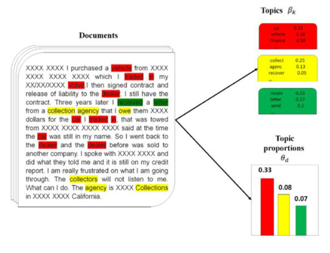
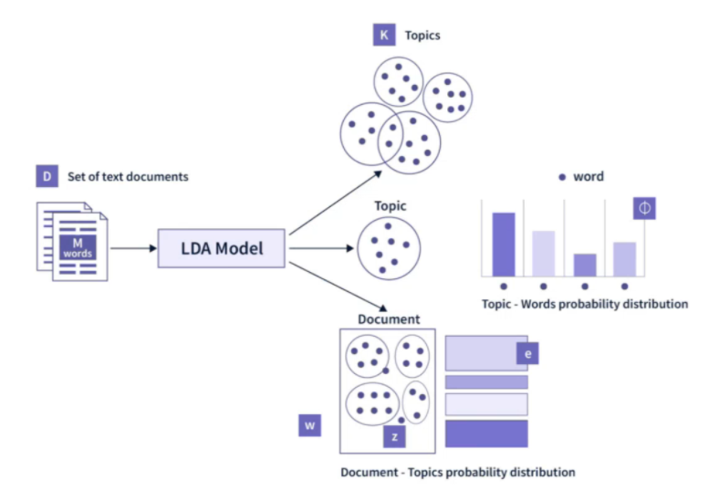
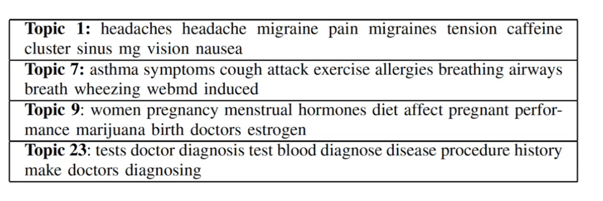
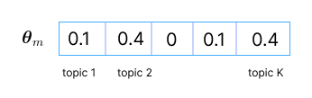
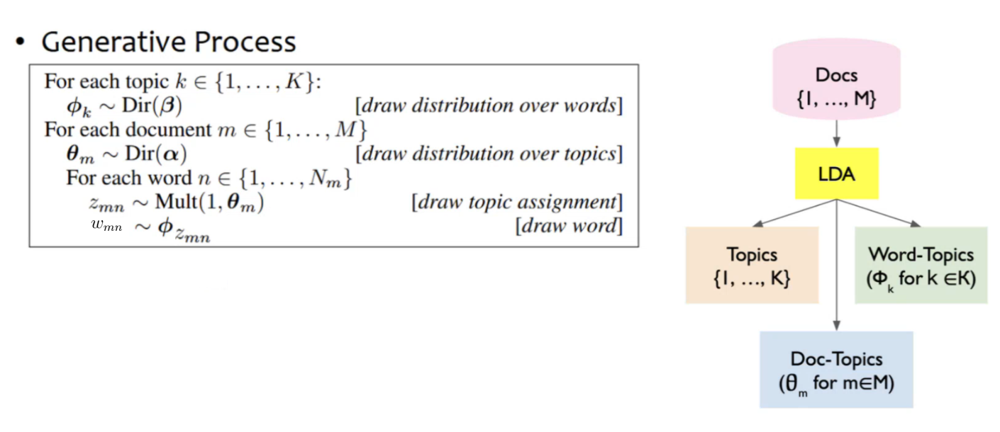
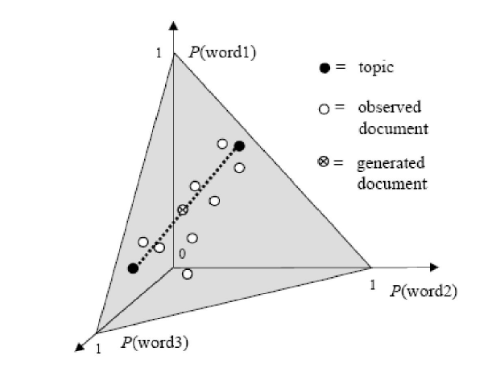
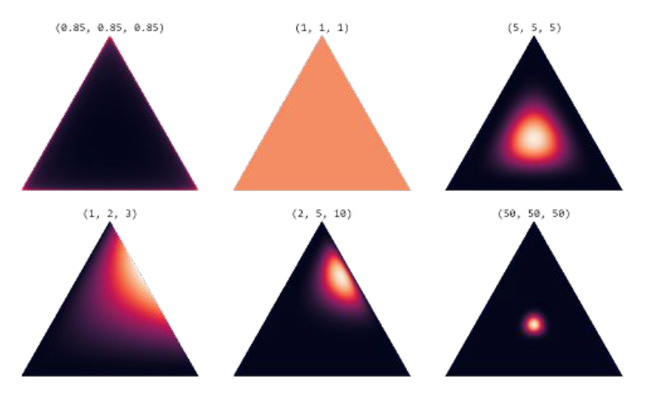
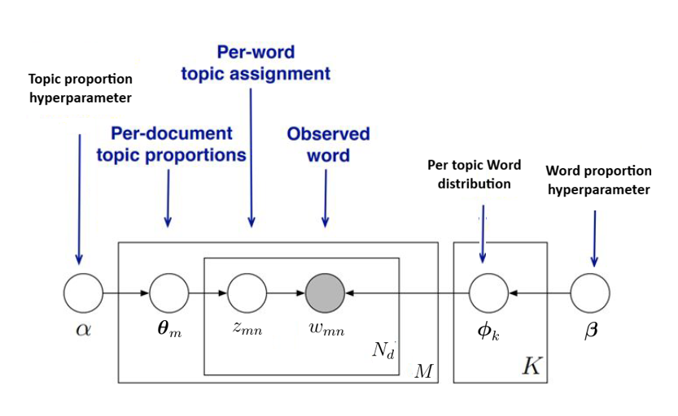
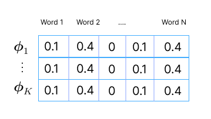

We need to come up with representation for terms and documents by considering topicality.

* TOC
{:toc}

## Introduction
Given a collection of documents, where a document can have one topic or more than one topic, we need to identify the topics discussed in each document. And then we can group these documents based on the identified topics.

The topics themselves are unknown or latent. We observe only documents (which is a collection of words). The words present in a document depends on the topics discussed in the document. We need a mechanism to identify the topics and for each topic, we need to find the high likely words. With these learnings, we can then explain the documents (such as clustering the documents by topics). LDA is a completely **unsupervised** technique used to find hidden (latent) topics in the document and allocate the documents to the identified topics.

<figure markdown="0" class="figure zoomable">
<figcaption>
  <strong>Figure 1. </strong> objectives of LDA
  </figcaption>
</figure>

Latent Dirichlet Allocation (LDA) is a probabilistic model used for topic modelling. The LDA model gives these outputs:

1. Different topics present in the documents
2. For each topic, probability distribution over words
3. For each document, what are the different topics discussed and how much? That is, it gives the proportion in which the topics are discussed.

<figure markdown="0" class="figure zoomable">
<figcaption>
  <strong>Figure 2. </strong> Learnings from LDA
  </figcaption>
</figure>

## Example
Suppose we have a collection of medical documents. We need to understand the various medical conditions that are talked about in this collection. For this experiment, 21 different medical conditions are selected (Asthma, cancer, migraine, etc.). Then, for each condition, documents are collected from the medical websites. Each document talks about a condition predominantly. This collection of documents is fed to LDA.

The top keywords from some of the identified LDA topics are: For each topic, the probability distribution over words is obtained (top 10 words is shown for each topic).

<figure markdown="0" class="figure zoomable">
<figcaption>
  <strong>Figure 3. </strong> Identified topics using LDA from a medical document collection
  </figcaption>
</figure>

From the words in a topic, we can identify what the topic is about. Besides the topics on which the documents are selected, LDA was able to identify other new prominent and interesting topics as well in the collection.

In general, we need to specify the number of topics we want the LDA algorithm to find in our collection. In some sense, this is similar to clustering, but clusters can overlap. There are other versions of LDA (hierarchical LDA) where we don't have to specify the number of topics to be identified.

## Latent Dirichlet Allocation
LDA assumes that there is an underlying generative process using which the documents are generated. This underlying process is modeled using a probabilistic model. The parameters of this model are then identified using MLE.

We first assume that there are $K$ number of topics. For each topic $k \in \{1, \dots, K\}$, we identify the probability distribution over words in the vocabulary, $\boldsymbol{\phi}_k$. This is modeled as $\boldsymbol{\phi}_k \sim  \text{Dir}(\boldsymbol{\beta})$.

Suppose there are $M$ number of documents. For each document $m \in \{1, \dots, M\}$:

We identify the probability distribution over the $K$ topics, $\boldsymbol{\theta}_m$. This is modeled as $\boldsymbol{\theta}_m \sim  \text{Dir}(\boldsymbol{\alpha})$.

<figure markdown="0" class="figure zoomable">
<figcaption>
<strong>Figure 4. </strong>Distribution of topics</figcaption></figure>

A document $m$ has a sequence of words. We assume that each word in this document is generated as follows:

For each word $n \in \{1, \dots, N_m\}$

* Draw a topic $z_{mn} \sim \boldsymbol{\theta}_m$, where $\boldsymbol{\theta}_m$ is a vector with probability distribution over topics present in document $m$. Here $z_{mn}$ refers to $m$th document, $n$th word topic.
* Draw a word $w_{mn} \sim \boldsymbol{\phi}_{zmn}$. For the selected topic, we see the probability distribution over the words, and sample a word. Here $w_{mn}$ refers to $m$th document, $n$th word.

<figure markdown="0" class="figure zoomable">
<figcaption>
<strong>Figure 5. </strong>LDA generative process</figcaption></figure>

In LDA, we assume that the documents are generated from this procedure. And each topic and word are sampled independently. Even though in practice this assumption doesn't hold, it makes the model simple but yet effective.

  
Warning

  
Here our objective is to find the summary information (topics, word-topics, and doc-topics) from the given collection. We don't (and cannot) use the generative process of LDA to generate valid sentences.

This is similar to having data of $N$ numbers, say $\{2,4,5, -10, \dots\}$. We assume that each number $x_i$ is independently generated from a normal distribution $\mathcal{N(\mu, \sigma)}$. Then, the probability of the entire dataset will be $p(x_1) \cdot p(x_2) \dots p(x_N)$. We define a likelihood function

$$
L(\theta) = \prod_i p(x_i)
$$

Find the values of $\theta = (\mu, \sigma)$ for which the likelihood of observing the given data is maximized. We don't generate the numbers after learning the parameters. Similarly, given the documents here, we will design a likelihood function and optimize the parameters $\boldsymbol{\phi}_1, \dots, \boldsymbol{\phi}_K, \boldsymbol{\theta}_1, \dots, \boldsymbol{\theta}_M$.

## LDA: Geometric Representation
Suppose there are three words in our vocabulary, $N=3$. We have an axis for probability of each word in $\mathbb{R}^3$. For a given topic $k$, we may be interested in the distribution of words, $\boldsymbol{\phi}_k$. We know that $P(\text{word 1}) + P(\text{word 2}) + P(\text{word 3}) = 1$.

<figure markdown="0" class="figure zoomable">
<figcaption>
<strong>Figure 6. </strong>Geometric representation of topic modeling</figcaption></figure>

The set of all possible points $S_N=\{\boldsymbol{\phi}_k: 0 \leq \phi_{kn} \leq 1, \sum_{n=1}^{N} \phi_{kn} = 1\}$ forms a $(N-1)$ simplex in $\mathbb{R}^N$ (a plane $x+y+z=1, x, y,z\geq 0$ if $N=3$). Here $\phi_{kn}$ is the probability of word $n$ in topic $k$. After training, each topic $\boldsymbol{\phi}_k$ can be represented as a point in this space.

A natural way to model $\boldsymbol{\phi}_k$ is using the Dirichlet distribution. We assume that $\boldsymbol{\phi}_k$ is a sample from $\text{Dir}(\boldsymbol{\beta})$. The set $S_N$ forms the domain of this distribution. The distribution is parameterized by $\boldsymbol{\beta} = (\beta_1, \dots, \beta_N)$, where $\beta_n \geq 0$. Given $\boldsymbol{\beta}$, the probability of $\boldsymbol{\phi}_k$ is:

$$
p(\boldsymbol{\phi}_k \, | \, \boldsymbol{\beta}) = \begin{cases} \frac{1}{B(\boldsymbol{\beta})} \prod_{n=1}^N \phi_{kn}^{\beta_n -1}, & \text{if } \boldsymbol{\phi}_k \in S_N \\
0, & \text{otherwise}
\end{cases}
$$

where $B(\boldsymbol{\beta})$ is the beta function with $N$ variables.

$$
B(\boldsymbol{\beta}) = \frac{\prod_{n=1}^N \Gamma(\beta_n)}{\Gamma(\beta_0)} \, \, \, \text{where  } \beta_0 = \sum_{n=1}^N \beta_n
$$

The parameter $\boldsymbol{\beta}= (\beta_1, \dots, \beta_N)$ can be thought of as a prior count or weight for the $n$th word. If $N=3$, the surface on which the probability distribution lies are as follows for different values of $\boldsymbol{\beta}$.

<figure markdown="0" class="figure zoomable">
<figcaption>
<strong>Figure 7. </strong>Dirichlet distribution with $N=3$ for different values of hyperparameter $\boldsymbol{\beta}$</figcaption></figure>

$\boldsymbol{\beta}$ is a hyperparameter we need to set:

* When $\boldsymbol{\beta}= (0.85, 0.85, 0.85)$, then the probability is high around the boundary. This way we are assuming that one word or two words are predominantly present in the given topic.

* When $\boldsymbol{\beta}= (1,1,1)$, then the probability is uniform over the simplex. This way we are assuming that any proportion of words is possible for a given topic.

* When $\boldsymbol{\beta}= (5,5,5)$, then the probability is high in the center of the simplex. This way we are assuming that all the words are equally important for a given topic.

For a given topic, if we don't have any idea about the relative importance of words, it is better to consider $\boldsymbol{\beta}= (1,1,1)$. But if we have domain knowledge, and are sure that certain words are more prominent, then different values can be chosen.

  
NOTE

  
The parameters of Dirichlet distribution are hyperparamters. We need to set them manually. $\boldsymbol{\phi}_1, \dots, \boldsymbol{\phi}_K, \boldsymbol{\theta}_1, \dots, \boldsymbol{\theta}_M$ are the vectors we will be learning.

Similarly, we can also plot the distribution of topics for each document by considering an axis for each topic. The set of all possible points $S_K=\{\boldsymbol{\theta}_m: 0 \leq \theta_{mk} \leq 1, \sum_{k=1}^{K} \theta_{mk} = 1\}$ forms a $(K-1)$ simplex in $\mathbb{R}^K$. Here $\theta_{mk}$ is the probability of topic $k$ in document $m$. After training, each document $\boldsymbol{\theta}_m$ can be represented as a point in this space.

We assume that $\boldsymbol{\theta}_m$ is a sample from $\text{Dir}(\boldsymbol{\alpha})$. The set $S_K$ forms the domain of this distribution. The distribution is parameterized by $\boldsymbol{\alpha} = (\alpha_1, \dots, \alpha_K)$, where $\alpha_k \geq 0$. Given $\boldsymbol{\alpha}$, the probability of $\boldsymbol{\theta}_m$ is:

$$
p(\boldsymbol{\theta}_m \, | \, \boldsymbol{\alpha}) = \begin{cases} \frac{1}{B(\boldsymbol{\alpha})} \prod_{k=1}^K \theta_{mk}^{\alpha_k -1}, & \text{if } \boldsymbol{\theta}_m \in S_K \\
0, & \text{otherwise}
\end{cases}
$$

where $B(\boldsymbol{\alpha})$ is the beta function with $K$ variables.

$$
B(\boldsymbol{\alpha}) = \frac{\prod_{k=1}^K \Gamma(\alpha_k)}{\Gamma(\alpha_0)} \, \, \, \text{where  } \alpha_0 = \sum_{k=1}^K \alpha_n
$$

## LDA: Probabilistic Graphical Model
The generative process of LDA can be explained using a Probabilistic Graphical Model:

<figure markdown="0" class="figure zoomable">
<figcaption>
<strong>Figure 8. </strong>Probabilistic Graphical Model for LDA</figcaption></figure>

Here $K, \boldsymbol{\alpha}$ and $\boldsymbol{\beta}$ are hyperparameters. We need to try out different $K$ values as we do in K-means clustering to find the optimal one. $\boldsymbol{\theta}, \boldsymbol{\phi}, z$ are model parameters.

* For each topic $k$, we have a distribution over words in the vocabulary $\boldsymbol{\phi}_k$.
* For each document $m$, we have a distribution over topics $\boldsymbol{\theta}_m$.
* $z_{mn}$ is the topic for the word $n$ in document $m$.

We observe only words $w_{mn}$, and all others are not observed. From this PGM, the full joint distribution over all latent and observed variables is:

$$
p(\boldsymbol{\phi}, \boldsymbol{\theta}, \mathbf{z}, \mathbf{w} \, | \, \boldsymbol{\alpha}, \boldsymbol{\beta}) = \left( \prod_{k=1}^K p(\boldsymbol{\phi}_k \, | \, \boldsymbol{\beta}) \right) \left( \prod_{m=1}^M p(\boldsymbol{\theta}_m \, | \, \boldsymbol{\alpha}) \prod_{n=1}^{N_m} p(z_{mn} \, | \, \boldsymbol{\theta}_m) \, p(w_{mn} \, | \, \boldsymbol{\phi}_{1:K}, z_{mn})\right)
$$

  
TIP

  
$p(\boldsymbol{\phi}, \boldsymbol{\theta}, \mathbf{z}, \mathbf{w}) = p(\boldsymbol{\phi}) \, p(\boldsymbol{\theta}) \, p(\mathbf{z} \, | \, \boldsymbol{\theta}) \, p(\mathbf{w} \, | \,  \mathbf{z}, \boldsymbol{\phi})$. Same principle here.

The likelihood of the observed words is:

$$
p(\mathbf{w} \, | \, \boldsymbol{\alpha}, \boldsymbol{\beta}) = \int \int \sum_z p(\boldsymbol{\phi}, \boldsymbol{\theta}, \mathbf{z}, \mathbf{w}) d\boldsymbol{\theta} \, d\boldsymbol{\phi}
$$

This integral is intractable, which is why LDA uses:

* Variational inference
* Gibbs sampling

Parameter estimation in LDA is time-consuming and tedious.

## Representations
LDA model estimation refers to estimating $\boldsymbol{\phi}_1, \dots, \boldsymbol{\phi}_K, \boldsymbol{\theta}_1, \dots, \boldsymbol{\theta}_M$ for the provided $M$ documents and specified $K$. Once the model is trained, we can feed a new, unseen document for inference. For the provided document, we get the topic distribution.

LDA gives us the representation for words and documents.

* Each document is represented as a vector $\boldsymbol{\theta}_m$ representing the probability distribution over topics present in it. By looking at it, we can easily identify what the document is all about. SVD decomposition representation of document doesn't provide us such interpretation.

* Word representation can be obtained from the columns as a **by-product** from the topic-word distributions $\boldsymbol{\phi}_k$. This is a by-product because we didn't ask the model to do it.

<figure markdown="0" class="figure zoomable">
<figcaption>
<strong>Figure 9. </strong>Distribution over words in vocabulary for each topic</figcaption></figure>

## Variants of LDA
There are many variants of LDA. Some of the prominent ones are supervised LDA, hierarchical LDA (this doesn't require us to specify the number of topics $K$).

Various implementation of LDA are available:

* [Gensim](https://radimrehurek.com/gensim/models/ldamodel.html)
* [An Example](https://ethen8181.github.io/machine-learning/clustering/topic_model/LDA.html)
