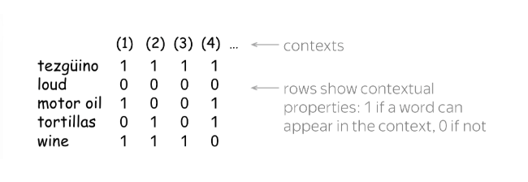
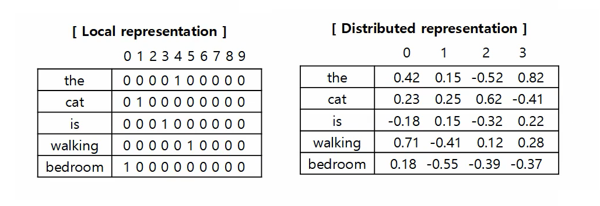
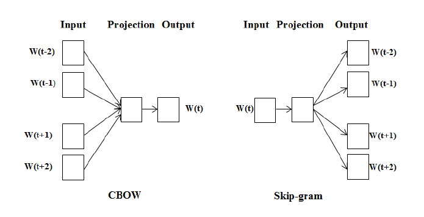
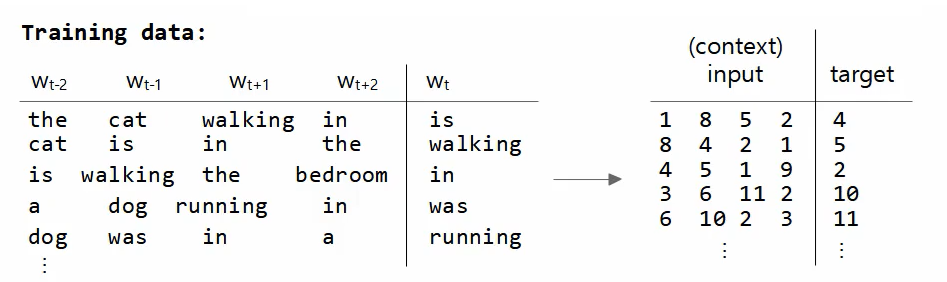
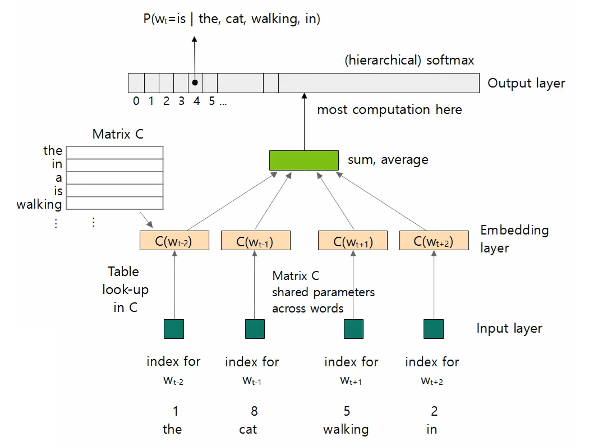
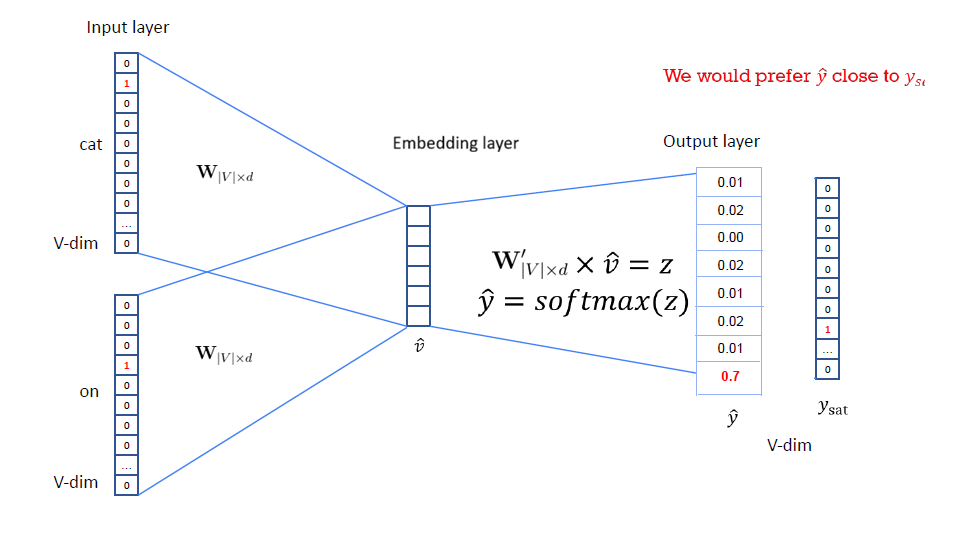

Can we come up with some technique that enforce the condition that if words are similar, their representation should be similar, and if documents are similar their representations should be similar?

* TOC
{:toc}

## Word Semantics
To capture meaning of words in their representations, we first need to define the notion of meaning used in practice. Let us try to understand how we, humans, get to know the meaning of a word, say `tezgüino`. To understand the meaning of this word, we look at how this word is used in different contexts.

* A bottle of tezgüino is on the table.
* Everyone like tezgüino.
* Tezgüino makes you drunk.
* We can make tezgüino out of corn.

Now, we guess that `Tezgüino` is a kind of alcoholic beverage made from corn. With context, we can understand the meaning of a word. How did we do this? The hypothesis is that our brain searched for other words that can be used in the same contexts, found some (e.g., wine), and made a conclusion that tezgüino has meaning similar to those words. This is the distributional hypothesis:

Words that are surrounded by the same contextual words must have similar meaning. That is, if two words $w_1$ and $w_2$ are surrounded by the same context, then words $w_1$ and $w_2$ must be similar.

Another way to understand the meaning of a word is by the following: Suppose we are given the below contexts: The words that fit into these contexts must be similar.

* A bottle of ____ is on the table.
* Everyone like ____.
* ____ makes you drunk.
* We can make ____ out of corn.

<figure markdown="0" class="figure zoomable">
<figcaption>
  <strong>Figure 1.</strong> Representation of words using contexts
  </figcaption>
</figure>

In these representations, we have put information about contexts into the word representation. The words wine, tezgüino can appear in these contexts, so their representations are similar.

Using these two ideas, it is clear that all we need to do to represent a word is to put information about their contexts into the representation.

## Word2Vec
Word2vec was presented in the paper titled "Efficient Estimation of Word Respresentations in Vector Space" by Tomas Mikolov et al. in 2013. Word2Vec is one of the most popular techniques for word embeddings. It is a **self-supervised** learning algorithm (input-target pairs are generated from the given data). This technique can be used for learning high-quality word representations from huge data sets with billions of words in the vocabulary. It works on the assumption that the representation of a word is dictated by other surrounding words.

It gives a neural network-based **distributed representation** for words. In NLP, words can be represented using traditional local representation such as one-hot encoding or modern distributed representations such as Word2Vec.

In a local representation, each word is represented by a single, dedicated unit (a separate neuron). Only that unit is active when the word is present. In a distributed representation, each word is represented by a pattern of activation across multiple units.

<figure markdown="0" class="figure zoomable">
<figcaption>
  <strong>Figure 2.</strong> Local and distributed representation of words
  </figcaption>
</figure>

## Learning Word Representation
Our objective is to build representations for all the words in the vocabulary. Word2Vec is a learning-based model for word embeddings; the word vectors are parameters of the model. The authors of the paper proposed two novel model architectures for computing word representations:

* Predict the words from the contexts. Given the context, we predict the missing central word. This is called Continuous Bag Of Words (CBOW).
* Predict contexts from words. Given the central word, we predict the context words. This is called skip-gram.

These are the two variations of Word2Vec representations. These architectures do not have any hidden layers. They only have input, projection (embedding) and output layers.

<figure markdown="0" class="figure zoomable">
<figcaption>
  <strong>Figure 2.</strong> CBOW and Skip-gram Architecture
  </figcaption>
</figure>

The softmax function incurs a significant computational cost in neural networks when working with a large vocabulary because its computation time is directly proportional to the size of the vocabulary. One way to solve this problem is to use hierarchical softmax which is a computationally efficient approximation of the full softmax. In the original paper, the author used hierarchical softmax where the vocabulary is represented as a Huffman binary tree. But to simplify the problem, we use the standard softmax for the output layer of the model.

## CBOW Model
Consider the corpus:

* the cat is walking in the bedroom
* a dog was running in a room
* the cat is running in a room
* a dog is walking in a bedroom
* the dog was walking in the room

Vocabulary:

{'the': 1,
'in': 2,
'a': 3,
'is': 4,
'walking': 5,
'dog': 6,
'room': 7,
'cat': 8,
'bedroom': 9,
'was': 10,
'running': 11
}

Let's assume a fixed length context window, for example, a window of five consecutive words $[w_{-2}, w_{-1}, c, w_1, w_2]$. Typically, we consider the window length to be an odd number.

Let's assume the length of the context window as 5 and get the training data as follows: Each word is converted to their corresponding indices in the vocabulary.

<figure markdown="0" class="figure zoomable">
<figcaption>
  <strong>Figure 3.</strong> CBOW training data sample
  </figcaption>
</figure>

The model architecture is: CBOW model predicts the current word $w_t$ based on the context of surrounding words.

<figure markdown="0" class="figure zoomable">
<figcaption>
  <strong>Figure 4.</strong> CBOW model architecture
  </figcaption>
</figure>

* The input vectors are fed into the model.
* The embedding layer selects a word vector (randomly initialized) corresponding to each word from the matrix $\mathbf{C}$.
* All these word vectors are added and averaged. This gives a latent vector for the input context words.
* The latent vector is fed into a standard softmax output layer.

Each neuron in the output layer outputs the conditional probability for a word in the vocabulary given the context words. For the first input, we expect the model to output something like $[0.01, 0.01, 0.02, 0.9, 0.1, \dots ]$. That is, we want to maximize $P(w_t = \text{is} \, | \, \text{the, cat, walking, in})$.

After training, we get a word vector for each word in our vocabulary, that is, the goal of this model is to find an appropriate matrix $\mathbf{C}$. The matrix $\mathbf{C}$ is the matrix $\mathbf{W}$ below:

<figure markdown="0" class="figure zoomable">
<figcaption>
  <strong>Figure 5.</strong> CBOW model architecture
  </figcaption>
</figure>

To compute the probabilities, we will be using the representation of $w_t$ and other words. We calculate the loss and back propagate it to update these representations with the objective of maximizing the probability. As the probability is maximized, the representations in $\mathbf{W}$ and $\mathbf{W}'$ are improved.
