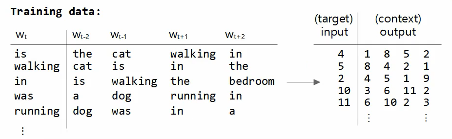
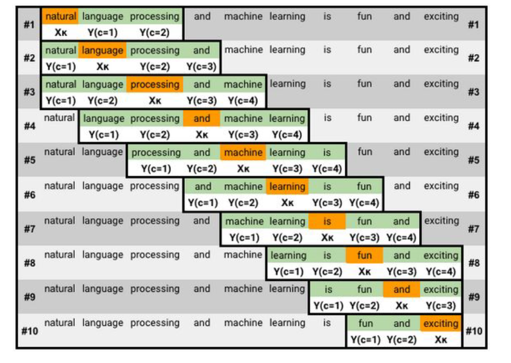
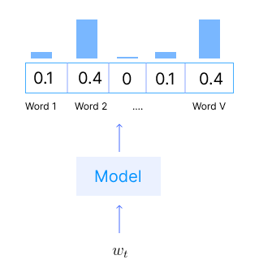
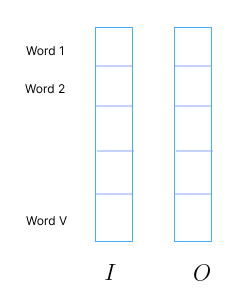
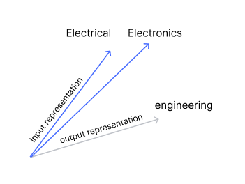
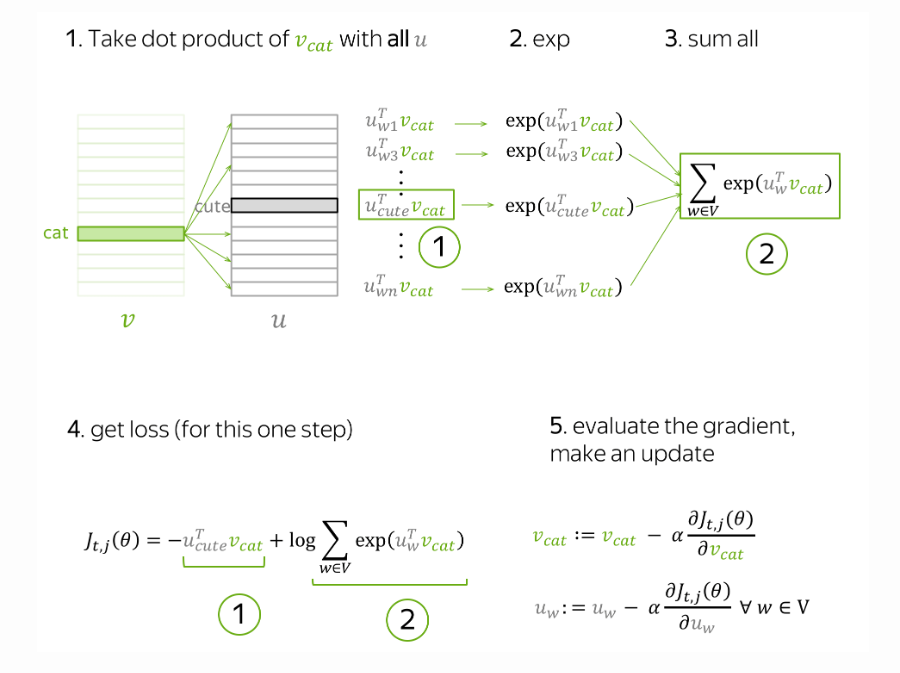
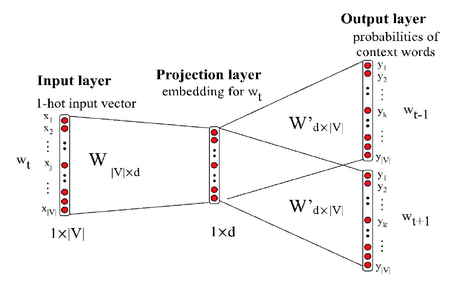
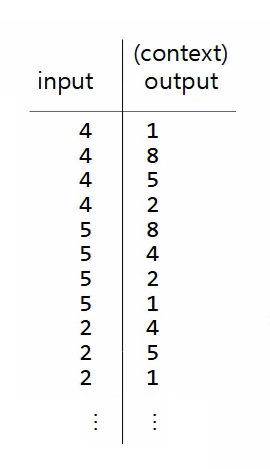
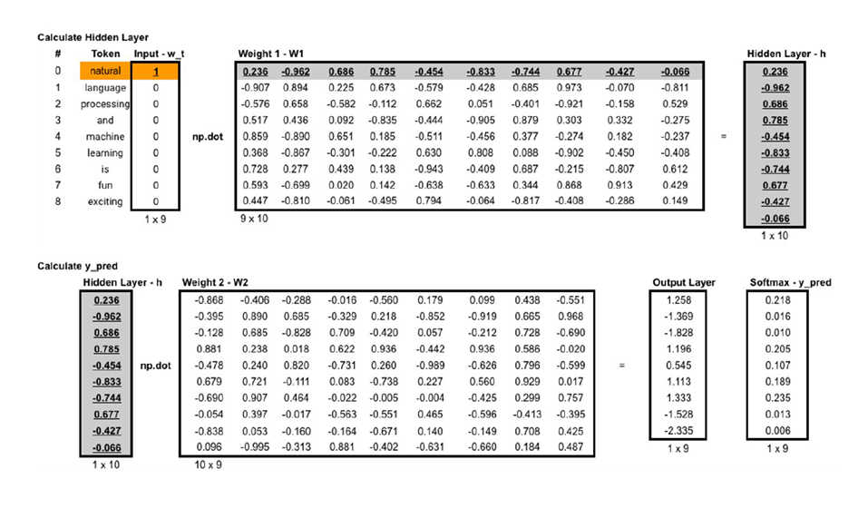
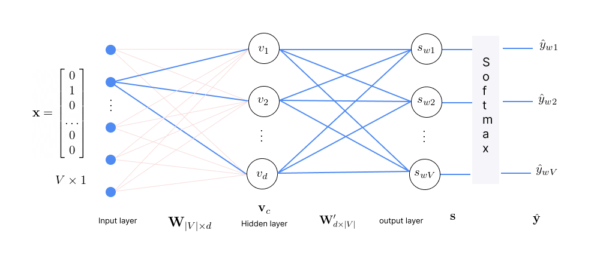

* TOC
{:toc}

## Main Idea
Its main idea is as follows:

1. Take a huge text corpus. Suppose there are $T$ words in the corpus. We start with random initialization of the word embeddings.

2. Go over the text with a sliding window of size $m$, moving one word at a time. At each step, there is a central word $w_t$ and context words $w_{t-m}, \dots, w_{t-1}, w_{t+1}, \dots, w_{t+m}$ (other words in this window). Typically, we take $m=2$. The word embeddings are learnable parameters.

3. For the given central word $w_t$, compute probabilities of all other words $w_i$ in the vocabulary, $P(w_i \, | \, w_t, \theta)$, where $i=1, \dots, V$ and $V$ is the number of words in the vocabulary. The skip-gram model gives us this probability.

4. Adjust the vector representations to increase the probability of actual context words and decrease the probability of non-context words (for a given central word).

## Training Data Preparation

Consider the corpus:

* the cat is walking in the bedroom
* a dog was running in a room
* the cat is running in a room
* a dog is walking in a bedroom
* the dog was walking in the room

Vocabulary:

{'the': 1, 'in': 2, 'a': 3, 'is': 4,
'walking': 5,
'dog': 6,
'room': 7,
'cat': 8,
'bedroom': 9,
'was': 10,
'running': 11
}

Let's assume a fixed length context window, for example, a window of five consecutive words $[w_{-2}, w_{-1}, c, w_1, w_2]$. Typically, we consider the window length to be an odd number. The training data is generated as follows:

<figure markdown="0" class="figure zoomable">
<figcaption>
  <strong>Figure 1.</strong> Skip-gram training data
  </figcaption>
</figure>

NOTE: For the first word 'the', there will be only two context words (cat, is), and similarly for the last word.

More examples:

<figure markdown="0" class="figure zoomable">
<figcaption>
  <strong>Figure 2.</strong> Skip-gram training data
  </figcaption>
</figure>

## Objective Function
We are given a collection of documents. The objective is to maximize the probability of seen word-context pairs. We open a document and start the sliding window process. Let $T$ be the total number of words in the **entire corpus** (without removing duplicates). Each word occurrence gets a chance to come as the center word once. So, we will be making predictions $T$ number of times.

  
TIP

  
$T$ is called the number of tokens. Every occurrence of a word in the collection is a token. For example, in the document 'to be or not to be'. The total number of words in the vocabulary is 4, but the number of tokens is 6. Every occurrence of a word is a different token.

Let $t=1, \dots, T$ be the token in the given corpus.

Given the central word $w_t$, we need to predict the context words, $m$ words to the left and $m$ words to the right: $w_{t-m}, w_{t-1}, w_{t+1}, w_{t+m}$. This is one prediction (one data point in our training data). Let $m=2$. Then, this input-output can be divided into four training points.

For example, for the word $w_t = \text{is}$, we check the probability $p(w_{t-2}, w_{t-1}, w_{t+1}, w_{t+2} \, | \, w_t)$. On assuming independence between the context words, this becomes

$$
P(w_{t-2} = \text{the} \, | \, \text{is}) \cdot P(w_{t-1} = \text{cat} \, | \, \text{is}) \cdot P(w_{t+1} = \text{walking} \, | \, \text{is}) \cdot P(w_{t+2} = \text{in} \, | \, \text{is})
$$

Lower this probability, higher is the model error for this particular training data point. Higher the probability, lower the error. Thus, our objective for this token is

$$
\max \prod_{-m \leq j \leq m, j\ne0} p(w_{t+j} \, | \, w_t)
$$

Given $w_t$ as the input to the model, we expect the model to produce high probabilities for $w_{t+j}$ for all $-m \leq j \leq m, j\ne0$ and less for all the other words in the vocabulary.

<figure markdown="0" class="figure zoomable">
<figcaption>
  <strong>Figure 3.</strong> Skip-gram objective
  </figcaption>
</figure>

We have to repeat this for every position $t=1, \dots, T$ in the given corpus. Then, the likelihood over the whole corpus can be written as:

$$
L(\theta) = \prod_{t=1}^T \prod_{-m \leq j \leq m, j\ne0} p(w_{t+j} \, | \, w_t; \theta)
$$

where $\theta$ are all the word representations to be optimized. That is, the input representations $\mathbf{W}$ and output representations of all the words $\mathbf{W'}$ in the vocabulary. The objective function (aka loss function or cost function) $J$ is the average negative log-likelihood.

$$
J(\theta) = - \frac{1}{T} \sum_{t=1}^T \sum_{-m \leq j \leq m, j\ne0} \log p(w_{t+j} \, | \, w_t; \theta)
$$

## Computing the Probability

But how to compute this probability $p(w_{t+j} \, | \, w_t)$? We represented $w_{t+j}$ and $w_t$ as vectors. For each word $w$ in the vocabulary, there will be two representations: input representation $v_w$ and output representation $u_w$. Input representation is used when the word is the central word, and the output representation is used when the same word is the context word.

<figure markdown="0" class="figure zoomable">
<figcaption>
  <strong>Figure 4.</strong> Skip-gram Representations
  </figcaption>
</figure>

The word vectors $v_w$ and $u_w$ for all the words in the vocabulary is our parameter $\theta$.

Say we have sentences "electrical engineering" and "electronics engineering". A data point has input word $c = \text{electrical}$ and output $o = \text{engineering}$. Then, the representation for 'electrical' is taken from the input representation and the representation for 'engineering' is taken from the output representation.

$$
p(o \, | \, c) = \frac{\text{exp}({u_o}^\top v_c)}{\sum_{w=1}^V \text{exp}({u_w}^\top v_c)}
$$

Here $c$ denotes the central and $o$ denotes outside word.

The dot-product gives the similarity strength between two vectors. It is

* Maximum when they are parallel to each other, meaning the angle between them is $0^{\circ}$.
* Zero when vectors are orthogonal $90^\circ$.
* Minimum when they are anti-parallel $180^\circ$.

We take dot product between the two vectors, and to make it a probability score, we pass it through a softmax layer to normalize over the entire vocabulary.

When we increase this probability, we bring the input representation of the central word close (in dot-product sense) to the output representation vector of the outside word, i.e., we are increasing the compatibility between them.

Then, for the second data point 'electronics engineering': we make the input representation of 'electronics' come closer to the output representation of 'engineering'. By this process, the input representation vectors for 'electrical' and 'electronics' will become closer (in dot-product sense).

<figure markdown="0" class="figure zoomable">
<figcaption>
  <strong>Figure 5.</strong> Skip-gram Representations
  </figcaption>
</figure>

## How to train
Our parameters $\theta$ are vectors $v_w$ and $u_w$ for all words in the vocabulary. These vectors are learned by optimizing the training objective via gradient descent.

$$
J(\theta) = - \frac{1}{T} \sum_{t=1}^T \sum_{-m \leq j \leq m, j\ne0} \log p(w_{t+j} \, | \, w_t; \theta)
$$

For each position $t$:

* Treat $w_t = c$ as the central word.
* For each context word $w_{t+j}$ in the window:
  1. Form a training pair $(w_t, w_{t+j})$
  2. Perform one SGD update using only this pair.

So the effective objective per step is:

$$
J_{t,j}(\theta) = - \log p(w_{t+j} \, | \, w_t; \theta) = - \log p(o \, | \, c; \theta) \tag{1}
$$

For the central word $w_t$, the loss $J(\theta)$ contains this term for each of its context words $w_{t+j}$. We know

$$
\begin{align*}
J_{t,j}(\theta) & = - \log \left( \frac{\text{exp}({u_o}^\top v_c)}{\sum_{w=1}^V \text{exp}({u_w}^\top v_c)} \right) \\
& = - {u_o}^\top v_c + \log \sum_{w=1}^V \text{exp}({u_w}^\top v_c) \\
& = - \left( {u_o}^\top v_c - \log \sum_{w=1}^V \text{exp}({u_w}^\top v_c) \right)
\end{align*}
$$

The objective is to minimize the $J_{t,j}(\theta)$, that is, we want to maximize the quantity inside the brackets. As we maximize this

* It pushes ${u_o}^\top v_c$ to be large. This means the vectors become more aligned (their cosine similarity increases). The center and its true context word get high compatibility.
* It pushes the sum of all possible dot products to be small.

As the objective is maximized, the word representations are improved. Note which parameters are present at this step:

* From the input representations: only the central word $v_c$.
* From the output representations: all the words in the vocabulary $u_w$ for all $w$ in the vocabulary.

Only these parameters will be updated at the current step. Assume $c=\text{cat}$ and $o=\text{cute}$. 

<figure markdown="0" class="figure zoomable">
<figcaption>
  <strong>Figure 6.</strong> Skip-gram update step
  </figcaption>
</figure>

In total, for a single pair of a center word and one of its context words, we make $|V|+1$ updates. By making an update to minimize $J_{t,j}(\theta)$, we force the parameters to increase similarity (dot product) of $v_{cat}$ and $u_{cute}$ and, at the same time, to decrease similarity between $v_{cat}$ and $u_{w}$ for all other words in the vocabulary.

  
NOTE

  
This may sound a bit strange: why do we want to decrease similarity between $v_c$ and all other words, if some of them are also valid context words? But do not worry: since we make updates for each context word (and for all central words in the text), on average over all updates our vectors will learn all the possible contexts.

We start with random initialization for all representations and iterate till convergence.

## Model Architecture
In Skip-gram, the center word or current word becomes the input and the surrounding context words become the output of the model.

<figure markdown="0" class="figure zoomable">
<figcaption>
  <strong>Figure 7.</strong> Skip-gram model architecture
  </figcaption>
</figure>

The output layer has $|V|$ neurons. Each neuron outputs the conditional probability for a word in the vocabulary given the center word. Given the input $w_t$, the model outputs $P(w \, | \, w_t)$ for all $w \in V$. To calculate the loss, the output is compared with one-hot encoded version of each true context word separately. As we calculate the loss separately for each central-context word pair, the training data can be considered as:

<figure markdown="0" class="figure zoomable">
<figcaption>
  <strong>Figure 8.</strong> Skip-gram model architecture
  </figcaption>
</figure>

### Step by Step Example

<figure markdown="0" class="figure zoomable">
<figcaption>
  <strong>Figure 9.</strong> Skip-gram forward pass
  </figcaption>
</figure>

**Input Layer:**

The token at position $t$ in the corpus is considered as the central word. The central word $w_t = c$ is represented as a one-hot vector $\mathbf{x}$ of size $|V|$.

**Hidden Layer:**

A weight matrix (input embedding matrix) $\mathbf{W}_{|V| \times d}$ to transform the input $\mathbf{x}$ into a lower-dimensional vector $\mathbf{v}_c$ of size $d$.

$$
\mathbf{v}_c = \mathbf{W}^\top \mathbf{x} =
\begin{bmatrix}
v_1 \\
v_2  \\
\dots \\
v_d 
\end{bmatrix}
$$

Each row in $\mathbf{W}$ is the input embedding of a word. Therefore, each column in $\mathbf{W}^\top$ is the input embedding of a word. Since $\mathbf{x}$ has 1 only on one of the entries, in the matrix-vector multiplication, we pick a corresponding column from the matrix $\mathbf{W}^\top$. This gives us a vector $\mathbf{v}_c$ which is the input representation of the central word $c$.

**Output Layer:**

A weight matrix (output embedding matrix) $\mathbf{W}'_{d \times |V|}$ to compute the similarity score between the central word $w_t$ and each word $w_1, w_2, \dots, w_V$ in the vocabulary. Each column of this matrix $\mathbf{u}_{w_k}$ is the output embedding of word $w_k$ for $k=1,2,\dots, |V|$.

$$
\mathbf{s} = \mathbf{W}'^T \mathbf{v}_c = 
\begin{bmatrix}
\mathbf{u}^\top_{w1} \mathbf{v}_c \\
\mathbf{u}^\top_{w2} \mathbf{v}_c  \\
\dots \\
\mathbf{u}^\top_{wV} \mathbf{v}_c
\end{bmatrix} = 
\begin{bmatrix}
s_{w1} \\
s_{w2}  \\
\dots \\
s_{wV}
\end{bmatrix}
$$

$s_{w_k}$ is the unnormalized similarity score between the central word $c$ and word $w_k$. A softmax function is then applied that produces a probability distribution over the vocabulary. This gives us a probability vector of size $V$, $\hat{\mathbf{y}} = [\hat{y}_{w1}, \dots, \hat{y}_{wV}]$, with each element representing the probability $p(w_k \, | \, c)$.

$$
\hat{y}_{w_k} = P(w_k \, | \, c; \boldsymbol{\theta}) = \frac{\text{exp}(s_{w_k})}{\sum_{w \in V} \text{exp}(s_{w})} = \frac{\text{exp}(\mathbf{u}^\top_{w_k} \mathbf{v}_c)}{\sum_{w \in V} \text{exp}(\mathbf{u}^\top_{w} \mathbf{v}_c)}
$$
Say $\hat{\mathbf{y}} = \{0.21, 0.16, 0.1, 0.2, \dots, 0.0\}$.

<figure markdown="0" class="figure zoomable">
<figcaption>
  <strong>Figure 10.</strong> Skip-gram architecture
  </figcaption>
</figure>

The prediction is then compared with the target. Given a central word $c$, we want the model to predict a context or outside word, say $o$. So, the target vector is a one-hot encoded vector with 1 only in the element where $w_k=o$, say, $\mathbf{y} = \{0,0,1,0,\dots,0\}$.

Given the prediction $\hat{\mathbf{y}}$ and the ground truth $\mathbf{y}$ (each of size $V$), the cross-entropy loss is given by

$$
L = - \sum_{k=1}^{|V|} y_{wk} \log \hat{y}_{wk} = - \log \hat{y}_o = - \log p(o \, | \, c)
$$

as $y_{wk} = 1$ only for the element where $w_k=o$ and 0 for all other elements. We can observe that equation <a href="#eq:eq1">(1)</a> is the same as this cross-entropy loss.

* If the model assigns a high probability to this context word, i.e., $\hat{y}_o = 0.8$, the loss is low $(L = - \log 0.8 \approx 0.22)$.
* If the model assigns a low probability to this context word, i.e., $\hat{y}_o = 0.1$, the loss is high $(L = - \log 0.1 \approx 2.33)$.

We then back propagate these losses to update the parameters. The matrix $\mathbf{W}$ and $\mathbf{W}'$ are learnable parameters. Each word is represented as vector of size $d$, so in total there are $2*d*|V|$ numbers to be optimized.

