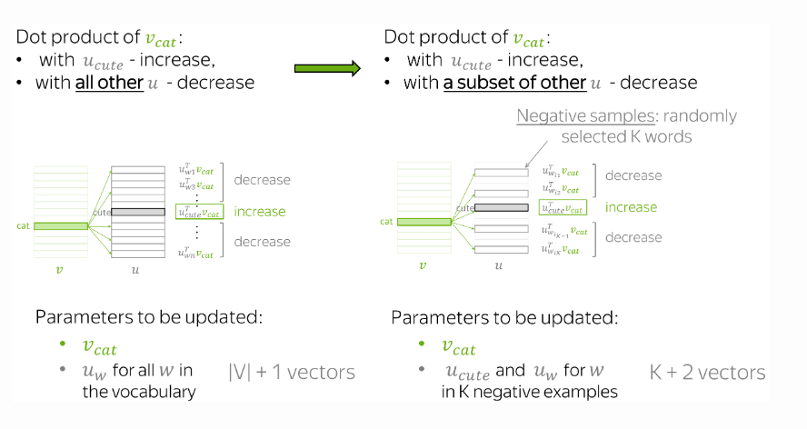

* TOC
{:toc}

## Main Idea
In Word2Vec, for each pair of a central word and its context word, we had to update all vectors for context words and the vector for the central word. In total, we update $|V| + 1$ vectors. This is highly inefficient: for each step, the time needed to make an update is proportional to the vocabulary size $V$.

But why do we have to consider **all** context vectors in the vocabulary at each step? For example, imagine that at the current step we consider context vectors not for all words, but only for the current context word $o$ and several randomly chosen words.

<figure markdown="0" class="figure zoomable">
<figcaption>
  <strong>Figure 1.</strong> Negative sampling in Skip-gram
  </figcaption>
</figure>

As before, we are increasing similarity between $c$ and $o$. What is different, is that now we decrease similarity between the central word $c$ and context vectors not for all words, but only with a subset of $K$ negative examples.

We just update the output representation of $K$ negative samples, the output representation of the positive sample, and the input representation of the central word. In total, there will only be $K+2$ updates. As before, we are increasing similarity between $\mathbf{v}_c$ and $\mathbf{u}_o$. But now we decrease similarity only between $\mathbf{v}_c$ and context vectors $\mathbf{u}_{w1}, \dots, \mathbf{u}_{wK}$.

Since we have a large corpus, on average over all updates we will update each vector sufficient number of times, and the vectors will still be able to learn well.

## Objective Function
Formally, the new loss function associated with a single pair $(c,o)$ is:

$$
\begin{align*}
J_{t,j}(\boldsymbol{\theta}) & = -\log\sigma(\mathbf{u}_o^T \mathbf{v}_c) -
\sum\limits_{w\in \{w_{i1},\dots, w_{iK}\}}\log\sigma(- \mathbf{u}_w^T \mathbf{v}_c) \\
& = -\log\sigma(\mathbf{u}_o^T \mathbf{v}_c) -
\sum\limits_{w\in \{w_{i1},\dots, w_{iK}\}}\log (1 - \sigma(\mathbf{u}_w^T \mathbf{v}_c))
\end{align*}
$$

where $w_{i1},\dots, w_{iK}$ are the $K$ negative samples chosen at this step. There parameters involved in the objective function are $\mathbf{v}_c, \mathbf{u}_o, \mathbf{u}_{w1}, \dots, \mathbf{u}_{wK}$.

### Update equation for $\mathbf{v}_c$:

$$
\begin{align*}
\frac{\partial J_{c,o}(\boldsymbol{\theta})}{\partial \mathbf{v}_c} & = - \frac{\partial }{\partial \mathbf{v}_c} \log\sigma(\mathbf{u}_o^T \mathbf{v}_c) - \sum\limits_{w\in \{w_{i1},\dots, w_{iK}\}} \frac{\partial }{\partial \mathbf{v}_c} \log (1 - \sigma(\mathbf{u}_w^T \mathbf{v}_c))\\
& = - (1 - \sigma(\mathbf{u}_o^T \mathbf{v}_c)) \mathbf{u}_o - \sum\limits_{w\in \{w_{i1},\dots, w_{iK}\}} - \sigma(\mathbf{u}_w^T \mathbf{v}_c) \mathbf{u}_w \\
& = (\sigma(\mathbf{u}_o^T \mathbf{v}_c) - 1) \mathbf{u}_o + \sum\limits_{w\in \{w_{i1},\dots, w_{iK}\}} \sigma(\mathbf{u}_w^T \mathbf{v}_c) \mathbf{u}_w \\
\end{align*}
$$

So the word vector $\mathbf{v}_c$ is updated to

$$
\begin{align*}
\mathbf{v}_c & := \mathbf{v}_c - \eta \left( (\sigma(\mathbf{u}_o^T \mathbf{v}_c) - 1) \mathbf{u}_o + \sum\limits_{w\in \{w_{i1},\dots, w_{iK}\}} \sigma(\mathbf{u}_w^T \mathbf{v}_c) \mathbf{u}_w \right) \\
& := \mathbf{v}_c + \eta (1 - \sigma(\mathbf{u}_o^T \mathbf{v}_c) ) \mathbf{u}_o) - \sum\limits_{w\in \{w_{i1},\dots, w_{iK}\}}  \eta \, (1 - \sigma(- \mathbf{u}_w^T \mathbf{v}_c)) \mathbf{u}_w \\
& := \mathbf{v}_c + \eta (1 - \sigma(\mathbf{u}_o^T \mathbf{v}_c) ) \mathbf{u}_o) + \sum\limits_{w\in \{w_{i1},\dots, w_{iK}\}}  \eta  \, (\sigma(- \mathbf{u}_w^T \mathbf{v}_c) - 1) \mathbf{u}_w \\
\end{align*}
$$

## Update equation for $\mathbf{u}_o$:

$$
\begin{align*}
\frac{\partial J_{c,o}(\boldsymbol{\theta})}{\partial \mathbf{u}_o} & = - \frac{\partial }{\partial \mathbf{u}_o} \log\sigma(\mathbf{u}_o^T \mathbf{v}_c) - \sum\limits_{w\in \{w_{i1},\dots, w_{iK}\}} \frac{\partial }{\partial \mathbf{u}_o} \log (1 - \sigma(\mathbf{u}_w^T \mathbf{v}_c))\\
& = - (1 - \sigma(\mathbf{u}_o^T \mathbf{v}_c)) \mathbf{v}_c + 0 \\
& = (\sigma(\mathbf{u}_o^T \mathbf{v}_c) -1 ) \mathbf{v}_c
\end{align*}
$$

So the true context vector $\mathbf{u}_o$ is updated to

$$
\begin{align*}
\mathbf{u}_o & := \mathbf{u}_o - \eta (\sigma(\mathbf{u}_o^T \mathbf{v}_c) -1) \mathbf{v}_c \\
& = \mathbf{u}_o + \eta (1 - \sigma(\mathbf{u}_o^T \mathbf{v}_c)) \mathbf{v}_c
\end{align*}
$$

### Update equation for $\mathbf{u}_w$:

Considering only the second term as the first term is independent of vector $\mathbf{u}_w$.

$$
\begin{align*}
\frac{\partial J_{c,o}(\boldsymbol{\theta})}{\partial \mathbf{u}_w} & = - \frac{\partial }{\partial \mathbf{u}_w} \log (1 - \sigma(\mathbf{u}_w^T \mathbf{v}_c)) \\
& = \sigma(\mathbf{u}_w^T \mathbf{v}_c) \mathbf{v}_c 
\end{align*}
$$

So the context vectors of negative samples $\mathbf{u}_w$ where $w \in \{w1, \dots, wK\}$ is updated to

$$
\begin{align*}
\mathbf{u}_w & := \mathbf{u}_w - \eta \sigma(\mathbf{u}_w^T \mathbf{v}_c) \mathbf{v}_c \\
& = \mathbf{u}_w + \eta (\sigma(-\mathbf{u}_w^T \mathbf{v}_c) - 1) \mathbf{v}_c \\
\end{align*}
$$

