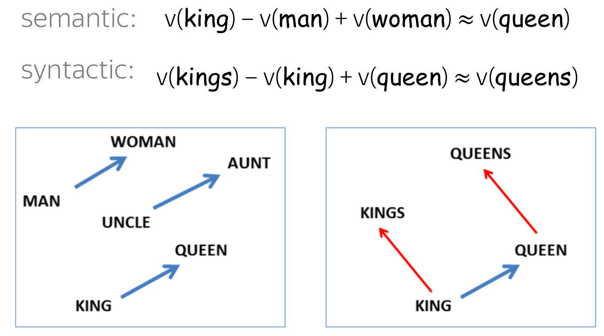
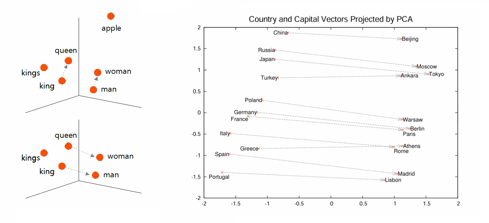
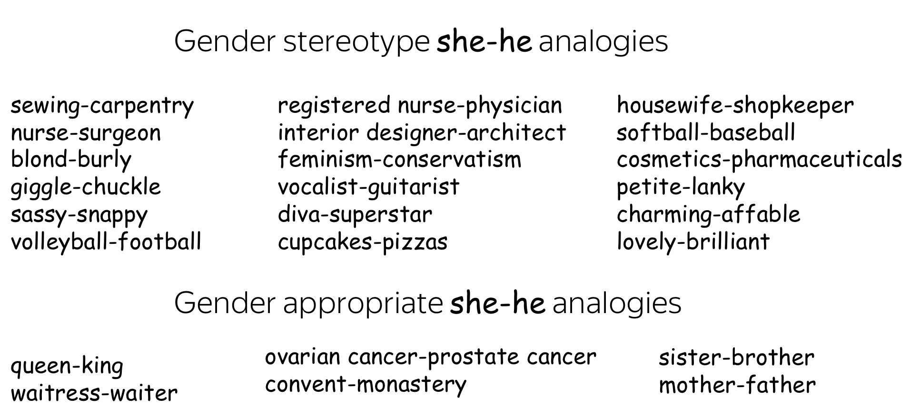

* TOC
{:toc}

## Representations
The Word2Vec model learns two different embeddings for each word in the vocabulary: input and output representations. These two representations capture different information.

After learning, we can compute the cosine similarity between word vectors to assess semantic similarity. Cosine similarity values range from -1 (opposite) to 1 (very similar), showing how closely related two words are in terms of meaning. We get different nearest neighbors in the word2vec embedding space based on whether we compute IN-IN or IN-OUT similarities between the words. For example, for the query word 'IIT' with its input representation:

* When computed similarity with input representation of all other words: we get 'Typical' notion of relatedness (types are the same). IIT is closer to Harvard and Stanford. IN-IN similarity gives typical relatedness.

* When computed similarity with output representation of all other words: we get 'Topical' notion of relatedness. IIT is closer to faculty, alumni, orientation, etc. IN-OUT similarity gives topical relatedness.

The Word2Vec model we build is actually a "fake-task" model. We train a model to perform a certain task, but we don't use the model for the task it is trained on. We train the model on a fake task, use a by-product (word vectors), and then we discard the rest of the model.

  
TIP

  
To train downstream ML models, we often consider IN representation of the words.

## Linear Structure
Consider either the input or output representation of the words. It is observed that many semantic and syntactic relationships between words are (almost) linear in word vector space. For example

* The difference between king and queen is (almost) the same as between man and woman. King and Queen are related to royalty and are semantically similar. The same goes for the relationship between man and woman. On performing simple algebraic operations on the word vectors, it is observed that vector('King') - vector('Man') + vector('Woman') results in a vector that is closest to the queen vector.
* A word that is similar to queen in the same sense that kings is similar to king turns out to be queens. A word that is similar to 'fast' in the same sense that 'slow' is similar to 'slowest' turns out to be 'fasted' (syntactically or grammatically relation).

<figure markdown="0" class="figure zoomable">
<figcaption>
  <strong>Figure 1.</strong> Linear structure in word vector space. The top vector in the left image is read as $v(\text{woman}) - v(\text{man})$ (we start at man and go to woman).
  </figcaption>
</figure>

The figure below on the right shows the two-dimensional PCA projection of the 1000-dimensional skip-gram vectors of countries and their capital cities. This illustrates the ability of the model to automatically organize concepts and learn implicitly the relationships between them even though no supervised learning information is provided during training.

<figure markdown="0" class="figure zoomable">
<figcaption>
  <strong>Figure 2.</strong> Observations from Word2Vec learnings
  </figcaption>
</figure>

## Word Analogy Task
After the training, these near-linear relationships can be leveraged to do a new type of evaluation: word analogy evaluation.

* Analogy: $a$ is to $a^*$ as $b$ is to $?$
* Task: $v(a^*) - v(a) + v(b) \approx ?$ This gives us a vector with some values. Find the closest vector from our learned representations and check if it corresponds to the correct word.

## Biases in Word Embeddings
Word embeddings learned by models reflect societal bias. For example, while their analogical reasoning can be desirable, e.g. "a man to a woman is as a king to a queen", but 

* "a man to a woman is as a physician to a nurse" is an undesired association.
* man: computer programmer :: woman: homemaker is undesirable.

These are stereotypes; these associations do not exist in real.

The authors noticed that word embeddings encode undesired gender associations. To find such examples, they take a seed pair (e.g., (a, b) = (he, she)) and find pairs of words which have the same association: differ from each other in the same direction, and relatively close to each other. Formally, they find pairs with the high score:

$$
S_{(\mathbf{a},\mathbf{b})}(\mathbf{x},\mathbf{y})= \cos(\mathbf{a}-\mathbf{b}, \mathbf{x}-\mathbf{y}) \hspace{1cm} \text{if} \|\mathbf{x}-\mathbf{y} \| \leq \delta, \hspace{1cm} 0 \text{ else}
$$

The term captures the similar relation, and the if condition ensures they are not too far from each other. Look at the results below - definitely some pairs are biased!

<figure markdown="0" class="figure zoomable">
<figcaption>
  <strong>Figure 3.</strong> Bias in embeddings
  </figcaption>
</figure>

Moreover, they observed, homemaker, nurse, librarian, stylist are mostly associated with women, while captain, magician, architect, warrior are more strongly associated with men. We should prevent our model from learning such associations.

### Identifying and Quantifying Bias in Word Embeddings

