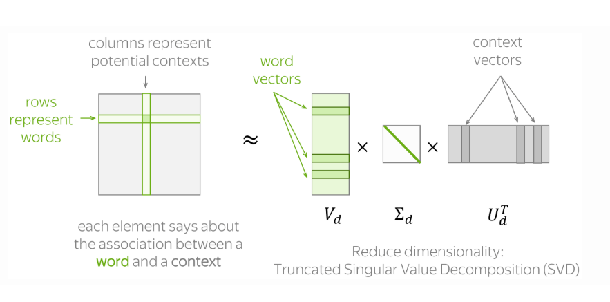
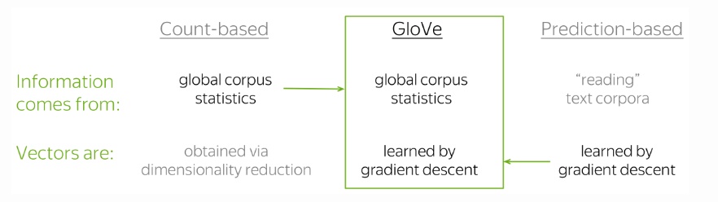
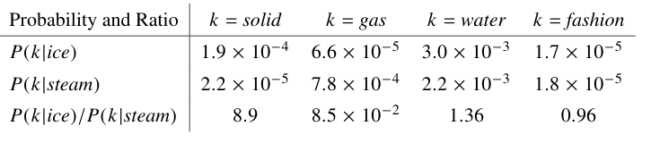
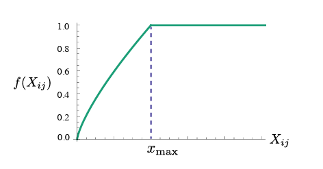

* TOC
{:toc}

## Count-Based Methods
The general procedure of count-based methods consists of two steps:

* Construct a word-context matrix, in which rows represent words in the vocabulary and columns represent contexts. The words in the rows and columns will be the same. But at times, we can remove some stop words from the vocabulary to form the context words. In such case, the words in column will be less than the words in rows.
* Reduce its dimensionality.

<figure markdown="0" class="figure zoomable">
<figcaption>
  <strong>Figure 1.</strong> Count-based methods for word embeddings
  </figcaption>
</figure>

To define a count-based method, we need to define two things:

* Define contexts (including what does it mean that a word appears in a context).
* The notion of association, i.e., formulas for computing matrix elements.

One of the ways of doing this is using the words co-occurence counts.

## Simple Co-occurence Counts
The simplest approach is to define contexts as the words in an L-sized window, i.e., for a word, the surrounding words in an L-sized window are the contexts. The words in the L-sized window around a central word $w$ are said to be appeared in the context of $w$.

We then build count or co-occurrence matrix where each element $X_{ij}$ is the number of times word $j$ appears in context of $i$, i.e., the number of times word $j$ and word $i$ co-occurred in the corpus.

Suppose our corpus has two documents:
* I love NLP
* I love to make videos

The co-occurrence matrix can be formed with $L=1$ as:

| | I | love | NLP | to | make | Videos | . |
| --- | --- | --- | --- | --- | --- | --- | ---|
| I | 0 | 2 | 0 | 0 | 0 | 0 | 0 |
| love| 2 | 0 | 1 | 1 | 0 | 0 | 0|
| NLP| 0 | 1 | 0 | 0 | 0 | 0 | 1|
| to| 0 | 1 | 0 | 0 | 1 | 0 | 0|
| make| 0 | 0 | 0 | 1 | 0 | 1 | 0|
| videos | 0 | 0 | 0 | 0 | 1 | 0 | 1|
| . | 0 | 0 | 1 | 0 | 0 | 1 | 0|

Read: 'Love' (in the column) appears in the context of 'I' (in the row) twice in the whole corpus. $\mathbf{X}_{\text{I, love}} =2$.

The co-occurence matrix is symmetric (if we have considered the same words for central and context in the same order). Each row in this matrix gives a representation of a word. If $n$ is the number of context words, then each word is represented as a vector of size $n$. And $L$ is a hyperparameter, typically we choose a value between 2 and 10.

  
Warning

  
If we change the ordering of the context words, the vector representation of words differ.

The resulting co-occurence matrix $\mathbf{X}_{m \times n}$, where $m$ is the number of words and $n$ is the number of context words, is very high-dimensional (grows with the vocabulary size) and very sparse. Each word is represented by a vector of size $n$. We carry out SVD to reduce the dimensions to $k$. After truncated SVD

$$
\mathbf{X}_{m \times n} \approx \tilde{\mathbf{X}}_{m \times n} = \tilde{\mathbf{U}}_{m \times k} \, \tilde{\boldsymbol{\Sigma}}_{k \times k} \, \tilde{\mathbf{V}}_{k \times n}^{\top}
$$

Each row of matrix $(\tilde{\mathbf{U}} \tilde{\boldsymbol{\Sigma}})_{m \times k}$ is the representation of a word. Each column of $\tilde{\mathbf{V}}_{k \times n}^{\top}$ can be considered as the representations of the context words (but this is usually discarded).

## GloVE
The GloVe model is a combination of count-based methods and prediction methods (e.g., Word2Vec). Model name, GloVe, stands for "Global Vectors", which reflects its idea: the method uses global corpus statistic to learn vectors.

In Word2Vec, we were just considering the local property, i.e., the surrounding context words for each token. In Glove, we will be taking advantage of the statistics from the whole document.

<figure markdown="0" class="figure zoomable">
<figcaption>
  <strong>Figure 2.</strong> Glove is a combination of count-based methods and prediction methods
  </figcaption>
</figure>

### Main Idea

* Let the matrix of word-word co-occurrence counts be denoted by $X$, whose entries $X_{ij}$ tabulate the number of times word $j$ occurs in the context of word $i$.

* Let $X_i=\sum_k X_{ik}$ be the number of times any word appears in the context of word $i$.

* $P_{ij} = P(j \, | \, i) = \frac{X_{ij}}{\sum_k X_{ik}}$ be the (co-occurrence) probability that word $j$ appear in the context of word $i$. For example, $P(\text{love} \, | \, \text{i}) = \frac{2}{2}=1$.

With a simple example, we can see how certain aspects of meaning can be extracted directly from co-occurrence probabilities. Consider two words $i$ and $j$, say $i=\text{ice}$ and $j=\text{steam}$. We want to see how these words relate to various "probe" words, $k$. This can be done by studying the ratio of their co-occurrence probabilities.

* For words $k$ related to ice but not steam, say $k=\text{solid}$, we expect the ratio $\frac{P_{ik}}{P_{jk}}$ will be large.
* For words $k$ related to steam but not ice, say $k=\text{gas}$, we expect the ratio $\frac{P_{ik}}{P_{jk}}$ to be large.
* For words $k$ like water or fashion, that are either related to both ice and steam, or to neither, the ratio should be close to one.

<figure markdown="0" class="figure zoomable">
<figcaption>
  <strong>Figure 2. </strong>Co-occurrence probabilities for target words ice and steam with selected context words from a 6 billion token corpus.
  </figcaption>
</figure>

By looking at these ratios, we can distinguish between words that are relevant to one target but not the other, versus words that are relevant to both (or neither).

Compared to the raw probabilities, the ratio (the last row) is better able to distinguish relevant words (solid and gas) from irrelevant words (water and fashion) and it is also better able to discriminate between the two relevant words. Only in the ratio noise from non-discriminative words like water and fashion cancel out, so that large values (much greater than 1) correlate well with properties specific to ice, and small values (much less than 1) correlate well with properties specific to steam.

The above argument suggests that the appropriate starting point for word vector learning should be with ratios of co-occurrence probabilities rather than the probabilities themselves (as in Word2Vec).

### Objective Function
For every word $i$, we need to compare it to every other word $j$ in the vocabulary. In total, there will be $VC_2 = \frac{V * (V-1)}{2}$ ways of selecting a pair. For each pair $(i,j)$, we need to look at the co-occurrence counts of all probe words $k$. For each probe word $k$, we look at the probability ratio $\frac{P_{ik}}{P_{jk}}$. The ratio $\frac{P_{ik}}{P_{jk}}$ depends on three words $i,j,k$, the most general model takes the form

$$
F(w_i, w_j, \tilde{w}_k) = \frac{P_{ik}}{P_{jk}}
$$

where $w \in \mathbb{R}^d$ are (input representations) of the word vectors and $\tilde{w} \in \mathbb{R}^d$ are the context word vectors (output representations). GloVe uses the co-occurrence counts to construct the loss function:

$$
J(\theta) = \sum_{i,j=1}^{|V|} f(X_{ij}) \, (w_i^\top \tilde{w}_j + b_i + \tilde{b}_j - \log X_{ij} )^2
$$

The summation is over $VC_2$ terms. The learning moves vectors around in a high-dimensional space until the "distances" (specifically the dot products) between them match the statistical "distances" (co-occurrence count) found in the text data. It essentially tries to minimize the difference between the dot product of two word vectors and the logarithm of their actual co-occurrence count. So, our model tunes the representations of words to predict their co-occurrence count.

$$
\log X_{ij} = w_i^\top \tilde{w}_j + b_i + \tilde{b}_j 
$$

The error is then modelled as the MSE kind of loss function.

Here $\theta$ refer to the representations $w$ and $\tilde{w}$ for each word in the vocabulary. Additionally, the method has a scalar bias term for each word vector (one for input representation and one for output representation). The co-occurrence count $X_{ij}$ can be contributed either to the bias for word $i$, bias for word $j$ or to the interplay between them (the dot product). A word that is widely present in the document or any stop words can co-occur with many other words. The co-occurrence counts for such words are often contributed to the bias terms.

Among $VC_2$ pairs, some pairs are more prominent and some are less prominent. $f(X_{ij})$ is used to capture this information; it assigns a weight to each pair $(i,j)$. The loss corresponding to words that are co-occurring a lot should be given more importance, that is, if $X_{ij}$ is high, $f(X_{ij})$ should be high, and vice versa.

* $f(0)=0$
* $f(x)$ should be non-decreasing so that rare occurrences are not overweighted.
* If $x$ is very large, the function value shouldn't blow up so that frequent co-occurrences are not overweighted.

Many functions satisfy these properties, but one class of functions that works well can be parameterized as:

$$
f(x) = \begin{cases}
    \left( \frac{x}{x_{max}} \right)^{\alpha}, & \text{if } x < x_{max} \\
    1,  & \text{otherwise }
\end{cases}
$$

<figure markdown="0" class="figure zoomable">
<figcaption>
  <strong>Figure 3. </strong> Weighting function $f$ with $\alpha=\frac{3}{4}$ and $x_{max} = 100$.
  </figcaption>
</figure>

  
TIP

  
When we use statistics based methods such as TF-IDF for word representations, the representation changes completely if the corpus changes. But this is not the case with Word2Vec or GloVe because these methods capture the meaning of the words. Models trained on a large corpus to capture the meaning are readily available. We can transfer the representations learned through these algorithms and use in our downstream tasks.

