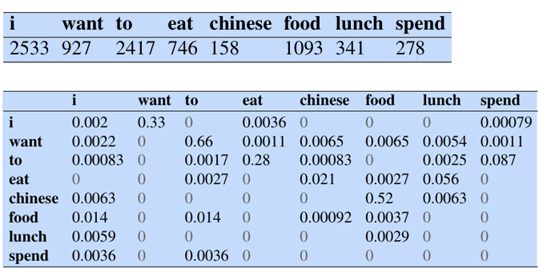
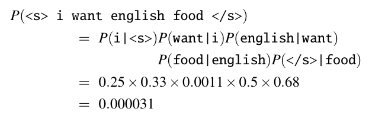
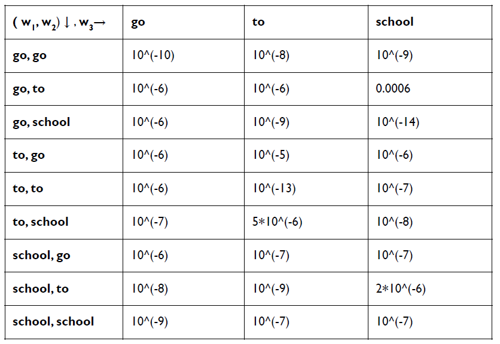

Predicting is difficult - especially about the future, as the old quip goes. But how about predicting something that seems much easier, like the next word someone is going to say?

* TOC
{:toc}

## Introduction
The focus here is to make the model understand the structure of the language and the relationship between words. Basis this understanding, the model can be used to assign probability to a text-segment/sentence.

### What is a Language Model?
A language model is a machine learning model that predicts upcoming words. More formally, a language model assigns a probability to each possible next word, or equivalently gives a probability distribution over possible next words. Language models can also assign a probability to an entire sentence. Thus, an LM could tell us that 

* The following sequence has a much higher probability of appearing in a text: "all of a sudden I notice three guys standing on the sidewalk" than the same set of words in a different order: "on guys all I of notice sidewalk three a sudden standing the".

* P(Have you seen this before) vs P(Have you scene this before?), P(tallest person on earth) vs P(longest person on earth). The first sentences are more likely to occur in the language and hence should be assigned a higher probability.

Once this capability is achieved, then the language model can be used in spell correction, evaluating generated text, matching query to documents, etc. Conditional query-likelihood model is used to match query to documents.

**Conditional Query-likelihood Model:**

Suppose there are $n$ documents. A language model (probability distribution over words) is built for each document. For a given user's query, the model then ranks these documents based on the probability that a specific document's language model would generate the query. That is, documents are ranked by $P(Q \, | \, M_d)$ which represents the probability of the query $Q$ given the document model $M_d$.

## $n$-gram Language Model
An $n$-gram is a sequence of $n$ words:

* A 2-gram (bigram) is a two-word sequence of words like The water, or water of, and
* A 3-gram (a trigram) is a three-word sequence of words like The water of, or water of Walden.

But we also (in a bit of terminological ambiguity) use the word '$n$-gram' to mean a probabilistic model that can estimate the probability of a word given the $n-1$ previous words, and thereby also to assign probabilities to entire sequences.

Let's begin with a task of computing $P(w \, | \, h)$, the probability of a word $w$ given some history $h$. Suppose the history $h$ is "The water of Walden Pond is so beautifully " and we want to know the probability that the next word is blue. One way to estimate this probability is directly from relative frequency counts: take a very large corpus, count the number of times we see "The water of Walden Pond is so beautifully, and count the number of times this is followed by blue. This would be answering the question "Out of the times we saw the history $h$, how many times was it followed by the word $w$", as follows:

$$
\begin{align*}
P(\text{blue} \, | \, \text{The water of Walden Pond is so beautifully}) \\
= \frac{C(\text{The water of Walden Pond is so beautifully blue})}{C(\text{The water of Walden Pond is so beautifully})}
\end{align*}
$$

If we had a large enough corpus, we could compute these two counts and estimate this probability. But even the entire web isn't big enough to give us good estimates for counts of entire sentences. This is because language is creative; new sentences are invented all the time, and we can't expect to get accurate counts for such large sentences.

How can we compute the probability of a word $w$ given a history $h$ or probability of entire sequences like $P(w_1, w_2, \dots, w_N)$? One thing we can do is decompose this probability using the chain rule of probability:

$$
\begin{align*}
P(w_1, w_2, \dots, w_N) & = P(w_1) \, P(w_2 \, | \, w_1) \, P(w_3 \, | \, w_{1:2}) \, \dots \, P(w_N \, | \, w_{1:N-1}) \\
& = \prod_{i=1}^N P(w_i \, | \, w_{1:i-1}) \tag{1}
\end{align*}
$$ 

The chain rule suggests that we could estimate the joint probability of an entire sequence of words by multiplying together a number of conditional probabilities. But using the chain rule doesn’t really seem to help us! We still don't know any way to compute the exact probability of a word given a long sequence of preceding words, $P(w_i \, | \, w_{1:i-1})$.

We can't just estimate by counting the number of times every word occurs following every long string in some corpus, because language is creative, and any particular context might have never occurred before.

### The Markov Assumption
The intuition of the $n$-gram model is that instead of computing the probability of a word given its entire history, we can approximate the history by just the last few words.

The bigram model, for example, approximates the probability of a word given all the previous words by using the probability of the word given only the preceding word.

$$
P(w_i \, | \, w_{1:i-1}) \approx P(w_i \, | \, w_{i-1}) \tag{2}
$$

In other words, instead of computing the below probability, we approximate it with:

$$
P(\text{blue} \, | \, \text{The water of Walden Pond is so beautifully}) \approx P(\text{blue} \, | \, \text{beautifully})
$$

When we use a bigram model to predict the conditional probability of the next word, we are making the approximation in <a href="#eq:eq2">(2)</a>.

The assumption that the probability of a word depends only on the previous word is called a Markov assumption. We can generalize the bigram (which looks one word into the past) to the trigram (which looks two words into the past) and thus to the $n$-gram (which looks $n-1$ words into the past).

Suppose $n$ refers to the $n$-gram size, then we can give a general equation for this $n$-gram approximation to the conditional probability of the next word in a sequence as follows:

$$
P(w_i \, | \, w_{1:i-1}) \approx P(w_i \, | \, w_{i-n+1:i-1})
$$

$n=2$ gives bigram approximation. Given the bigram assumption for the probability of an individual word, we can compute the probability of a complete word sequence by substituting <a href="#eq:eq2">(2)</a> in <a href="#eq:eq1">(1)</a>:

$$
\begin{align*}
P(w_1, w_2, \dots, w_N) & \approx \prod_{i=1}^N P(w_i \, | \, w_{i-1})
\end{align*}
$$

## Model Training - Estimate Probabilities
How do we estimate these $n$-gram probabilities? An intuitive way to estimate probabilities is called maximum likelihood estimation. To compute a particular $n$-gram probability of a word $w_i$ given previous words $w_{i-n+1:i-1}$, we use

$$
\begin{align*}
P_{\text{MLE}}(w_i \, | \, w_{i-n+1:i-1}) & = \frac{C(w_{i-n+1:i-1}w_i)}{\sum_{w \in V} C(w_{i-n+1:i-1} w)} \\
& = \frac{C(w_{i-n+1:i-1} w_i)}{C(w_{i-n+1:i-1})} \\
\end{align*}
$$

This ratio is called a relative frequency. Suppose we have a mini-corpus of three sentences:

* \<s> I am Sam \</s>
* \<s> Sam I am \</s>
* \<s> I do not like green eggs and ham \</s>

Here are the calculations for some of the bigram probabilities from this corpus:

* $P(\text{I} \, | \, <s>)=\frac{2}{3}=0.67$
* $P(\text{Sam} \, | \, <s>)=\frac{1}{3}=0.33$
* $P(\text{am} \, | \, \text{I})=\frac{2}{3}=0.67$
* $P(<\s> \, | \, \text{Sam})=\frac{1}{2}=0.5$

These are the MLE estimates of probabilities computed from a given training dataset.

Let's move on to some examples from a real but tiny corpus. The Berkeley Restaurant Project Corpus has 9332 sentences, and the number of words in the vocabulary is $|V|=1442$.

<figure markdown="0" class="figure zoomable">
<figcaption>
  <strong>Figure 1.</strong> Bigram counts for eight of the words from the Berkeley Restaurant Project Corpus. Each cell shows the count of the column label word following the row label word. Thus, the cell in row $i$ and column want means that want followed $i$ 827 times in the corpus, $C(\text{want} \, | \, \text{i})= 827$.
  </figcaption>
</figure>

The bigram probabilities after normalization (dividing each cell in the table above by the appropriate unigram for its row. The unigram probabilities of each word $w_i$ is computed by

$$
P(w_i) = \frac{C(w_i)}{N}
$$

where $N$ is the total number of word tokens in the corpus.

<figure markdown="0" class="figure zoomable">
<figcaption>
  <strong>Figure 2.</strong> Bigram probabilities for eight words in the Berkeley Restaurant Project corpus. Zero probabilities are in gray.
  </figcaption>
</figure>

Now, we can compute the probability of sentences like "I want English food" or "I want Chinese food" by simply multiplying the appropriate bigram probabilities together, as follows:

<figure markdown="0" class="figure zoomable">

</figure>

  
WARNING

  
For example, suppose the word 'Chinese' occurs 400 times in our training corpus of a million words. Then, the MLE estimate of its probability, $P(\text{chinese})$ will be 0.0004. This is the probability that a random word selected from some other text of, say, a million words will be the word Chinese. Now, 0.0004 is not the best possible estimate of the probability of Chinese occurring in all situations; it might turn out that in some other corpus Chinese is a very unlikely word. So, we have to modify the MLE estimates slightly to get better probability estimates.

### Parameters of the Model
Suppose the vocabulary size is 10. And we want to build a trigram language model. For a trigram language model, the MLE estimate of probability is

$$
P(w_i \, | \, w_{i-1}, w_{i-2}) = \frac{C(w_{i-2} \, w_{i-1} w_n)}{C(w_{i-2} \, w_{i-1})}
$$

The possible contexts are all ordered pairs: $(w_{i-2}\, w_{i-1}) \in V \times V$. So, the number of possible contexts is 100. For each context, the model defines a distribution over the next word. So, we could represent the trigram model as:

* 100 rows: contexts
* 10 columns: possible next words

Total parameters of the model are $100 \times 10$. The trigram model defines probabilities for all $10^3$ possible trigrams.

<figure markdown="0" class="figure zoomable">
<figcaption>
  <strong>Figure 3.</strong> For the corpus "go to school", $|V|=3$. The trigam model then defines 27 probabilities.
  </figcaption>
</figure>

If a context never appears $C(w_{i-2} \, w_{i-1})=0$. Then, the MLE probability is undefined. If a trigram never appears, then the MLE probability is 0. These cases are corrected by smoothing.

In general, for an $n$-gram model, the total number of parameters are $|V|^n$. It is almost impossible to capture those many entries. And as we increase the gram size, the matrix gets bigger and sparse, the probability estimates become unreliable and noisy. In such cases, most of the probabilities will be smoothed probabilities; we are highly likely to move away from the original data.

  
WARNING

  
We typically don't go beyond the gram size of $n=3$ or $4$.

## Model Testing
Suppose we trained a trigram model. And we want to test it on a test sentence: "I like NLP". We need to compute the probability of this sentence using the trigram probabilities. So, we add start-of-sentence markers to ensure that every token has a two-token context:

\<s> \<s> I like NLP \</s>

Now, the sentence probability can be computed by trigram probabilities.

### Handling Out-of-Vocabulary Words
What happens if a particular word, say Jurafsky, never occurs in our training set, but pops up in the test set?

A language model assigns probabilities only to words in its training vocabulary. If a test sentence contains a word $w \notin V$, then $P(w \, | \, h)$ is undefined. Since sentence probability is a product of token probabilities, this would make the entire sentence probability zero, leading to infinite perplexity.

In classical $n$-gram models, the standard solution is to add a special token \<UNK> to the vocabulary during training. Rare words (or words outside a chosen vocabulary cutoff) are replaced with \<UNK>. Example training corpus:

* I love NLP
* I love statistics

If "statistics" is rare, we transform training data to

* I love NLP
* I love \<UNK>

Now the model learns probabilities like $P(<\text{UNK}> \, | \, \text{love})$.

Now, when a test sentence contains a word not in the vocabulary, we map it to \<UNK>. Then, the probability of the test sentence is computed.

  
NOTE

  
We normally run our NLP algorithms not on words but on subword tokens. With subword tokenization (like the BPE algorithm) any word can be modeled as a sequence of known smaller subwords, if necessary by a sequence of tokens corresponding to individual letters.
  
  So actually, the language model vocabulary is normally the set of (subword) tokens rather than words, and in this way the test set can never contain unseen tokens.

