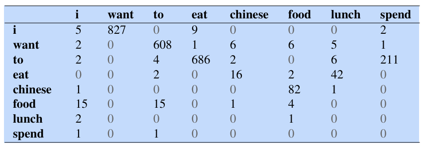
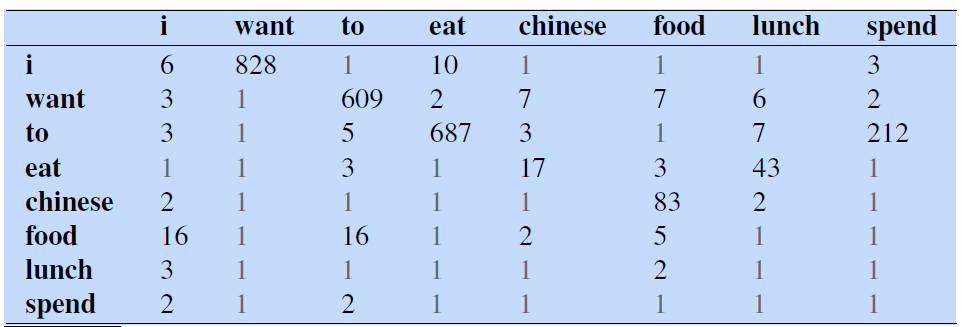
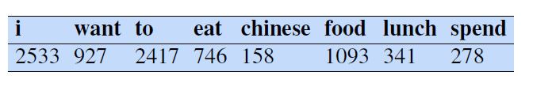
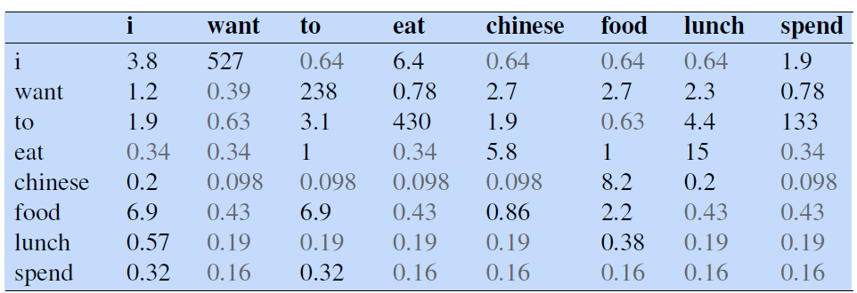

* TOC
{:toc}

## Smoothing Techniques
There is a problem with using maximum likelihood estimates for probabilities: any finite training corpus will be missing some perfectly acceptable English word sequences. That is, cases where a particular $n$-gram never occurs in the training data but appears in the test set.

These unseen sequences or **zeros** are sequences that don't occur in the training set but do occur in the test set. If the conditional probability of any word in the test set is 0, the probability of the whole test set is 0. Perplexity is defined based on the inverse probability of the test set. Thus, if some words in context have zero probability, we can't compute perplexity at all, since we can't divide by zero!

In the long chain of conditional probability multiplications, if one of the probabilities is 0, then the probability of the sentence, $P(W)$, becomes 0. Suppose there are two sentences $W_1$ and $W_2$, where $W_1$ has error in one of the words and $W_2$ is a junk sentence.

* $W_1$: What is the mane of the person?
* $W_2$: Car what king much bed you

Then, both these sentences are assigned a probability of 0. The standard way to deal with putative "zero probability n-grams" is smoothing or discounting. Smoothing algorithms shave off a bit of probability mass from some more frequent events and give it to unseen events. Some of the smoothing algorithms are:
1. Laplace (add-one) smoothing
2. $n$-gram interpolation
3. Stupid backoff

## Laplace Smoothing
The simplest way to do smoothing is to add one to the counts in the numerator, and normalize them into probabilities. All the counts that used to be zero will now have a count of 1, the counts of 1 will be 2, and so on. This algorithm is called **Laplace or add-1** smoothing.

The normal probabilities are computed by:

$$
P_{\text{MLE}}(w_i \, | \, w_{1:i-1}) = \frac{C(w_{1:i-1} \, w_i)}{\sum_{w \in V} C(w_{1:i-1}\,w)} \hspace{1cm} \text{and} \hspace{1cm} P_{\text{MLE}}(w_i) = \frac{C(w_i)}{N}
$$

To avoid the probability from becoming 0, we add 1 to the count $C(w_{1:i-1} \, w_i)$ in the numerator. This guarantee that the numerator cannot be 0. As the result, the probability is guaranteed to be non-zero. Then, to normalize it, on adding 1 to all the counts in the denominator as well:

$$
\begin{align*}
P_{\text{add-1}}(w_i \, | \, w_{1:i-1}) & = \frac{C(w_{1:i-1} \, w_i)+1}{\sum_{w \in V} \left( C(w_{1:i-1}\,w) + 1 \right)} = \frac{C(w_{1:i-1} \, w_i)+1}{\sum_{w \in V} C(w_{1:i-1}\,w) + |V|} = \frac{C(w_{1:i-1} \, w_i)+1}{C(w_{1:i-1}) + |V|}
\\ \text{and} 
\\
P_{\text{add-1}}(w_i) & = \frac{C(w_i)+1}{N + |V|}
\end{align*}
$$

because

$$
\begin{align*}
\sum_{w \in V} C(w_{1:i-1} \, w) & = C(w_{1:i-1}) \\
\end{align*}
$$

**Example:**

The bigram counts for eight of the words from the Berkeley Restaurant Project Corpus.

<figure markdown="0" class="figure zoomable">
<figcaption>
  <strong>Figure 1.</strong> Bigram counts for eight of the words from the Berkeley Restaurant Project Corpus. Each cell shows the count of the column label word following the row label word. Thus, the cell in row $i$ and column want means that want followed $i$ 827 times in the corpus, $C(\text{want} \, | \, \text{i})= 827$.
  </figcaption>
</figure>

<figure markdown="0" class="figure zoomable">
<figcaption>
  <strong>Figure 2.</strong> Add-one smoothed bigram counts for eight of the words from the Berkeley Restaurant Project Corpus.
  </figcaption>
</figure>

**Reconstituted Counts:**
One useful visualization technique is to reconstruct an adjusted counts= matrix $C^*$ so we can see how much a smoothing algorithm has changed the original counts. The adjusted count $C^*$ is the count that, if divided by $C(w_{1:i-1})$, would result in the smoothed probability.

$$
P_{\text{add-1}}(w_i \, | \, w_{1:i-1}) = \frac{C(w_{1:i-1} \, w_i)+1}{C(w_{1:i-1}) + |V|} = \frac{C^*(w_{1:i-1} \, w_i)}{C(w_{1:i-1})}
$$

which can be solved by re-arranging terms

$$
C^*(w_{1:i-1} \, w_i) = \frac{[C(w_{1:i-1} \, w_i)+1] \cdot C(w_{1:i-1})}{C(w_{1:i-1}) + |V|}
$$

For bigram model, this is:

$$
C^*(w_{i-1} \, w_i) = \frac{[C(w_{i-1} \, w_i)+1] \cdot C(w_{i-1})}{C(w_{i-1}) + |V|}
$$

With the unigram counts as follows, and the number of words in the vocabulary $|V|=1442$.

<figure markdown="0" class="figure zoomable">

</figure>

The reconstituted counts for eight words are:

<figure markdown="0" class="figure zoomable">
<figcaption>
  <strong>Figure 3.</strong> Add-one reconstituted counts for eight words from the Berkeley Restaurant Project Corpus.
  </figcaption>
</figure>

$$
C^*(\text{want to}) = \frac{609 * 927}{ 927 + 1442} = 238.3
$$

This adjusted $n$-gram count matrix $C^*(w_{i-n+1:i-1} \, w_i)$  can then be compared directly with the MLE $n$-gram count matrix $C(w_{i-n+1:i-1} \, w_i)$. If we do too much smoothing, we will deviate away from our original count matrix, that is, $C^*(w_{i-n+1:i-1} \, w_i)$ will be very different from $C(w_{i-n+1:i-1} \, w_i)$.

We can see that the count of the bigram "Want to" is changed from 608 to 238. The **discount $d$** is defined as the ratio between new and old counts. The discount for the bigram "want to" is $0.39$. This indicates that we have smoothed the counts too much.

We can see this in probability space as well: $P(\text{to} \, | \, \text{want})$ decreased from $\frac{608}{927}=0.66$ to $\frac{238}{927}=0.26$. The sharp change occurs because too much probability mass is moved to all the zeros.

### Add-$k$ Smoothing
One alternative to add-one smoothing is to move a bit less of the probability mass from the seen to the unseen events. Instead of adding 1 to each count, we add a fractional count $k$ such as $0.5, 0.01$, etc.

$$
P_{\text{add-K}}(w_i \, | \, w_{1:i-1}) = \frac{C(w_{1:i-1} \, w_i)+k}{C(w_{1:i-1}) + k|V|}
$$

Add-$k$ smoothing requires that we have a method for choosing $k$; this can be done by optimizing on the devset.

## LM Interpolation
To solve the problem of zero counts, we can combine different order $n$-grams by linearly interpolating them. That is, we estimate the trigram probability by interpolating (weighting and combining) the trigram, bigram, and unigram probabilities, each weighted by a $\lambda$.

$$
\hat{P}(w_i \, | \, w_{i-2} \, w_{i-1}) = \lambda_1 P(w_i) + \lambda_2 P(w_i \, | \, w_{i-1}) +  \lambda_3 P(w_i \, | \, w_{i-2} \, w_{i-1})
$$

The $\lambda$s must sum to 1. These $\lambda$s are hyperparameters learnt from a held-out corpus.

In a slightly more sophisticated version of linear interpolation, each $\lambda$ can be computed by conditioning on the context.

$$
\hat{P}(w_i \, | \, w_{i-2} \, w_{i-1}) = \lambda_1(w_{i-2} \, w_{i-1}) P(w_i) + \lambda_2(w_{i-2} \, w_{i-1}) P(w_i \, | \, w_{i-1}) +  \lambda_3(w_{i-2} \, w_{i-1}) P(w_i \, | \, w_{i-2} \, w_{i-1})
$$

where $\lambda_1, \lambda_2, \lambda_3$ are all functions of context words.

This way, if we have particularly accurate counts for a particular bigram, we assume that the counts of the trigrams based on this bigram will be more trustworthy, so we can make the $\lambda$s for those trigrams higher and thus give that trigram more weight in the interpolation.

## Stupid Backoff
An alternative to interpolation is backoff. In a backoff model, if the $n$-gram we need has zero counts, we approximate it by backing off to the $(n-1)$ grams. We continue backing off until we reach a history that has some counts.

For a backoff model to give a correct probability distribution, we have to discount the higher-order $n$-grams to save some probability mass for the lower order $n$-grams. In practice, instead of discounting, it's common to use a much simpler non-discounted backoff algorithm called stupid backoff.

Let $n$ be the gram size. If a higher-order $n$-gram has a zero count, we simply backoff to a lower order $n$-gram, weighed by a fixed weight $\lambda$. So, this algorithm does not produce a probability distribution; thus we refer to it as score $S$.

$$
S(w_i \, | \, w_{i-n+1: i-1}) =  \begin{cases}
        \frac{C(w_{i-n+1: i})}{C(w_{i-n+1: i-1})} & \text{if } C(w_{i-n+1: i})>0 \\
        \lambda \, S(w_i \, | \, w_{i-n+2: i-1}) & \text{otherwise }
    \end{cases}
$$

The backoff terminates in the unigram, which has score $S(w_i) = \frac{C(w_i)}{N}$. A value of $\lambda=0.4$ works well.

In essential, in a trigram model, if the probability value  

$$
P(w_i \, | \, w_{i-2}\,w_{i-1}) = \frac{C(w_{i-2} \, w_{i-1} \, w_i)}{C(w_{i-2}\, w_{i-1})}
$$

is 0, we assign the bigram probability to it:

$$
P(w_i \, | \, w_{i-2}\,w_{i-1}) := \lambda \, \frac{C(w_{i-1} \, w_i)}{C(w_{i-1})} = \lambda \, P(w_i \, | \, w_{i-1})
$$

If this is also 0, then we go to unigram probability, $P(w_i)$.

By doing so, $\sum_{w_i \in V} P(w_i \, | \, w_{i-2}\,w_{i-1})$ will not sum to 1. We are not correcting it.

  
WARNING

  
Note that the stupid backoff is carried out during training.

