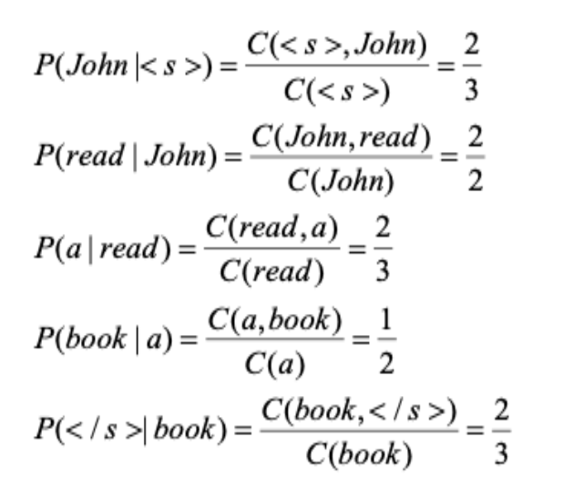
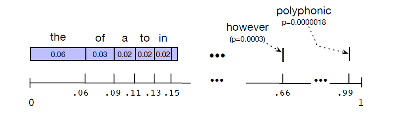

The language modelling can be done using various $n$-gram models using different smoothing techniques. How do we evaluate the performance of these models, and find the better one?

* TOC
{:toc}

## Evaluating Language Models
In order to evaluate any machine learning model, we need to have at least three distinct datasets: the training set, the development set, and the test set.

* The training set is the data we use to learn the parameters of our model.
* The test set is a different, held-out set of data, not overlapping with the training set, that we use to evaluate the model. The test set should reflect the language we want to use the model for. If we're going to use our language model for speech recognition of chemistry lectures, the test set should be text of chemistry lectures.

If we are given a corpus of text and want to compare the performance of two different n-gram models, we divide the data into training and test sets, and train the parameters of both models on the training set. We then compare how well the two trained models fit the test set, i.e., whichever language model assigns a higher probability to the test set - is a better model. This essentially means that a better model is the one that is better at predicting upcoming words.

If we test our language model on the test set many times after making different changes, we might implicitly tune the model to the test data's characteristics, by noticing which changes seem to make the model better. For this reason, we normally have a third dataset called a **development test set** or devset. We do all our testing on this dataset until the very end, and then we test on the test set once to see how good our model is. But how to evaluate a model?

The best way to evaluate the performance of a $n$-gram language model or neural LLMs is to embed it in an application (such as speech recognition or machine translation), make use of the computed probabilities, and observe how much the application improves. We can compare the performance of two candidate language models by running the speech recognizer or machine translator twice, once with each language model, and seeing which gives the more accurate transcription. Such end-to-end evaluation is called **extrinsic evaluation**. Unfortunately, running big NLP systems end-to-end is often very expensive.

Instead, it's helpful to have a metric that can be used to quickly measure the language model performance. An **intrinsic evaluation** metric is one that measures the quality of a model independent of any application. **Perplexity** is one of such metrics.

### Perplexity
The perplexity (sometimes abbreviated as PP or PPL) of a (trained) language model on a test set is the inverse probability of the test set (one over the probability of the test set), normalized by the number of tokens $N$. The reason for normalization is that the probability of a test set (or any sequence) depends on the number of tokens in it; the probability of a sentence gets smaller the longer the sentence.

Perplexity measures the average uncertainty per predicted token. For this reason it's sometimes called the per-word or per-token perplexity. We normalize by the number of tokens $N$ by taking the $N$th root.

Given a test set $W=(w_1\,w_2 \dots w_N)$ with $N$ tokens and an $n$-gram model, we compute its perplexity as:

$$
\begin{align*}
\text{Perplexity}(W) & = P(w_1\,w_2 \dots w_N)^{-\frac{1}{N}} \\
& = \sqrt[N]{\frac{1}{P(w_1\,w_2 \dots w_N)}} \\
& = \sqrt[N]{\prod_{i=1}^N \frac{1}{P(w_i \, | \, w_{i-n+1} \dots w_{i-1})}} \\
\end{align*}
$$

With a bigram language model

$$
\text{Perplexity}(W) = \sqrt[N]{\prod_{i=1}^N \frac{1}{P(w_i \, | \, w_{i-1})}}
$$

Perplexity is normalized by length, so we can use it to compare the model performance across texts of different lengths.

The higher the probability of the word sequence, the lower the perplexity. Thus, the lower the perplexity of a model on the data, the better the model. A better model is better at predicting upcoming words, and so it will be less surprised by (i.e., assign a higher probability to) each word when it occurs in the test set.

**Example 01:**
Suppose our train corpus is for which we have added sentence markers:

* \<s> John read her book \<\s>
* \<s> I read a different book \<\s>
* \<s> John read a book by Mulan \<\s>

And the test document $W$ is: \<s> John read a book \<\s>

We train a bigram model on the training set, i.e., compute the statistics (bigram probabilities). Then, test the model by computing the test set probability:

<figure markdown="0" class="figure zoomable">

</figure>

The test set has $N=5$ tokens. Then, the perplexity is 

$$
\sqrt[5]{\frac{1}{0.66 * 1 * 0.66 * 0.5 * 0.66}} = 1.47
$$

**Example 02:**
If the test corpus has two sentences:

* I like NLP
* Language models are useful

When evaluating perplexity, we often treat the test corpus as a single sequence with sentence markers:

\<s> I like NLP \</s> \<s> Language models are useful \</s>

The model computes probabilities for the sequence step by step:

$$
P(\text{I} \, | \, <s>) \cdot P( \text{like} \, | \, \text{I}) \cdot \dots \cdot P(</s> \, | \, \text{useful})
$$

So the end-of-sentence token \</s> is something the model must predict. After the first sentence ends, the sequence continues to compute $P(<s> \,  | \, </s>)$. But this probability is almost always 1, because this transition is trivial and artificial. Therefore, we typically exclude \<s> from the token count $N$. For a sentence $<s>\, w_1 \, w_2 \, \dots \, w_T \, </s>$, the number of tokens is $N=T+1$.

  
WARNING

  
Given a text $W$, Perplexity can be used to compare the performance of different language models on $W$. The perplexity of two language models is only comparable if they use identical vocabularies. Because if the vocabularies changes, the number of possible next tokens changes. The models assign probabilities to different token sets, and therefore the probability mass is distributed differently across the vocabularies.
  
  And, without smoothing/backoff, perplexity is meaningless for real test data.

## Sampling Sentences
One important way to visualize what kind of knowledge a language model embodies is to sample from it. Sampling from a distribution means to choose random points according to their likelihood.

A language model represents a distribution over sentences. So, sampling from a language model is choosing each sentence according to its likelihood as defined by the model. We are more likely to generate sentences that the model thinks have a high probability.

It's simplest to visualize how this works for the unigram case. Our goal is to sample sentences by repeatedly sampling unigrams. Imagine all the words of the English language covering the number line between 0 and 1, each word covering an interval proportional to its frequency.

<figure markdown="0" class="figure zoomable">
<figcaption>
  <strong>Figure 1.</strong> A visualization of the sampling distribution for sampling sentences by repeatedly sampling unigrams. The words are ordered from most frequent to least frequent, but the choice of order can be arbitrary.
  </figcaption>
</figure>

We choose a random value between 0 and 1, find that point on the probability line, and print the word whose interval includes this chosen value. We continue choosing random numbers and generating words until we randomly generate the sentence-final token \</s>.

We can use the same technique to generate bigrams by first generating a random bigram that starts with \<s> (according to its bigram probability). That is, form a number line as above for the probability distribution $P(w \, | \, <s>)$ and sample a word. Let’s say the second word of that bigram is $w$. We next choose a random bigram starting with $w$ (again, drawn according to its bigram probability), and so on.

