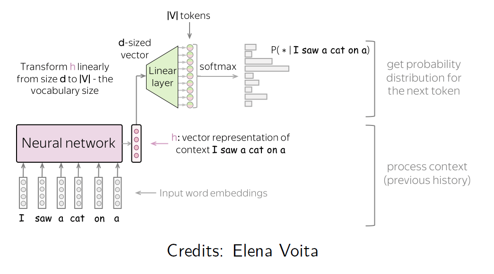
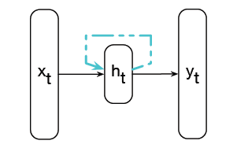
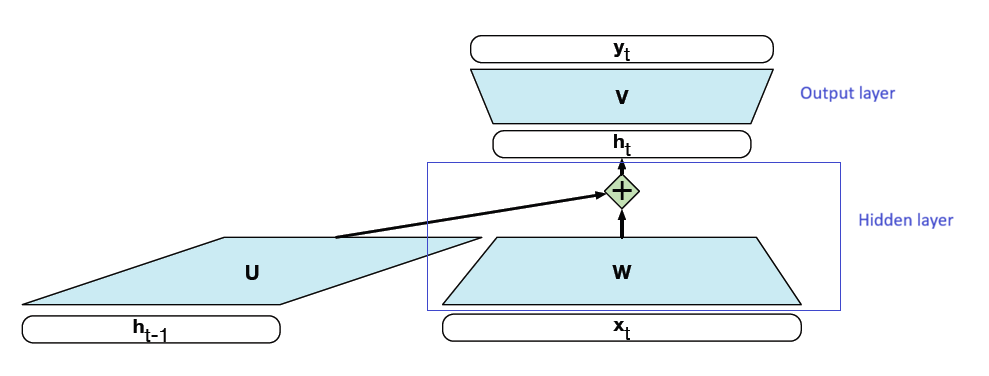
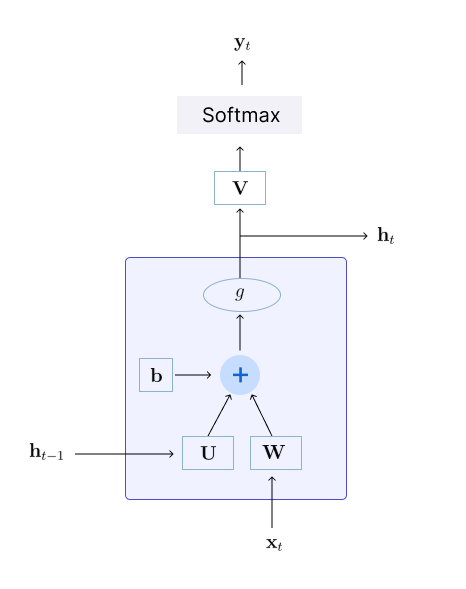
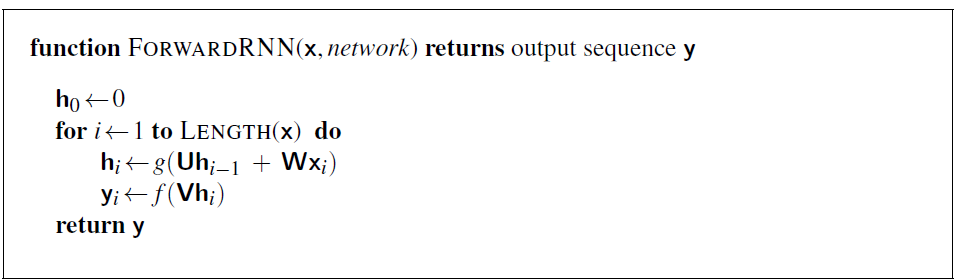
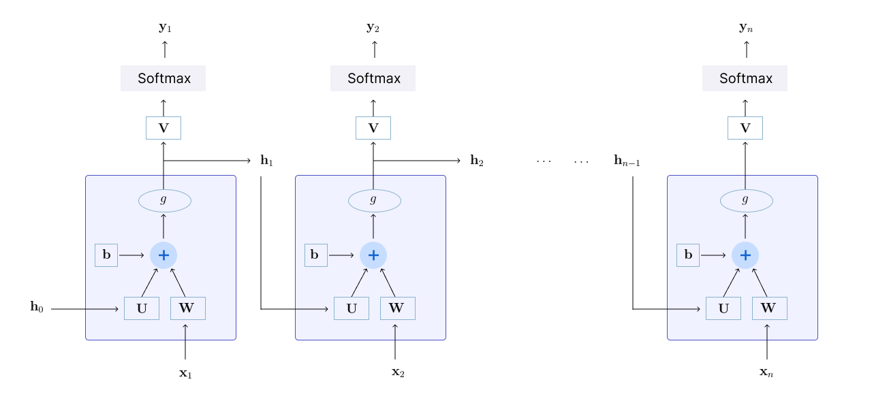
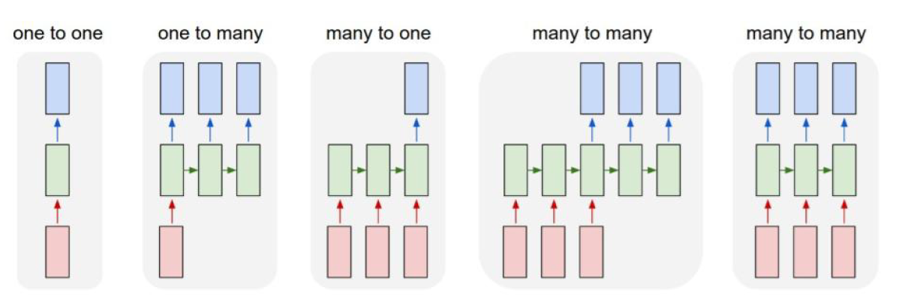

* TOC
{:toc}

## Introduction
Language is inherently sequential in nature. That is, language is a time series composed of sequence of words.

* Words are sequences of characters.
* Sentences are sequences of words.
* Paragraphs / documents / dialogues are sequences of sentences.

We need to model the order and dependency in the data, and the dependency can be long-distance. For example in these sentences, what is the referent of "they"?

* The city councilmen refused the demonstrators a permit because **they** feared violence.
* The city councilmen refused the demonstrators a permit because **they** advocated violence.

These two sentences differ only in one word. Due to this word change, the noun associated with 'they' is changing. In the first sentence, 'they' refers to the city councilmen, and in the second sentence, it refers to the demonstrators. This indicates that the language has long-range dependencies.

In the previous sections, we saw the statistical way of modelling the language using the classical $n$-gram language models. But the $n$-gram LMs can go only till few words into the past; beyond which we don't get sufficient statistics. So instead of using statistical based models for language modelling, can we use deep learning architectures to estimate the probabilities?

<figure markdown="0" class="figure zoomable">
<figcaption>
  <strong>Figure 1.</strong> Neural network consuming an input sequence $w_{1:n-1}$ and predicting the next token in the sequence.
  </figcaption>
</figure>

From the resulting probability distribution, we can select the word that has the highest probability and predict it as the next token. Then, this word is added to the sequence, i.e., as input to the next time step and the process is repeated. The process is stopped when the model predicts \<eos> as the next token.

The recurrent neural network (RNNs) and RNN variants like LSTMs are designed to handle such sequential tasks, and they also offer a way to represent the prior context, allowing the model's decision to depend on information from hundreds of words in the past. 

## What are RNNs?
A recurrent neural network (RNN) is any network that contains a cycle within its network connections, meaning that the value of some unit is directly, or indirectly, dependent on its own earlier outputs as an input.

<figure markdown="0" class="figure zoomable">
<figcaption>
  <strong>Figure 2.</strong> A Simple recurrent neural network
  </figcaption>
</figure>

The hidden layer includes a recurrent connection as part of its input. That is, the activation value of the hidden layer $\mathbf{h}_t$ depends on the current input $\mathbf{x}_t$ as well as the activation value of the hidden layer from the previous time step $\mathbf{h}_{t-1}$.

Sequences are processed by presenting one item at a time to the network. So, here $\mathbf{x}_t$ refers to the input vector $\mathbf{x}$ at time $t$.

The output of the hidden layer from the previous time step  $\mathbf{h}_{t-1}$ provides a form of memory, or context, that encodes the summary of all the past inputs and informs the decisions to be made at later points in time. Critically, this approach does not impose a fixed-length limit on this prior context (as in $n$-gram models). The context embodied in $\mathbf{h}_{t-1}$ can include information extending back to the beginning of the sequence.

  
TIP

  
RNNs are infinite response models, i.e., an input in the past can have influence all the way to the present. An input $\mathbf{x}_t$ has influence on the output $\mathbf{y}_t$ and on all the further outputs (all the timesteps > $t$), i.e., $\mathbf{x}_t$'s influence doesn't die. This way, all the inputs till $t$ (including) influence the output at $t$. 

**Similarity with FFN:**

In essence, given an input vector $\mathbf{x}_t$ and the output of the hidden layer from the previous time step $\mathbf{h}_{t-1}$, we are still performing the standard feedforward calculation.

<figure markdown="0" class="figure zoomable">
<figcaption>
  <strong>Figure 2.</strong> Simple recurrent neural network illustrated as a feedforward network
  </figcaption>
</figure>

The most significant change lies in the new set of weights, $\mathbf{U}$, that connect the hidden layer from the previous time step to the current hidden layer. These weights determine how the network makes use of past context in calculating the output for the current input.

## Inference with RNNs
To compute an output $\mathbf{y}_t$ for an input $\mathbf{x}_t$, we multiply the input $\mathbf{x}_t$ with the weight matrix $\mathbf{W}$, and the hidden layer output from the previous time step $\mathbf{h}_{t-1}$ with the weight matrix $\mathbf{U}$. We add these values together and pass them through a suitable activation function, $g$, to arrive at the activation value for the current hidden layer, $\mathbf{h}_t$. Once we have the values for the hidden layer, we proceed with the usual computation to generate the output vector.

$$
\begin{align*}
\mathbf{h}_t & = g(\mathbf{U}\mathbf{h}_{t-1} + \mathbf{W} \mathbf{x}_t) \\
\mathbf{y}_t & = \text{softmax}(\mathbf{V}\mathbf{h}_t)
\end{align*}
$$

$\mathbf{y}_t$ gives a probability distribution over the possible output classes.

Let's refer to the input, hidden and output layer dimensions as $d_{in}, d_h, d_{out}$ respectively. Given this, our three parameter matrices are:

* $\mathbf{W} \in \mathbb{R}^{d_h \times d_{in}}$: the weights from the input to the hidden layer
* $\mathbf{U} \in \mathbb{R}^{d_h \times d_h}$: the weights from the previous hidden layer to the current hidden layer.
* $\mathbf{V} \in \mathbb{R}^{d_{out} \times d_h}$: the weights from the hidden layer to the output layer.

<figure markdown="0" class="figure zoomable">
<figcaption>
  <strong>Figure 3.</strong> An RNN cell
</figure>

The sequential nature of simple recurrent networks can be seen by unrolling the network in time.

<figure markdown="0" class="figure zoomable">
<figcaption>
  <strong>Figure 4.</strong> Forward inference in a simple recurrent network where we are mapping a sequence of inputs $\mathbf{x}$ to a sequence of outputs $\mathbf{y}$. The initial hidden state $\mathbf{h}_0$ is often set to 0, or it can be initialized with random values and learned to get a better starting point.
</figure>

The matrices $\mathbf{W}, \mathbf{U}, \mathbf{V}$ are shared across time, while new values $\mathbf{h}_i$ and $\mathbf{y}_i$ are calculated with each time step. Note that the loop is repeated for the length of $\mathbf{x}$. Thus, the network can handle inputs of varying length.

<figure markdown="0" class="figure zoomable">
<figcaption>
  <strong>Figure 5.</strong> Unrolling the network in time
</figure>

**Different Configurations:**

There are different variations of the RNNs architecture depending on the tasks.

<figure markdown="0" class="figure zoomable">
<figcaption>
  <strong>Figure 6.</strong> Different configurations of RNNs
</figure>

Many-to-many has different configurations: In some tasks like language translation, we may want the output to start after the completion of the input, whereas for some other tasks we may want the model to generate the output at every instance the input is fed.

### Training of RNNs
Training of RNNs is done using backpropagation through time (BPTT). To update the parameters $\mathbf{W}, \mathbf{U}, \mathbf{V}$, we need to compute $\frac{\partial L}{\partial \mathbf{W}}, \frac{\partial L}{\partial \mathbf{U}}, \frac{\partial L}{\partial \mathbf{V}}$.

The hidden layer at time step $i$ contributes to the loss at the next time step since it takes part in that calculation. As a result, during the backward pass of training, the hidden layers are subject to repeated multiplications, as determined by the length of the sequence. A frequent result of this process is that the gradients are eventually driven to zero, a situation called the **vanishing gradients** problem.

When gradients are close to 0, there will be no updates to the weights. The gradient signal gets smaller and smaller as it backpropagates further, i.e., the gradient signal from far away is lost because it's much smaller than the gradient signal from close-by. So, model weights are updated only with respect to near effects, and not long-term effects.

Thus, it is difficult to encode very long-distance information in RNNs.