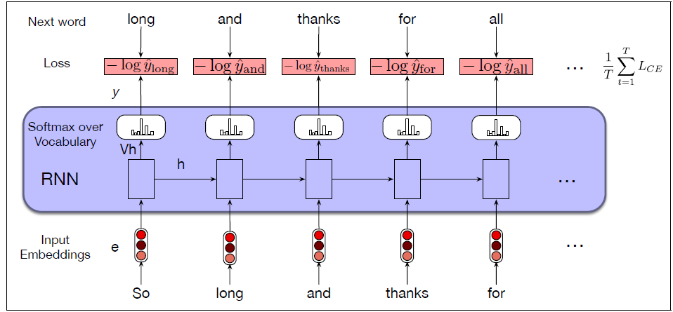
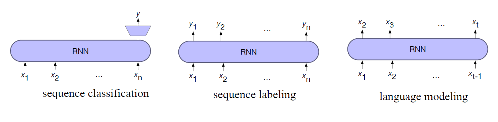
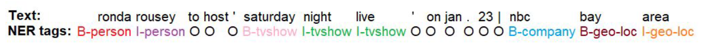
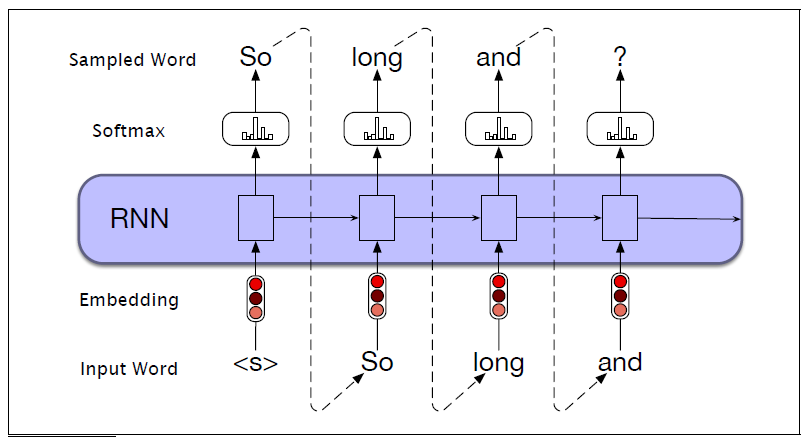

* TOC
{:toc}

## RNNs as Language Models
As we know language models predict the next word in a sequence given some preceding context, $P(w_i \, | \, w_{1:i-1})$.

The $n$-gram language models with gram size $n$ compute the probability of a word given counts of its occurrence with the $n-1$ prior words.

$$
P(w_i \, | \, w_{1:i-1}) \approx P(w_i \, | \, w_{i-n+1:i-1})
$$

The context is thus of size $n-1$. For the feedforward language models, the context is the fixed window size.

The input sequence $\mathbf{X} = \{\mathbf{x}_1, \dots, \mathbf{x}_i, \dots, \mathbf{x}_N\}$ consists of a series of words each represented as a one-hot vector of size $|V| \times 1$, and the output prediction $\hat{\mathbf{y}}_i$ is a vector representing a probability distribution over the vocabulary.

The RNN language models process the input sequence one word at a time $\mathbf{x}_i$, attempting to predict the next word from the current word and the previous hidden state.

  
TIP

  
RNNs thus don't have the limited context problem that $n$-gram models have, or the fixed context that feedforward language models have, since the hidden state can in principle represent information about all the preceding words all the way back to the beginning of the sequence.

At each step $i$, the model uses the word embedding matrix $\mathbf{E}$ to retrieve the embedding for the current word, multiples it by the weight matrix $\mathbf{W}$, and then adds it to the hidden layer from the previous step (weighted by weight matrix $\mathbf{U}$) to compute a new hidden layer. This hidden layer is then used to generate an output layer which is passed through a softmax layer to generate a probability distribution over the entire vocabulary. That is, at time $i$

$$
\begin{align*}
\mathbf{e}_i & = \mathbf{E} \mathbf{x}_i \\
\mathbf{h}_i & = g(\mathbf{U} \mathbf{h}_{i-1} + \mathbf{W} \mathbf{e}_i) \\
\hat{\mathbf{y}}_i & = \text{softmax}(\mathbf{V} \mathbf{h}_i) \\
\end{align*}
$$

Note that after training $\hat{\mathbf{y}}_i$ should have high probability for the next true word $w_{i+1} = \mathbf{x}_{i+1}$.

When we do language modeling with RNNs, it's convenient to make the assumption that the embedding dimension $d_e$ and the hidden dimension $d_h$ are the same. So we'll just call both of these the model dimension $d$. Then,

* $\mathbf{x}_i \in \mathbb{R}^{|V| \times 1}$
* $\mathbf{E} \in \mathbb{R}^{d \times |V|},\,\, \mathbf{e}_i \in \mathbb{R}^{d \times 1}$
* $\mathbf{W}, \mathbf{U} \in \mathbb{R}^{d \times d} ,\,\, \mathbf{h}_i \in \mathbb{R}^{d \times 1}$
* $\mathbf{V} \in \mathbb{R}^{|V| \times d},\,\, \mathbf{Vh}_i \in \mathbb{R}^{|V| \times 1}$. The vector $\mathbf{Vh}_i$ can be thought of as a set of scores over the vocabulary given the evidence provided in $\mathbf{h}_i$. Passing these scores through the softmax normalizes the scores into a probability distribution $\hat{\mathbf{y}}_i$.

The probability that a particular word $k$ in the vocabulary is the next word is represented by $\hat{\mathbf{y}}_i[k]$, the $k$th component of $\hat{\mathbf{y}}_i$.

$$
P(w_{i+1} = k \, | \, w_{1:i}) = \hat{\mathbf{y}}_i[k]
$$

### Training an RNN Language Model
To train an RNN as a language model, we use the same self-supervision (or self-training) algorithm: we take a corpus of text as training material and at each time step $i$ ask the model to predict the next word.

We simply train the model to minimize the error in predicting the true next word in the training sequence, using cross-entropy as the loss function.

$$
L_{CE}(\hat{\mathbf{y}}_i, \mathbf{y}_i) = - \sum_{w \in V} \mathbf{y}_i[w] \, \log \, \hat{\mathbf{y}}_i[w] 
$$

If the actual next word is $w_{i+1}$, then the vector $\mathbf{y}_i$ will have 1 for the actual next word, and 0 for all the other entries. Thus, the cross-entropy loss for language modeling is determined by the probability the model assigns to the correct next word. So at time $i$, the CE loss is the negative log probability the model assigns to the next word in the training sequence.

$$
L_{CE}(\hat{\mathbf{y}}_i, \mathbf{y}_i) = - \log \, \hat{\mathbf{y}}_i[w_{i+1}] 
$$

<figure markdown="0" class="figure zoomable">
<figcaption>
  <strong>Figure 1.</strong> Training RNNs as language models
</figure>

Suppose we have the training sequence \<s> so long and thanks for \</s>, we pass

* Initialize $\mathbf{h}_0=\mathbf{0}$ and $\mathbf{x}_1$ - the vector corresponding to the start token. The model will output $\mathbf{h}_1$ and $\hat{\mathbf{y}}_1$ from which we take the probability of the correct next word 'so', that is, $\hat{\mathbf{y}}_1$['so']. Calculate the loss $-\log \hat{\mathbf{y}}_1$['so']$.

* Then, we pass $\mathbf{h}_1$ and $\mathbf{x}_2$ - the vector corresponding to the correct next word 'so'. This gives us $\hat{\mathbf{y}}_2$ from which we take the probability of the correct next word 'long', that is, $\hat{\mathbf{y}}_1$['love'].  Calculate the loss $-\log \hat{\mathbf{y}}_1$['long']$.

* And so on.

Compute the average CE loss over the training sequence, and back propagate the loss to adjust the weights of the network.

This idea that we always give the model the correct history sequence to predict the next word (rather than feeding the model its best case from the previous time step) is called **teacher forcing**.

The learnable parameters are: embedding matrix $\mathbf{E}$, input weights $\mathbf{W}$, recurrent weights $\mathbf{U}$, and output weights $\mathbf{V}$.

In most modern neural language models, the embedding matrix is initialized randomly and learned during training, but sometimes the embedding matrix is pretrained and kept fixed. Pretrained embeddings such as Word2Vec, GloVe, FastText, etc. can be used, and the embedding matrix can then be just used as a lookup table.

### Testing the Model
Once the model is trained, we can use it to compute the probability of an entire sequence. The probability of an entire sequence is just the product of the probabilities of each item in the sequence, where we'll use $\hat{\mathbf{y}}_i[w_{i+1}]$ to mean the probability of the true word $w_{i+1}$ at time step $i+1$.

$$
\begin{align*}
P(w_{1:N}) & = \prod_{i=1}^N P(w_{i+1} \, | \, w_{1:i}) \\
& = \prod_{i=1}^N \hat{\mathbf{y}}_i[w_{i+1}]
\end{align*}
$$

This gives us the probability of the entire sentence as per the model. For example, for the test sentence \<s> I love NLP \</s>, we pass

* $\mathbf{h}_0=\mathbf{0}$ and $\mathbf{x}_1$ - the vector corresponding to the start token. The model will output $\mathbf{h}_1$ and $\hat{\mathbf{y}}_1$ from which we take the probability of the correct next word 'I', that is, $\hat{\mathbf{y}}_1$['I']. This gives us $P(\text{I} \, | \, \text{<s>})$.

* Then, we pass $\mathbf{h}_1$ and $\mathbf{x}_2$ - the vector corresponding to the correct next word, 'I'. This gives us the output $\hat{\mathbf{y}}_2$ from which we take the probability of the correct next word 'love', that is, $\hat{\mathbf{y}}_1$['love'].  This gives us $P(\text{love} \, | \, \text{I})$.

* And so on.

Once we have these (bigram) probabilities, we multiply them to get the probability of the sentence.

  
WARNING

  
Note here also we are just predicting the next word given the context and the current word. We are not passing the output at a time step as the input to the next step.

## RNNs for other NLP tasks
Let's consider how to apply RNN to three types of NLP tasks:

1. Sequence classification tasks like sentiment analysis and topic classification
2. Sequence labeling tasks like part-of-speech tagging
3. Text generation tasks (using language models)

<figure markdown="0" class="figure zoomable">
<figcaption>
  <strong>Figure 2.</strong> RNN architectures for NLP tasks
</figure>

* In sequence labeling (for example for part of speech or named entity tagging), we train a model to map each input token $\mathbf{x}_i$ to an output token $\mathbf{y}_i$.
* In sequence classification, for example for sentiment analysis, we ignore the output for each token, and only take the value from the end of the sequence. We map the entire input sequence to a single class.
* In language modeling, we train the model to predict the next word at each token step.

There is a fourth architecture: encoder-decoder.

### Named Entity Recognition
Given an input text, we want to identify named entities such as person names, organizations, locations, dates, and monetary values. The entity we look for can be domain-specific such as movie/event names in entertainment, genes/drug names in medicine, etc.

Identifying the named entities help us in tackling question-answering problems, constructing knowledge graphs, and indexing the contents to easily fetch documents.

<figure markdown="0" class="figure zoomable">
<figcaption>
</figure>

Here B stands for beginning, and I for inside. For example: B-Person: beginning of an entity of type person, and I-person: inside of an entity of type person. And 'O' indicates outside; it is not part of any entity.

If we have text and named entity annotations, we can train a model to identify the named entities. Models that respect the sequential nature of data have better performance on this task because we want to capture the beginning and inside of organization or person names, and tag them accordingly. For example, say 'Best Buy'. Bidirectional RNNs (or biLSTMs) are typically used for this task.

### Generation with RNN-Based LMs
The approach of using a language model to incrementally generate words by repeatedly sampling the next word conditioned on our previous choices is called **autoregressive generation** or causal LM generation. The procedure of generating a sequence in a neural context is:

1. Sample a word from the softmax distribution that results from using the beginning of sentence marker \<s> as the first input.
2. Use the word embedding for that word as the input to the network at the next time step, and then **sample** the next word in the same fashion.
3. Continue generating until the end of sentence marker, \</s>, is sampled or a fixed length limit is reached.

  
WARNING

  
Technically an autoregressive model is a model that predicts a value at time $t$ based on a linear function of the previous values at times $t-1, t-2$, and so on. Although language models are not linear (since they have many layers of non-linearities), we loosely refer to this generation technique as autoregressive generation since the word generated at each time step is conditioned on the word selected by the network from the previous step.

<figure markdown="0" class="figure zoomable">
<figcaption>
  <strong>Figure 4.</strong> Autoregressive generation with an RNN-based neural language model
</figure>

Instead of simply using \<s> to get things started we can also provide a richer task-appropriate context. For example, some words such as school, king, movie, etc.