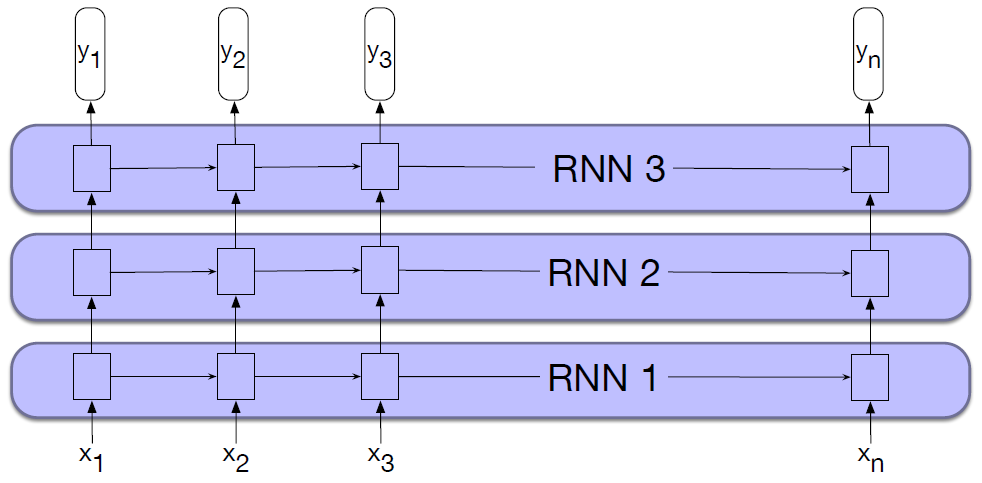
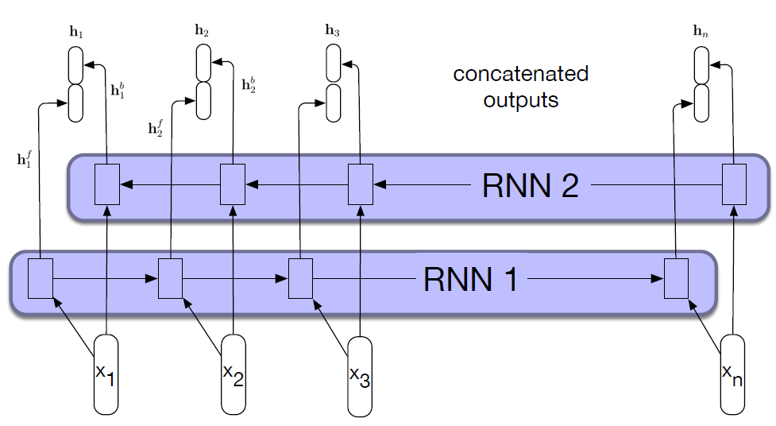

* TOC
{:toc}

## Stacked RNNs
The complex networks can be treated as modules and can be combined in creative ways. Two of the more common network architectures used in language processing with RNNs are Stacked RNNs and Bidirectional RNNs.

Stacked RNNs consist of multiple RNN networks where the output of one layer serves as the input to a subsequent layer, and the output of the last network is considered as the final output.

<figure markdown="0" class="figure zoomable">
<figcaption>
  <strong>Figure 1.</strong> Stacked recurrent networks
</figure>

Stacked RNNs generally outperform single-layer networks. One reason for this success seems to be that the network induces representations at differing levels of abstraction across layers. Just as the early stages of the human visual system detect edges that are then used for finding larger regions and shapes, the initial layers of stacked networks can induce representations that serve as useful abstractions for further layers.

## Bidirectional RNNs
The RNN uses information from the left (prior) context to make its predictions at time step $t$. But in many applications we have access to the entire input sequence; in those cases we would like to use words from the context to the right of $t$. One way to do this is to run two separate RNNs: one left-to-right, and one right-to-left.

In the left-to-right RNNs we've discussed so far, the hidden state at a given time $t$ represents everything the network knows about the sequence up to that point. The state is a function of the inputs $\mathbf{x}_1, \dots, \mathbf{x}_t$.

$$
\mathbf{h}^f_t = \text{RNN}_{\text{forward}}(\mathbf{x}_1, \dots, \mathbf{x}_t)
$$

$\mathbf{h}^f_t$ (the same as our usual $\mathbf{h}_t$) is the normal hidden state at time $t$ representing the context that the network has gained from the sequence so far.

To take advantage of context to the right of the current input, we can train an RNN on a reversed input sequence. With this approach, the hidden state at time $t$ represents information about the sequence to the right of the current input:

$$
\mathbf{h}^b_t = \text{RNN}_{\text{backward}}(\mathbf{x}_t, \dots, \mathbf{x}_N)
$$

Here the hidden state $\mathbf{h}^b_t$ represents all the information we have discerned about the sequence from $t$ to the end of the sequence.

A bidirectional RNN combines two independent RNNs, one where the input is processed from the start to the end, and the other from the end to the start. We then concatenate the two representations computed by the networks into a single vector that captures both the left and right contexts of an input at each point in time.

Let the sequence be $\mathbf{x}_1, \dots, \mathbf{x}_N$.

* The forward RNN processes left to right. So, say at $t=2$, i.e., for the word $\mathbf{x}_2$, we get a representation $\mathbf{h}^f_2$ from the forward RNN which contains information from $\mathbf{x}_1, \mathbf{x}_2$.
* The backward RNN processes right to left. So, say at $t=2$, i.e., for the word $\mathbf{x}_2$, we get a representation $\mathbf{h}^b_2$ from the backward RNN which contains information from $\mathbf{x}_N,  \mathbf{x}_{N-1}, \dots, \mathbf{x}_2$.

Thus, the combined hidden state at time step $t=2$ or the bidirectional representation for the word $\mathbf{x}_2$ is

$$
\mathbf{h}_2 = [\mathbf{h}^f_2; \mathbf{h}^b_2]
$$

which captures the entire sequence context around $\mathbf{x}_2$.

This word representation can then be passed to the downstream network (FFN or any other network) or any ML algorithms (where these representations become features) for NLP tasks such as POS tagging or NER.

<figure markdown="0" class="figure zoomable">
<figcaption>
  <strong>Figure 2.</strong> A bidirectional RNN
</figure>

  
TIP

  
Other simple ways to combine the forward and
backward contexts include element-wise addition or multiplication. 

**Applications:**
Because the backward RNN needs future tokens, BiRNNs cannot be used for standard left-to-right language generation. They are typically used for tasks like:

* POS tagging
* Named Entity Recognition
* Sequence labeling
* Sentence encoding

Bidirectional RNNs have also proven to be quite effective for sequence classification. For sequence classification, we use the final hidden state of the RNN as the input to a subsequent feedforward classifier. A difficulty with this approach is that the final state naturally reflects more information about the end of the sentence than its beginning. Bidirectional RNNs provide a simple solution to this problem. We simply combine the final hidden states from the forward $\mathbf{h}^f_n$ and backward $\mathbf{h}^b_1$ passes (for example by concatenation) and use that as input for follow-on processing.