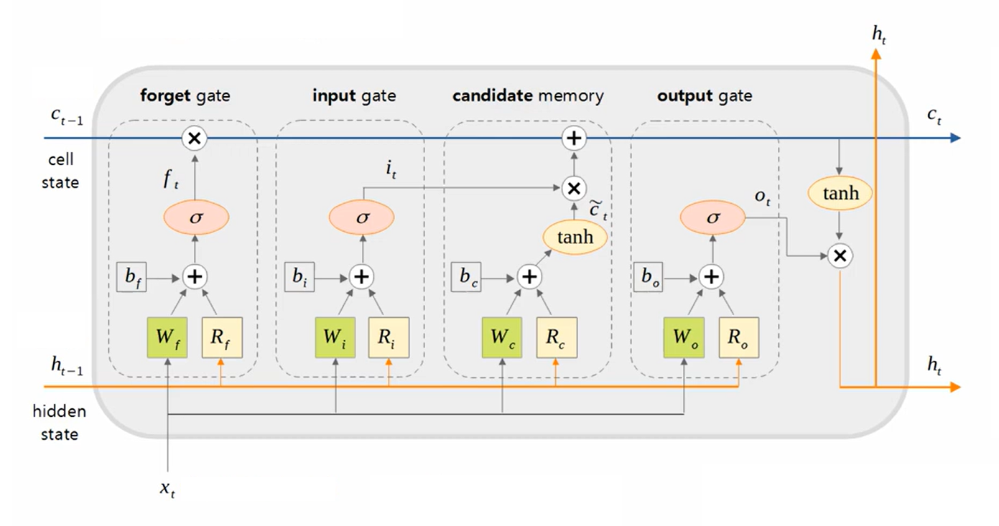
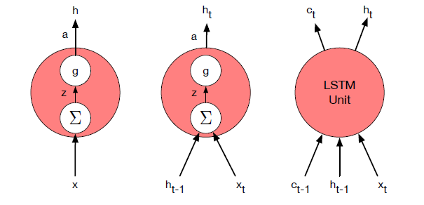

* TOC
{:toc}

## Cons of RNNs
In practice, it is quite difficult to train RNNs for tasks that require a network to make use of information distant from the current point of processing. Despite having access
to the entire preceding sequence, the information encoded in hidden states tends to be fairly local, more relevant to the most recent parts of the input sequence and recent decisions.

One reason for the inability of RNNs to carry forward critical information is that the weights that determine the values in the hidden layer are being asked to perform two tasks simultaneously:

* Provide information useful for the current decision $\mathbf{y}_t$, and
* Updating and carrying forward information required for future decisions $\mathbf{h}_t$.

A second difficulty with training RNNs arises from the need to back propagate the error signal back through time - leading to vanishing gradient problems.

To address these issues, more complex network architectures have been designed to explicitly manage the task of maintaining relevant context over time, by enabling the network to learn to forget information that is no longer needed and to remember information required for decisions still to come.

## What are LSTMs?
LSTMs (long short term memory) network is an extension to RNN that is designed to better handle long-range dependencies. LSTMs divide the context management problem into two subproblems: removing information no longer needed from the context, and adding information likely to be needed for later decision-making. LSTMs accomplish this by first adding an explicit context layer $\mathbf{c}$ to the architecture (in addition to the usual recurrent hidden layer $\mathbf{h}$).

* The context vector or cell state $\mathbf{c}$ carry-forwards the long-term information. Unless it is erased, it will be available at all time steps.
* The hidden state $\mathbf{h}$ focuses on the current time step, i.e., it carries information that is fairly local, and more relevant to the most recent parts of the input sequence and recent decisions.

  
NOTE

  
In vanilla RNNs, the hidden state $\mathbf{h}_{t-1}$ is always overwritten by $\mathbf{h}_t$.

### LSTM Unit
An LSTM unit takes three inputs: the current input $\mathbf{x}_t$, the previous context $\mathbf{c}_{t-1}$ and the previous hidden state $\mathbf{h}_{t-1}$. The outputs are a new hidden state $\mathbf{h}_t$ and an updated context $\mathbf{c}_t$.

<figure markdown="0" class="figure zoomable">
<figcaption>
  <strong>Figure 1.</strong> Schematic of an LSTM unit
  </figcaption>
</figure>

An LSTM cell consists of a forget gate, an input gate, a candidate memory, and an output gate. It consists of four blocks. Each block has a trainable parameter $\mathbf{W}$ that is multiplied by $\mathbf{x}_t$ and a trainable parameter $\mathbf{R}$ that is multiplied by $\mathbf{h}_{t-1}$.

**Forget gate $\mathbf{f}_t$:**

The purpose of this gate is to delete information from the context that is no longer needed. The forget gate computes a weighted sum of the previous state's hidden layer and the current input and passes that through a sigmoid. This mask is then multiplied element-wise by the context vector to remove the information from context that is no longer required.

$$
\begin{align*}
\mathbf{f}_t & = \sigma(\mathbf{h}_{t-1} \, \mathbf{R}_f + \mathbf{x}_t \, \mathbf{W}_f + \mathbf{b}_f) \\
\mathbf{k}_t & = \mathbf{c}_{t-1} \odot \mathbf{f}_t 
\end{align*}
$$

This forget gate (mask) $\mathbf{f}_t$ controls how much of the context information in $ \mathbf{c}_{t-1}$ is passed on to the next time step. Since the activation function is sigmoid, the elements of $\mathbf{f}_t$ are between 0 and 1. This vector is point-wise multiplied by $\mathbf{c}_{t-1}$.

* If an element of $\mathbf{f}_t$ is 0, the past information available in the corresponding element of $\mathbf{c}_{t-1}$ is erased. The LSTM completely forgets this information.

* If an element of $\mathbf{f}_t$ is 1, the whole information available in the corresponding element of $\mathbf{c}_{t-1}$ is preserved, i.e., all past memories are retained.

The vector $\mathbf{k}_t$ has all past memories with some irrelevant context erased.

**Candidate Memory $\tilde{\mathbf{c}}_t$:**
The next task is to compute the actual new information we need to extract from the previous hidden state and current inputs - the same basic computation we have been using for all our recurrent networks.

$$
\begin{align*}
\tilde{\mathbf{c}}_t & = \tanh(\mathbf{h}_{t-1} \, \mathbf{R}_c + \mathbf{x}_t \, \mathbf{W}_c + \mathbf{b}_c) \\
\end{align*}
$$

**Add/Input Gate $\mathbf{i}_t$:**

Next, we generate the input gate (mask) $\mathbf{i}_t$ to select the information from $\tilde{\mathbf{c}}_t$ to add to the current context. The elements of $\mathbf{i}_t$ are values between 0 and 1. If the new information is important, the value of that element increases (close to 1) to store more information, and if it is meaningless, the value of that element decreases to store less information.

$$
\begin{align*}
\mathbf{i}_t & = \sigma(\mathbf{h}_{t-1} \, \mathbf{R}_i + \mathbf{x}_t \, \mathbf{W}_i + \mathbf{b}_i) \\
\mathbf{j}_t & = \tilde{\mathbf{c}}^t \odot \mathbf{i}^t 
\end{align*}
$$

$\mathbf{j}_t$ is the new information created. Next, we add this to the modified context vector to get our new context vector (updated memory).

$$
\mathbf{c}_t = \mathbf{k}_t + \mathbf{j}_t
$$

Due to these addition operations, the vanishing gradient problem is mitigated.

**Output gate $\mathbf{o}_t$:**
The final output gate (mask) $\mathbf{o}_t$ is used to decide what information is required for the current hidden state from $\mathbf{c}_t$ (as opposed to what information needs to be preserved for future decisions).

$$
\begin{align*}
\mathbf{o}_t & = \sigma(\mathbf{h}_{t-1} \, \mathbf{R}_o + \mathbf{x}_t \, \mathbf{W}_o + \mathbf{b}_o) \\
\mathbf{h}_t & = \tanh(\mathbf{c}_t) \odot \mathbf{o}_t \\
\hat{\mathbf{y}}_t & = f_o(\mathbf{h}_{t} \, \mathbf{W}_{y} + \mathbf{b}_y)
\end{align*}
$$

The non-linear weighted version of the long term memory, i.e., $\tanh(\mathbf{c}_t) \odot \mathbf{o}_t$ becomes our short-term memory $\mathbf{h}_t$.

The outputs are a new hidden state $\mathbf{h}_t$ (which captures the short-term memory) and an updated context $\mathbf{c}_t$ (which captures the long-term memory).

In short, the forget gate erases something, the input gate writes something, and the output gate reads only the required part.

### Shape of the Parameters
Let $n$ be the batch size, $m$ be the number of features, and $p$ be the number of hidden units.

* $\mathbf{x}_t$ is the current input data of size $(n \times m)$. This is fed into each block.
* $\mathbf{W}_f$, $\mathbf{W}_i$, $\mathbf{W}_c$, $\mathbf{W}_o$ are $(m \times p)$ matrices.
* $\mathbf{h}_{t-1}$ is a $(n \times p)$ matrix. This is fed into each block.
* $\mathbf{R}_f$, $\mathbf{R}_i$, $\mathbf{R}_c$, $\mathbf{R}_o$ are $(p \times p)$ matrices.
* $\mathbf{b}_f$, $\mathbf{b}_i$, $\mathbf{b}_c$, $\mathbf{b}_o$ are $(1 \times p)$ vectors.
* $\mathbf{f}_t$, $\mathbf{i}_t$, $\tilde{\mathbf{c}}_t$, $\mathbf{c}_t$, $\mathbf{o}_t$ are $(n \times p)$ matrices and are the outputs of respective blocks.
* $\mathbf{W}_y$ is a $(p \times o)$ matrix, where $o$ is the number of units in the output layer.
* $\mathbf{b}_y$ is a $(1 \times o)$ vector.
* $\hat{\mathbf{y}}_t$ is a $(n \times o)$ matrix.

## Various Processing Units

<figure markdown="0" class="figure zoomable">
<figcaption>
  <strong>Figure 2.</strong> Basic neural units used in feedforward, simple recurrent networks (SRN), and long short-term memory (LSTM).
  </figcaption>
</figure>

The complexity of the architecture is encapsulated within the basic processing units, allowing us to maintain modularity and to easily experiment with different architectures.

