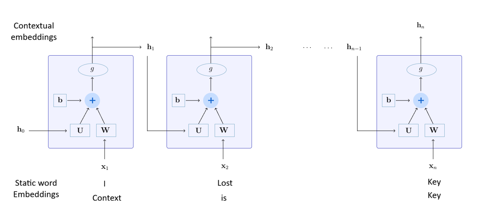
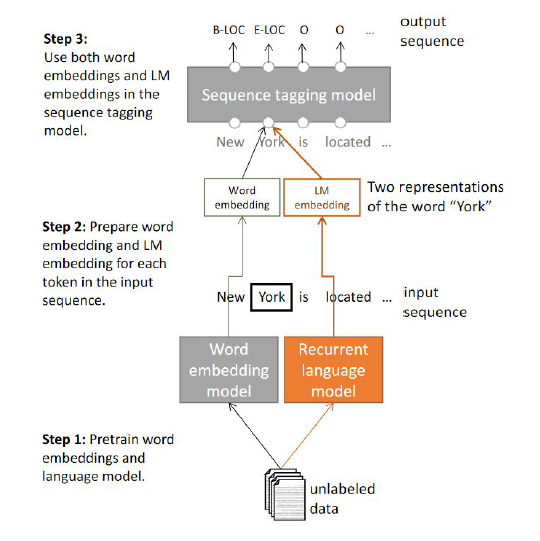
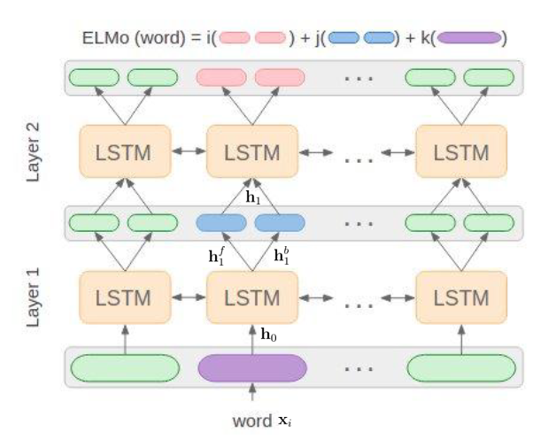

* TOC
{:toc}

## Introduction
Words are ambiguous: the same word can be used to mean different things. For example, the word 'key' can mean

* Context is key
* I lost the key somewhere in the garden
* You need to generate an SSH key pair.

Static word embedding methods like Word2Vec, GloVe and FastText learns a single vector embedding for each unique word $w$ in the vocabulary. These methods give the same representation for the word 'key' in all these sentences. These representations are poor for tasks that require the meaning of tokens or words in context. So, we need different representations in different contexts.

Contextual Embeddings refers to words/tokens representations considering the context. With contextual embeddings, each word $w$ will be represented by a different vector each time it appears in a different context.

## Embeddings from RNNs
In RNNs, the representation of a token is affected by the representation of the previous token.

<figure markdown="0" class="figure zoomable">
<figcaption>
  <strong>Figure 1.</strong>  RNN-based contextual embeddings
</figure>

The hidden state $\mathbf{h}_n$ depends on the current input (which is the static word embeddings for the word 'key') and the previous hidden state $\mathbf{h}_{n-1}$. So, the hidden $\mathbf{h}_n$ will be different for the word 'key' for both these sentences as the previous hidden states are different. This hidden state vector $\mathbf{h}_n$ can be considered as the embeddings for the word 'key'. This will be the representation based on the context in which the word appears in.

Similarly, we can also use BiRNNs to get the representation for a word considering the contexts to the left and to the right.

**Combining representations:**
We can combine the contextual and non-contextual representations of a word, and pass this combined representation to the next architecture block. This is shown to work well for sequence labelling task.

<figure markdown="0" class="figure zoomable">
<figcaption>
  <strong>Figure 2.</strong>  Combining contextual and non-contextual representations
</figure>

Here we use the RNN that is trained for the next word prediction (language model).

## Embeddings from Language Models (ELMO)

For a token $\mathbf{x}_i$, we can use stacked biLSTMs (or stacked biRNNs) to get the contextual representation as follows:

<figure markdown="0" class="figure zoomable">
<figcaption>
  <strong>Figure 3.</strong> Embeddings from stacked BiLSTMs
</figure>

Each LSTM layer $i$ gives a representation $\mathbf{h}_i$ for the token $\mathbf{x}_i$. The final representation $\mathbf{h}$ is a combination of the representations from different layers.

$$
\mathbf{h} = f(\mathbf{h}_0, \dots, \mathbf{h}_L)
$$

where $\mathbf{h}_0$ is the base representation for the token $\mathbf{x}_i$ from the static word embeddings. A simple way to combine the representations from multiple layers is to take the simple average or weighted combination of them. It is observed in experiments that the lower level representations captured the structures well, and the higher level representations captured the overall semantics and abstractions well. Depending on the tasks, we can give different weightages to these representations:

* For tasks such as POS tagging, lower representations work well. So, we can give more weightage to the lower level representations. 
* For other tasks that require semantic and abstract information, more weightage can be given to the higher level representations.
