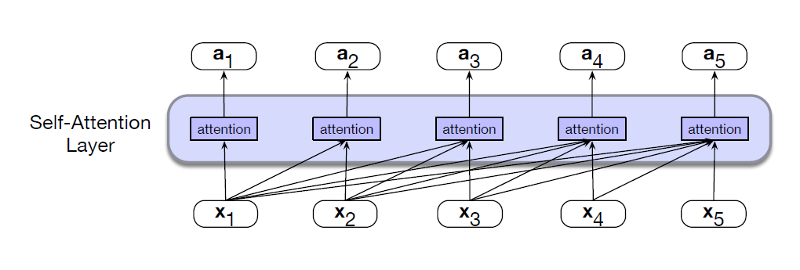
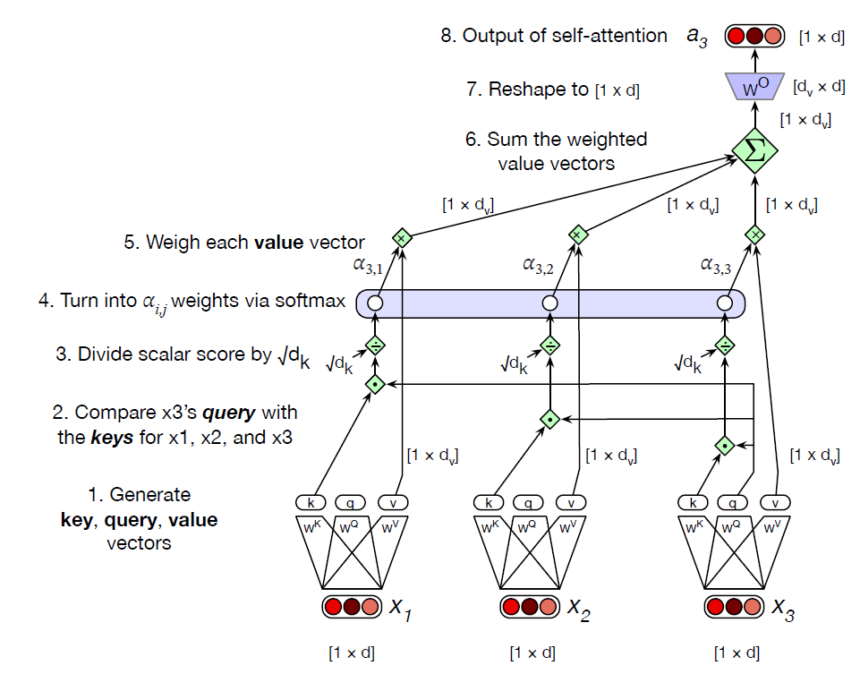
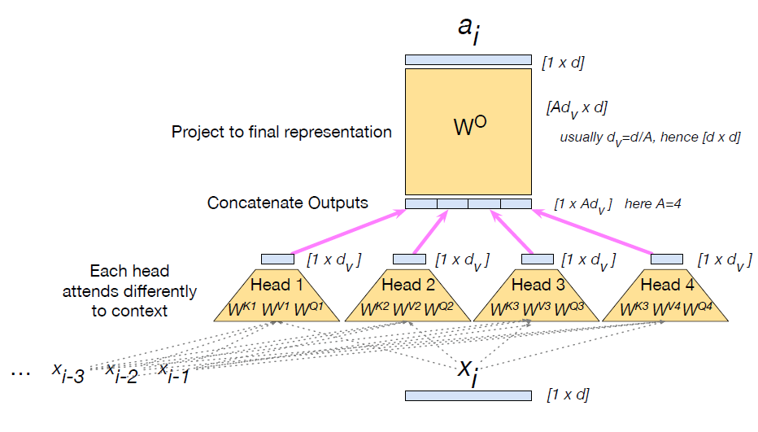
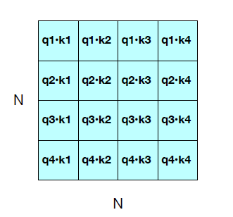
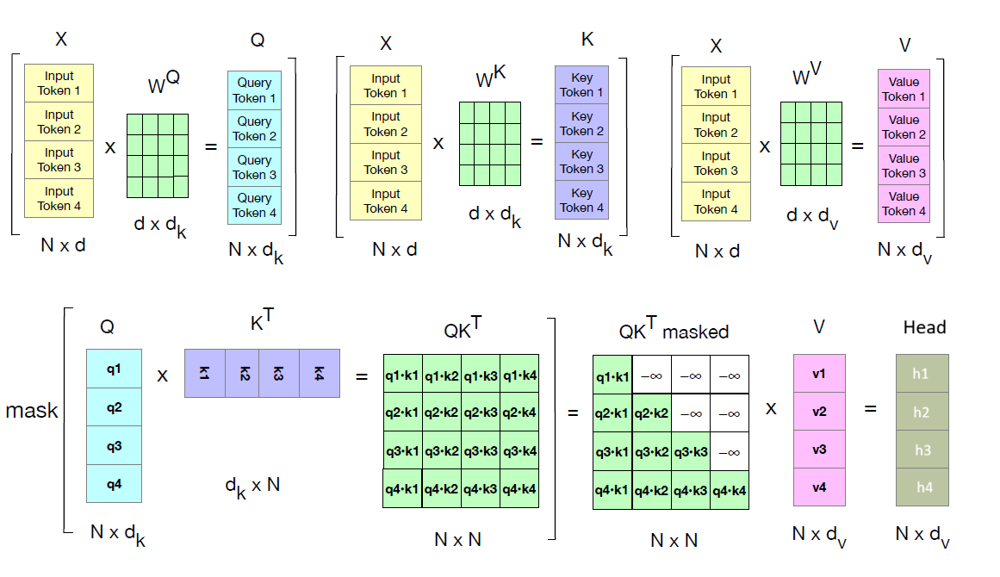
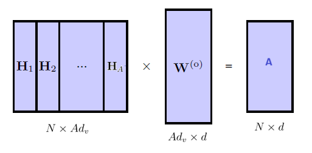

Each output representation is computed by attending to all input representations.

* TOC
{:toc}

## What is Attention?
Consider the following two sentences:

* I swam across the river to get to the other bank.
* I walked across the road to get cash from the bank.

Here the word 'bank' has different meanings in the two sentences. However, this can be detected only by looking at the context provided by other words in the sequence. We also see that some words are more important than others in determining the interpretation of 'bank'.

* In the first sentence, the words 'swam' and 'river' most strongly indicate that 'bank' refers to the side of a river.
* In the second sentence, the word 'cash' is a strong indicator that 'bank' refers to a financial institution.

We see that to determine the appropriate interpretation of 'bank', a model processing such a sentence should _attend to_, in other words rely more heavily on specific words from the rest of the sequence.

To start with, word embeddings (Word2Vec or GloVe) are used to map words into vectors in an embedding space. The word embedding layer maps each word to a fixed dense vector. These embeddings capture elementary semantic properties, for example by mapping words with similar meanings to nearby locations in the embedding space. But the characteristic of such embeddings is that a given word always map to the same embedding vector, regardless of the context. The word "bank" will have the same vector representation whether used in "river bank" or "financial bank."

But can we update these static representations to contextual representations? RNN helps us do this. In RNNs, the output of the current time step depends on the previous hidden state.  RNNs processes sequentially and updates the hidden state at each time step. The processing at time step $t$ can take place only after processing at time step $t-1$ is complete. This makes it difficult to parallelize the computations in RNNs. Sequential connections make the training slow.

Can we remove the sequential connections but still capture the contextual dependencies? Can we compute the contextual representations for all the tokens in parallel without waiting for the previous time step to complete? The improvement in representation is done through a mechanism called **self-attention**.

## Self Attention Layer
Suppose that we have a set of input tokens $\mathbf{x}_1, \dots, \mathbf{x}_N$ in an embedding space (static embeddings), and we want to map this to another set $\mathbf{a}_1, \dots, \mathbf{a}_N$ having the same number of tokens but in a new embedding space that captures a richer semantic structure. The output of the attention layer $\mathbf{a}_1, \dots, \mathbf{a}_N$ will be a rich contextualized representation of the input sequence $\mathbf{x}_1, \dots, \mathbf{x}_N$.

Attention takes an input representation $\mathbf{x}_i$ corresponding to the input token at position $i$, and the representations of all the prior tokens in the context window (context window consist of thousands of tokens) $\mathbf{x}_1, \dots, \mathbf{x}_{i-1}$ (but no tokens after $i$), and produces an output $\mathbf{a}_i$. Note that the attention computation happens in parallel at each token position $i$.

<figure markdown="0" class="figure zoomable">
<figcaption>
  <strong>Figure 1.</strong>  Information flow in causal self-attention layer. When processing each input $\mathbf{x}_i$, the model attends to all the inputs up to, and including $\mathbf{x}_i$.
</figure>

Attention can be thought of as a way to build contextual representations of a token's meaning by attending to and integrating information from surrounding tokens. As a result, the word "bank" in the above sentences will have different vector representations. For example, in the first sentence the transformed representation might put 'bank' close to 'water' in the embedding space, whereas in the second sentence the transformed representation might put it close to 'money'. These representations allow us to disambiguate words based on context.

Each token flows through its own path through the self-attention layer. So, all the input tokens can be updated simultaneously, i.e., the various paths can be executed in *parallel*. So this architecture require only $\mathbb{O}(1)$ steps to process the whole input sequence. Unlike in RNNs, we don't have to process the tokens sequentially.

  
TIP

  
We are looking at the attention in causal, left-to-right language models. We will generalize attention later so it can also look ahead to future words. And the process is called self-attention because each token is attending to tokens in the same sequence.

**Simplified version of attention:**
At its heart, attention is really just a weighted sum of context vectors. The attention output $\mathbf{a}_i$ (the new representation) at token position $i$ is simply the weighted sum of all the representations $\mathbf{x}_1, \dots, \mathbf{x}_{i-1}, \mathbf{x}_i$ (the prior representations of all prior words).

$$
\mathbf{a}_i = \sum_{j \leq i} \alpha_{ij} \mathbf{x}_j
$$

where $\alpha_{ij}$ is a scalar represents how much $\mathbf{x}_j$ should contribute to $\mathbf{a}_i$. These are known as **attention weights**. We weight each prior embedding proportionally to how similar it is to the embedding of token $i$. And we have the constraints:

$$
\alpha_{ij} \geq 0  \, \, \text{  and  } \, \, \sum_{j \leq i} \alpha_{ij} = 1
$$

Without these constraints, we get the same effect of the linear combinations in multiple ways. $\alpha_{ij}$ captures the strength of association of token $i$ with token $j$. If token $j$ is similar to token $i$, then the new representation for token $i$ will draw heavily from the representation of token $j$. Therefore, $\mathbf{a}_i$ is the sum of the embeddings of prior tokens weighted by their similarity with the current token embedding $\mathbf{x}_i$.

We compute similarity scores via dot product. The larger the score, the more similar the vectors that are being compared. We will then normalize these scores with a softmax to create the vector of weights $\alpha_{ij}$ for all $j \leq i$.

$$
\begin{align*}
\text{score}(\mathbf{x}_i, \mathbf{x}_j) & = \mathbf{x}_i^\top \mathbf{x}_j \\
\alpha_{ij} & = \text{softmax}(\text{score}(\mathbf{x}_i, \mathbf{x}_j)) \,\, \forall j \leq i
\end{align*}
$$

  
NOTE

  
Of course, the softmax weight will likely be highest for $\mathbf{x}_i$, since $\mathbf{x}_i$ is very similar to itself. But other context words may also be similar to $\mathbf{x}_i$, and the softmax will also assign some weight to those words as well.

### Attention Head
Each input embedding $\mathbf{x}_i$ takes three roles during the course of the attention process:

1. As the *current element* being compared to the preceding (prior) inputs. We'll refer to this role as a **query**.

2. As a *preceding input* that is being compared to the current element. We'll refer to this role as a **key**.

3. As a **value** of a preceding element that gets weighted and summed up to compute the output for the current element.

To capture these three different roles, transformers uses weight matrices $\mathbf{W}^Q, \mathbf{W}^K, \mathbf{W}^V$. These weights will project each input vector $\mathbf{x}_i$ into a representation of its role as a query, key, or value:

$$
\begin{align*}
\mathbf{q}_i &= \mathbf{x}_i \, \mathbf{W}^Q \\
\mathbf{k}_i &= \mathbf{x}_i \, \mathbf{W}^K \\
\mathbf{v}_i &= \mathbf{x}_i \, \mathbf{W}^V \\
\end{align*}
$$

These vectors capture different aspect of the input token $\mathbf{x}_i$. Now, when we are computing the similarity of the current element $\mathbf{x}_i$ with some prior element $\mathbf{x}_j$, we'll use the dot product between the current element's query vector $\mathbf{q}_i$ and the preceding element's key vector $\mathbf{k}_j$.

The result of a dot product can be an arbitrarily large (positive or negative) value, and exponentiating large values can lead to numerical issues during training. Recall that the gradients of the softmax function become exponentially small for inputs of high magnitude. To avoid this, we scale the dot product by a factor related to the size of the embeddings, via dividing by the square root of the dimensionality of the query and key vectors $(d_k)$.

$$
\begin{align*}
\mathbf{q}_i & = \mathbf{x}_i \, \mathbf{W}^Q; \hspace{0.5cm}
\mathbf{k}_j = \mathbf{x}_j \, \mathbf{W}^K; \hspace{0.5cm}
\mathbf{v}_j = \mathbf{x}_j \, \mathbf{W}^V \\
\text{score}(\mathbf{x}_i, \mathbf{x}_j) &= \frac{\mathbf{q}_i^\top \mathbf{k}_j}{\sqrt{d_k}} \\
\alpha_{ij} & = \text{softmax}(\text{score}(\mathbf{x}_i, \mathbf{x}_j)) \,\, \forall j \leq i \\
\text{head}_i & = \sum_{j \leq i} \alpha_{ij} \, \mathbf{v}_j \\
\mathbf{a}_i & = \text{head}_i \, \mathbf{W}^O \\
\end{align*}
$$

The softmax calculation resulting in $\alpha_{ij}$ remains the same, but the output calculation for $\text{head}_i$ is now based on a weighted sum over the value vectors $\mathbf{v}$.

These are the final set of equations for computing self-attention for a single self attention output vector $\mathbf{a}_i$ from a single input vector $\mathbf{x}_i$. This version of attention computes $\mathbf{a}_i$ by summing the values of the prior elements, each weighted by the similarity of its key to the query from the current element.

For example, for calculating $\mathbf{a}_3$:

<figure markdown="0" class="figure zoomable">
<figcaption>
  <strong>Figure 2.</strong> Calculating $\mathbf{a}_3$ using causal (left-to-right) self-attention. This is the "attention" block mentioned in the previous figure.
</figure>

About the shapes:

* The input to attention $\mathbf{x}_i$ and the output from attention $\mathbf{a}_i$ both have the same dimensionality $[1 \times d]$.
* Both the query and key vector are $1 \times d_k$.
* Separate dimension $d_v$ for the value vectors.
* $\mathbf{W}^Q$ and $\mathbf{W}^K$ are $d \times d_k$. And $\mathbf{W}^V$ is $d \times d_v$.
* The output of $\text{head}_i$ is  $1 \times d_v$.
* $\mathbf{W}^O$ is $d_v \times d$.

In the original transformer work, $d$ was 512, and $d_k= d_v= 64$.

## Multi-Head Attention
There may be multiple patterns of attention that are relevant at the same time. In natural language, for example, some patterns might be relevant to tense whereas others might be associated with vocabulary. That is, according to one notion, a set of words might be more relevant. And in another notion, a different set of words might be more relevant. Using a single attention head can lead to averaging over these effects. Instead, we can use multiple attention heads in parallel.

We can have $A$ independent attention heads, residing in parallel, each with its own set of parameters. Each head $c$ has its own set of query, key, and value matrices: $\mathbf{W}^{Qc}, \mathbf{W}^{Kc}, \mathbf{W}^{Vc}$. In the original paper, $A=8$ heads with the same shapes as mentioned for single-head above is used.

Below are the equations for attention augmented with multiple heads:

$$
\begin{align*}
\mathbf{q}^c_i & = \mathbf{x}_i \, \mathbf{W}^{Qc}; \hspace{0.5cm}
\mathbf{k}^c_j = \mathbf{x}_j \, \mathbf{W}^{Kc}; \hspace{0.5cm}
\mathbf{v}^c_j = \mathbf{x}_j \, \mathbf{W}^{Vc} \hspace{0.5cm} \forall c \, \, 1 \leq c \leq A\\
\text{score}^c(\mathbf{x}_i, \mathbf{x}_j) &= \frac{\mathbf{q}^c_i \cdot \mathbf{k}^c_j}{\sqrt{d_k}} \\
\alpha^c_{ij} & = \text{softmax}(\text{score}^c(\mathbf{x}_i, \mathbf{x}_j)) \,\, \forall j \leq i \\
\text{head}^c_i & = \sum_{j \leq i} \alpha^c_{ij} \, \mathbf{v}^c_j \\
\mathbf{a}_i & = (\text{head}^1_i \oplus \text{head}^2_i \oplus \dots \oplus \text{head}^A_i) \mathbf{W}^O \\
\end{align*}
$$

The whole operation is denoted by

$$
\text{MultiHeadAttention}(\mathbf{x}_i, [\mathbf{x}_1, \dots, \mathbf{x}_{i-1}]) = \mathbf{a}_i
$$

as multi-head attention is a function of the current input $\mathbf{x}_i$, as well as all the other inputs.

<figure markdown="0" class="figure zoomable">
<figcaption>
  <strong>Figure 3.</strong> The multi-head attention computation for input $\mathbf{x}_i$ producing output $\mathbf{a}_i$. Here there are four heads, $A=4$.</figcaption>
</figure>

The output of each of the $A$ heads is of shape $1 \times d_v$, and so the output of the multi-head layer with A heads consists of A vectors of shape $1 \times d_v$. These are concatenated to produce a single output with dimensionality $1 \times Ad_v$. Then we use another linear projection $\mathbf{W}^O \in \mathbb{R}^{Ad_v \times d}$ to reshape it, resulting in the multi-head attention vector $\mathbf{a}_i$ of shape $1 \times d$ for each input $\mathbf{x}_i$.

Usually the dimensionality $d_v$ of the heads is set so that $d_v = \frac{d}{A}$, with the result that $\mathbf{W}^O$ is a square matrix of shape $d \times d$.

  
TIP

  
Using multiple heads is kind of equivalent to ensembling in ML. We are ensembling the various projection of the input into query, key, and value vectors.
  
  Multiple heads may learn the same information. Once the model is trained, one can check the redundant blocks and remove them to make the model efficient.

## Parallelizing Computation
The attention computation performed for each token to compute $\mathbf{a}_i$ is independent of the computation for each other token. That means we can easily parallelize the entire computation, taking advantage of efficient matrix multiplication routines.

We pack the input embeddings for the $N$ tokens of the input sequence into a single matrix $\mathbf{X}$ of size $[N \times d]$. Transformers for large language models commonly have an input length $N$ from 1K to 32K. So, $\mathbf{X}$ can have 1K to 32K rows each of the dimensionality of the embedding $d$ (the model dimension).

For example, consider a text: "The cat sat on the mat." Let's assume the embedding dimension $d=4$. Then, our input matrix is

$$
\mathbf{X} = \begin{bmatrix}
0.1 & 0.3 & 0.5 & 0.2 \\
0.4 & 0.2 & 0.6 & 0.1 \\
0.3 & 0.7 & 0.8 & 0.4 \\
0.5 & 0.1 & 0.2 & 0.3 \\
0.6 & 0.4 & 0.7 & 0.5 \\
0.2 & 0.5 & 0.9 & 0.8 \\
\end{bmatrix}_{N \times d}
$$

* Each row is the embedding of one token of the input.
* Each column corresponds to a feature dimension of the token's embedding.

This matrix represents one set of input tokens. We will require a data set containing many such independent passages of text depending upon the task.

**Parallelizing Single Attention Head:**
We multiply $\mathbf{X}$ by the query, key, and value matrices $\mathbf{W}^Q$ of shape $[d \times d_k]$, $\mathbf{W}^K$ of shape $[d \times d_k]$, and $\mathbf{W}^V$ of shape $[d \times d_v]$ to produce:

$$
\begin{align*}
\mathbf{Q} & = \mathbf{X}\mathbf{W}^Q \hspace{0.5cm} \text{ of shape } [N \times d_k] \\
\mathbf{K} & = \mathbf{X}\mathbf{W}^K \hspace{0.5cm} \text{ of shape } [N \times d_k] \\
\mathbf{V} & = \mathbf{X}\mathbf{W}^V \hspace{0.5cm} \text{ of shape } [N \times d_v] \\
\end{align*}
$$

Given these matrices we can compute all the requisite query-key comparisons simultaneously by multiplying $\mathbf{Q}$ and $\mathbf{K}^\top$ in a single matrix multiplication. The result is of shape $[N \times N]$.

  
NOTE

  
In practice we can also include bias parameters in these linear transformations. However, the bias parameters can be absorbed into the weight matrices by augmenting the data matrix $\mathbf{X}$ with an additional column of 1's and by augmenting the weight matrices with an additional row of parameters to represent the biases.

In $\mathbf{Q}\mathbf{K}^\top$ operation, every query vector (each row of $\mathbf{Q}$) is multiplied by all the key vectors (all the columns of $\mathbf{K}^\top$). This results in a $\mathbf{S}_{N \times N}$ matrix called the attention scores matrix. This represents the degree of importance a query token assigns to a key token.

<figure markdown="0" class="figure zoomable">

</figure>

Once we have $\mathbf{Q}\mathbf{K}^\top$ matrix, we can very efficiently scale these scores, take the softmax, and then multiply the result by $\mathbf{V}$ resulting in a matrix of shape $[N \times d_v]$. Therefore, the entire self-attention step for an entire sequence of $N$ tokens for one head can be given by:

$$
\begin{align*}
\textbf{head}_{N \times d_v} & = \text{softmax}\left(\frac{\mathbf{Q}\mathbf{K}^\top}{\sqrt{d_k}} \right) \, \mathbf{V} \\
\mathbf{A}_{N \times d} & = \textbf{head} \,\mathbf{W}^O 
\end{align*}
$$

The softmax function is applied row-wise over the scores. The result from the softmax, that is, $\text{softmax}\left(\frac{\mathbf{Q}\mathbf{K}^\top}{\sqrt{d_k}} \right)$ gives the attention weights.

**Masking out the future:**
The calculation of $\mathbf{Q}\mathbf{K}^\top$ results in a score for each query value to every key value, including those that follow the query. This is inappropriate in the setting of language modeling: guessing the next word is pretty simple if you already know it. To fix this, the elements in the upper-triangular portion of the matrix are set to $-\infty$, which the softmax will turn to zero, thus eliminating any knowledge of words that follow in the sequence.

This is done in practice by adding a mask matrix $\mathbf{M}$ in which $\mathbf{M}_{ij} = -\infty$ for all $j >i$ and $\mathbf{M}_{ij} = 0$ otherwise. Then, the equations become:

$$
\begin{align*}
\textbf{head}_{N \times d_v} & = \text{softmax}\left(\text{mask}\left(\frac{\mathbf{Q}\mathbf{K}^\top}{\sqrt{d_k}} \right)\right) \, \mathbf{V} \\
\mathbf{A}_{N \times d} & = \textbf{head} \,\mathbf{W}^O 
\end{align*}
$$

The operation $\text{softmax}\left(\text{mask}\left(\frac{\mathbf{Q}\mathbf{K}^\top}{\sqrt{d_k}} \right)\right) \, \mathbf{V}$ is denoted as $\text{SelfAttention}(\mathbf{Q}, \mathbf{K}, \mathbf{V})$.

<figure markdown="0" class="figure zoomable">
<figcaption>
  <strong>Figure 4.</strong> Schematic of the attention computation for a single attention head in parallel.
  </figcaption>
</figure>

The lower triangular matrix $\mathbf{Q}\mathbf{K}^\top$ after normalizing by dimensionality becomes the attention score matrix. Then, softmax is applied over it row-wise (the rows sum to 1 after softmax). The final $\mathbf{A}_{N \times d}$ matrix has the attention output vectors.

It is clear that attention computation is quadratic in the length of the input, since at each layer we need to compute dot products between each pair of tokens in the input. This makes it expensive to compute attention over very long documents (like entire novels).

**Parallelizing multi-head attention:**
The output of a single attention head is of the shape $[N \times d_v]$. So, the output of the multi-head layer with $A$ heads consists of $A$ such matrices. They are all concatenated to produce a single output with dimensionality $[N \times Ad_v]$. Finally, we use a final linear projection $\mathbf{W}^O$ of shape $[Ad_v \times d]$ that reshapes it to the original output dimension for each token. The matrix $\mathbf{A}_{N \times d}$ is the self-attention output.

$$
\begin{align*}
\mathbf{Q}^c & = \mathbf{X} \, \mathbf{W}^{Qc}; \hspace{0.5cm}
\mathbf{K}^c = \mathbf{X} \, \mathbf{W}^{Kc}; \hspace{0.5cm}
\mathbf{V}^c = \mathbf{X} \, \mathbf{W}^{Vc} \hspace{0.5cm} \forall c \, \, 1 \leq c \leq A\\
\textbf{head}^c_{N \times d_v} & = \text{softmax}\left(\text{mask}\left(\frac{\mathbf{Q}^c\mathbf{K}^{c\top}}{\sqrt{d_k}} \right)\right) \, \mathbf{V}^c \\
\mathbf{A}_{N \times d} & = (\textbf{head}^1 \oplus \textbf{head}^2 \oplus \dots \oplus \textbf{head}^A) \mathbf{W}^O \\
\end{align*}
$$

These whole operations are denoted as $\text{MultiHeadAttention}(\mathbf{X})$. The input $X$ and the output from this operation are of the same shape $[N \times d]$.

<figure markdown="0" class="figure zoomable">

</figure>

The learnable parameters are $\mathbf{W}^{Qc}, \mathbf{W}^{Kc}, \mathbf{W}^{Vc}$ for $c=1, \dots, A$, and $ \mathbf{W}^O$.