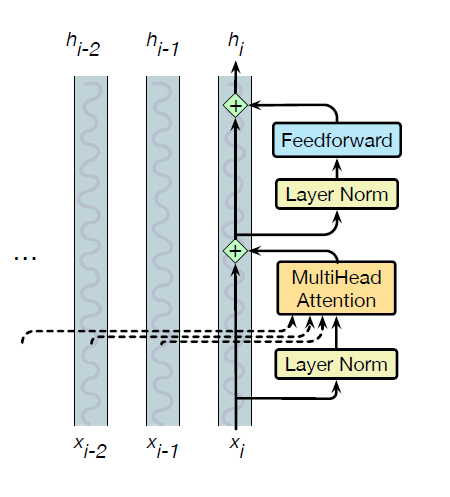

* TOC
{:toc}

## Transformer Block
A transformer block consists of normalizing layers, self-attention layer, residual layer and residual connections. A common way of thinking about the block is as residual streams. In the residual stream viewpoint, we consider the processing of an individual token $i$ through the transformer block as a single stream. This residual stream starts with the original input vector, and the various components read their input from the residual stream and add their output back into the stream.

1. The initial vector $\mathbf{x}_i$ at the bottom of the stream is an embedding for a token, which has dimensionality $d$. This vector is passed through a layer norm and attention layer, and the result is added back into the stream, i.e., to the original input vector $\mathbf{x}_i$.

2. And then this summed vector is again passed through another layer norm and a feedforward layer, and the output of those is added back into the residual. $\mathbf{h}_i$ is the resulting output of the transformer block for token $\mathbf{x}_i$.

<figure markdown="0" class="figure zoomable">
<figcaption>
  <strong>Figure 1.</strong> The architecture of a transformer block from the viewpoint of residual streams.
</figure>

**FeedForward Layer:**
The feedforward layer is a fully-connected 2-layer network, i.e., one hidden layer, two weight matrices. The weights of the matrices are the same for each token position $i$, but are different from one block to another block.

$$
\text{FFN}(\mathbf{x}_i) = \text{ReLU}(\mathbf{x}_i\, \mathbf{W}_1 + b_1) \mathbf{W}_2 + b_2
$$

It is common to make the dimensionality of the hidden layer $d_{ff}$ be larger than the model dimensionality $d$. In the original transformer model, $d=512, d_{ff}=2048$.

**Layer Norm:**
At two stages in the transformer block we normalize the vector. This process, called layer norm (short for layer normalization), is one of many forms of normalization that can be used to improve training performance in deep neural networks by keeping the values of a hidden layer in a range that facilitates gradient-based training.

Layer norm is a variation of the z-score from statistics, applied to each vector. The input to layer norm is a vector $\mathbf{x}$ of dimensionality $d$, and the output is that vector normalized $\hat{\mathbf{x}}$, again of dimensionality $d$.

$$
\hat{\mathbf{x}} = \frac{\mathbf{x} - \mu}{\sigma}
$$

where $\mu = \frac{1}{d} \sum_{i=1}^d x_i$ and $\sigma =  \sqrt{\frac{1}{d} \sum_{i=1}^d (x_i-\mu)^2}$. The resulting vector is a new vector with zero mean and a standard deviation of one.

Finally, in the standard implementation of layer normalization, two learnable parameters, $\gamma$ and $\beta$, representing gain and offset values, are introduced. Therefore,

$$
\text{LayerNorm}(\mathbf{x}_i) = \gamma  \frac{(\mathbf{x}_i - \mu)}{\sigma} + \beta
$$

**Putting it all together:**

The equations for a single transformer block are:

$$
\begin{align*}
\mathbf{t}^1_i & = \text{LayerNorm}(\mathbf{x}_i) \\
\mathbf{t}^2_i & = \text{MultiHeadAttention}(\mathbf{t}^1_i, [\mathbf{t}^1_1, \dots, \mathbf{t}^1_{i-1}]) \\
\mathbf{t}^3_i & = \mathbf{t}^2_i + \mathbf{x}_i \\
\mathbf{t}^4_i & = \text{LayerNorm}(\mathbf{t}^3_i) \\
\mathbf{t}^5_i & = \text{FFN}(\mathbf{t}^4_i) \\
\mathbf{h}_i & = \mathbf{t}^5_i + \mathbf{t}^3_i
\end{align*}
$$

All the $\mathbf{t}$ and $\mathbf{h}$ vectors are of the shape $1\times d$. The input and output dimensions of transformer blocks are matched so they can be stacked. Transformers for large language models stack many of these blocks, typically 12 to 96 such blocks.

When we use this architecture for language modeling: at the earlier transformer blocks, the residual stream represents the current token. At the highest transformer blocks, the residual stream represents the following token,
since at the very end it’s being trained to predict the next token. At the very end of the last transformer block, there is a single extra layer norm that is run on
the last $\mathbf{h}_i$ of each token stream (just below the language model head layer).

  
TIP

  
This is the most common current transformer architecture, called as the prenorm architecture. The original definition of the transformer used an alternative architecture called the postnorm transformer in which the layer norm happens after the attention and FFN layers; it turns out moving the layer norm beforehand works better.

**Parallelizing Computations:**
The computations performed in a transformer layer or block are:

$$
\begin{align*}
\mathbf{T}^1 & = \text{LayerNorm}(\mathbf{X}) \\
\mathbf{T}^2 & = \text{MultiHeadAttention}(\mathbf{T}^1) \\
\mathbf{T}^3 & = \mathbf{T}^2 + \mathbf{X} \\
\mathbf{T}^4 & = \text{LayerNorm}(\mathbf{T}^3) \\
\mathbf{T}^5 & = \text{FFN}(\mathbf{T}^4) \\
\mathbf{H} & = \mathbf{T}^5 + \mathbf{T}^3
\end{align*}
$$

All $\mathbf{T}$ are of shape $[N \times d]$. The notation $\text{FFN}(\mathbf{T}^3)$ means that the same FFN is applied in parallel to each of the $N$ embedding vectors. Similarly, each of the $N$ tokens is normed in parallel in the LayerNorm.

Crucially, the input and output dimensions of transformer blocks are matched so they can be stacked. The input $\mathbf{X}$ and the output of the transformer block are both of shape $[N \times d]$.

When we stack several transformer blocks, for the first layer, the input is the initial word embedding + positional embedding vectors. But for subsequent layers $k$, the input is the output from the previous layer $\mathbf{H}^{k-1}$.

