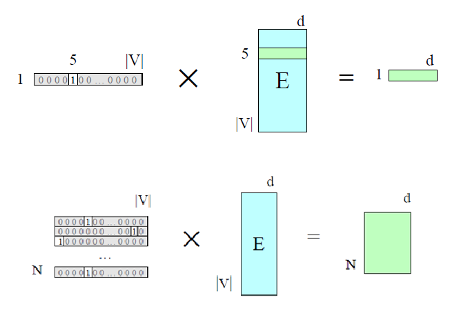
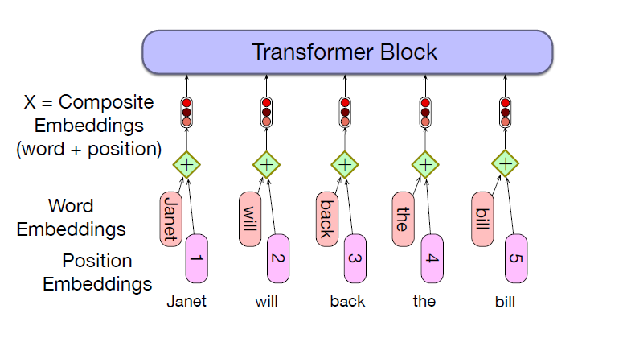
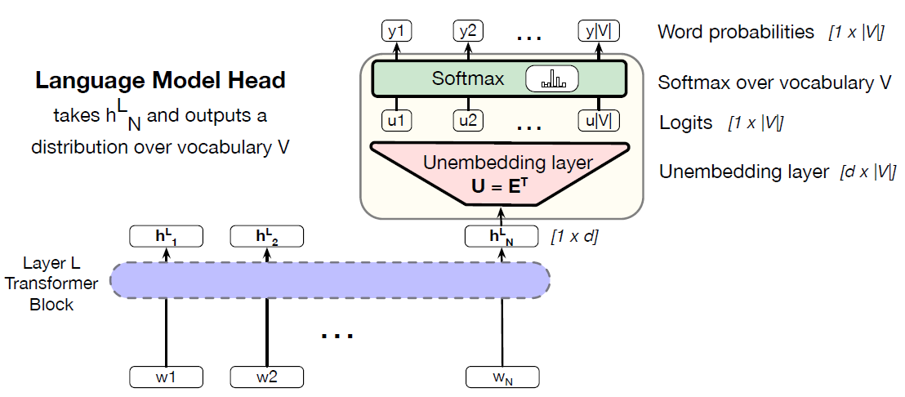
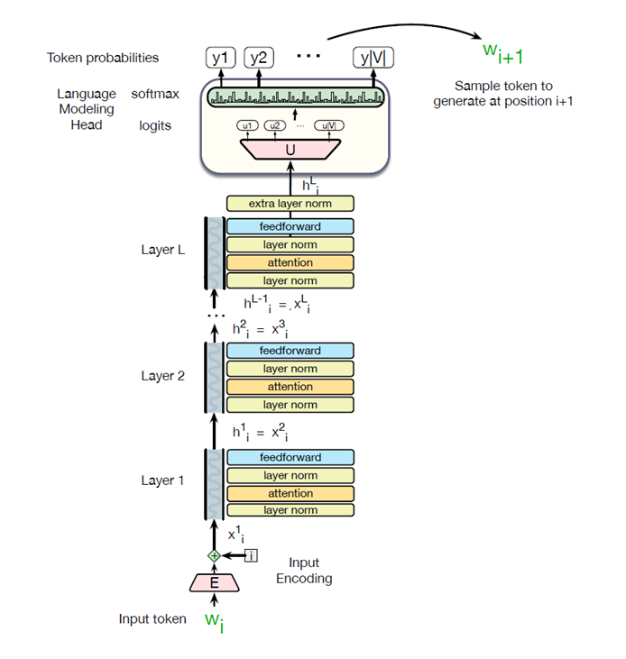

* TOC
{:toc}

## Token Embedding
Given a sequence of $N$ tokens ($N$ is the context embedding length in tokens), the matrix $\mathbf{X}$ of shape $[N \times d]$ has an embedding for each word in the context. These embeddings are actually computed using two embeddings: an input token embedding, and an input positional embedding.

A token embedding, is a vector of dimension $d$ that will be our initial representation for the input token. The set of initial embeddings is stored in the embedding matrix $\mathbf{E}_{|V| \times d}$, which has a row for each of the $|V|$ tokens in the vocabulary. Each word is mapped to a row vector of $d$ dimensions.

Given an input token string like "Thanks for all the", we first convert the tokens into vocabulary indices (these were created when we first tokenized the input using BPE or SentencePiece). So the representation of "thanks for all the" might be

$$
\mathbf{w} = [5, 4000, 10532, 2224]
$$

Next we use indexing to select the corresponding rows from $\mathbf{E}$ (row 5, row 4000, row 10532, row 2224).

Another way to think about selecting token embeddings from the embedding matrix is to represent tokens as one-hot vectors of shape $1 \times |V|$. That is, if the word "thanks" has index 5 in the vocabulary, then $x_5=1$, and $x_i=0 \, \forall i \ne 5$. Multiplying by a one-hot vector that has only one non-zero element $x_i=1$ simply selects out the embedding for word $i$.

<figure markdown="0" class="figure zoomable">
<figcaption>
  <strong>Figure 1.</strong> Selecting the embedding vector for each word (top row), and for all words in parallel (bottom row).
</figure>

The entire token sequence $N$ is represented as a matrix of one-hot vectors, $\mathbf{W}_{N \times |V|}$. This is multiplied by $\mathbf{E}_{|V| \times d}$.

### Position Embedding
Transformers are `permutation equivariant` with respect to input permutations. That is, it doesn't respect the temporal nature of the input tokens.

All tokens are processed using the same set of linear projection weights $(\mathbf{W}^{Q}, \mathbf{W}^{K}, \mathbf{W}^{V})$ in the attention layers and the same feedforward networks. As a consequence, the transformer block has the property that permuting the order of the input tokens, i.e., the rows of $\mathbf{X}$, results in the same permutation of the rows of the output matrix $\mathbf{H}$. So, the final representation of the sentence we compute by aggregating the vectors of all these tokens will remain the same.

For example

* The two sentences 'The food was bad, not good at all.' and 'The food was good, not bad at all.' contain the same tokens, so the learned representation of each token in these two sentences will be exactly the same. But the sentences have opposite meanings because of the different token ordering. In fact, we can permutate these words into 8! ways, all of which gives us the same updated representations.

Because permutation equivariance effectively treats a sentence as an unordered "bag of words," it is actually a limitation for sequential data, because the representation learned by a transformer will be independent of the input token ordering (e.g., "the cat sat on the mat" vs. "the mat sat on the cat"). So, we need to find a way to inject token order information (relative or absolute position of the tokens in the sequence) into the network.

The simplest method, called absolute position, is to start with randomly initialized embeddings corresponding to each possible input position up to some maximum length. For example, just as we have an embedding for the word 'fish', we'll have an embedding for the position 3. These positional embeddings can be learned along with other parameters during training. We can store them in a matrix $\mathbf{E}_{\text{pos}}$ of shape $[N \times d]$.

To produce an input embedding that captures positional information, we just add the word embedding for each input to its corresponding positional embedding. This new embedding which is also of shape $[N \times d]$ serves as the input for further processing.

$$
\mathbf{X} = \mathbf{W} \, \mathbf{E} + \mathbf{E}_{\text{pos}}
$$

<figure markdown="0" class="figure zoomable">
<figcaption>
  <strong>Figure 2.</strong> A simple way to model position: add an embedding of the absolute position to the token embedding.
</figure>

An alternative to simple position embedding is to choose a static function $f_{PE}(\text{pos})$ that maps integer inputs to real-valued vectors in a way that better handles sequences of arbitrary length. A combination of sine and cosine functions with differing frequencies was used in the original transformer work.

## The Language Modeling Head
The language modeling head is an additional neural circuitry we add on top of the basic transformer architecture when we apply pretrained transformer models to do language modeling. Given a context of words, the language models assign a probability to each possible next word, giving us a distribution over the entire vocabulary.

* The $n$-gram language models compute the probability of a word given counts of its occurrence with the $n-1$ prior words. The context is thus of size $n-1$.

* For transformer language models, the context is the size of the transformer's context window, which can be quite large, like 32K tokens for large models.

The job of the language modeling head is to take the output of the final transformer layer from the last token $N$ and use it to predict the upcoming word at position $N+1$.

<figure markdown="0" class="figure zoomable">
<figcaption>
  <strong>Figure 3.</strong> The language modeling head
</figure>

The output token embedding at position $N$ from the final block $L$ is fed into the linear layer. This  vector is then converted to a logit vector (or score vector), that will have a single score for each of the $|V|$ possible words in the vocabulary V. This linear layer can be learned, but more commonly we tie this matrix to (the weight tying transpose of) the embedding matrix $\mathbf{E}$. In the learning process, $\mathbf{E}$. will be optimized to be good at doing both of these mappings (forward and reverse).

A softmax layer turns the logits $\mathbf{u}$ into the probabilities $\mathbf{y}$ over the vocabulary.

$$
\begin{align*}
\mathbf{u} & = \mathbf{h}^L_N \, \mathbf{E}^\top \\
\mathbf{y} & = \text{softmax}(\mathbf{u})
\end{align*}
$$

We can use these probabilities to do things like help assign a probability to a given text. But the most important usage is to generate text, which we do by sampling a word from these probabilities. We might sample the highest probability word ('greedy' decoding), or use any other sampling methods.

In either case, whatever entry $y_k$ we choose from the probability vector $\mathbf{y}$, we generate the word that has that index $k$ in the vocabulary.

## Transformer Language Model
The total stacked architecture of transformer based language model for one token $w_i$:

<figure markdown="0" class="figure zoomable">
<figcaption>
  <strong>Figure 4.</strong> A transformer language model (decoder-only), stacking transformer blocks and mapping from an input token $w_i$ to a predicted next token $w_{i+1}$.
</figure>

This kind of unidirectional causal language model are called decoder-only transformer model.

* During training, the decoder is typically started with an arbitrary or indicator token \<sos\>, and it is trained to output the next word in the sequence.

* During inference, it starts with \<sos\>, and predicts $y_1$. This predicted word is appended to the input, and the process continues until the model produces a special \<eos\> token or reaches a maximum length limit. At time step $t$, the decoder has operated till $t-1$ time step and predicted $y_1, \dots, y_{t-1}$ tokens. Then, the self-attention happens on these generated tokens.

  
TIP

  
The causal transformer language models are sometimes called **decoder-only** because they correspond to the decoder part of the encoder-decoder model.

