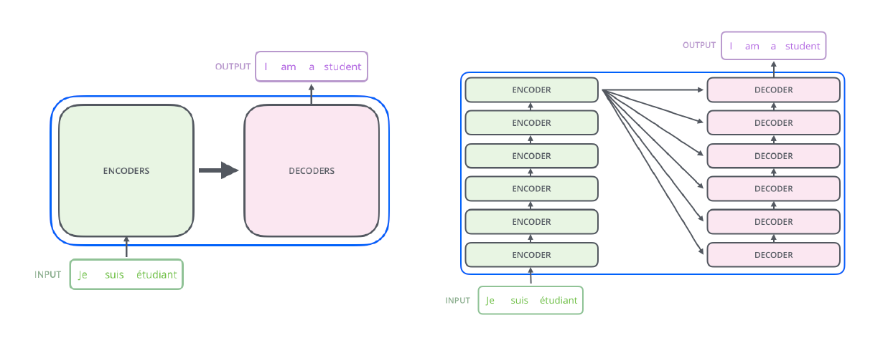
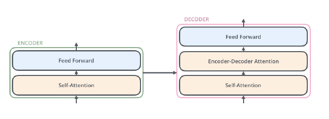
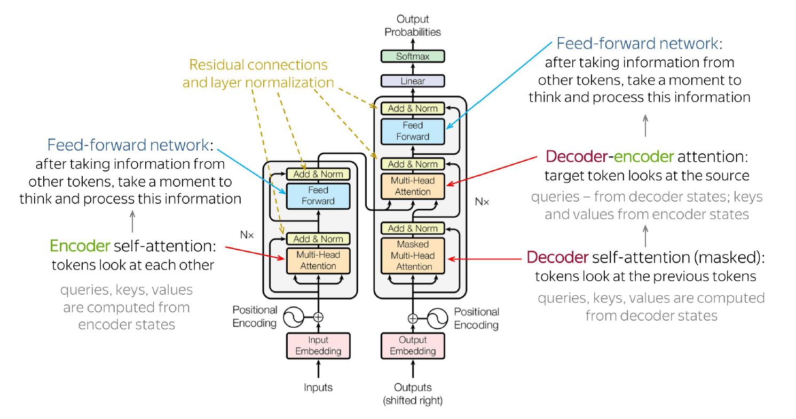

* TOC
{:toc}

## Transformers for Machine Translation
The transformer architecture proposed for machine translation task consists of encoder-decoder components. Each word in the input sequence is transformed to a fixed-size vector. These vectors are fed into the bottom-most encoder. Other encoders receive updated representation vectors from the encoder immediately below it. The encoder outputs the final representations for each token. These representations are made available to the decoder during its processing. The decoder decodes and generates the output sequence.

<figure markdown="0" class="figure zoomable">
<figcaption>
  <strong>Figure 1.</strong> Transformer schema with both encoder and decoder
</figure>

The main components within the encoder and decoder are:

<figure markdown="0" class="figure zoomable">
<figcaption>
  <strong>Figure 2.</strong> Components within encoder and decoder
</figure>

In the encoder-decoder attention mechanism, we attend the encoder states from the decoder, i.e., queries from decoder states, keys and values from encoder states. In self-attention mechanism, we attend within the encoder, i.e., from each state from a set of states to all other states in the same set. Hence, the name "self-attention".

## Transformer Architecture
The architecture given below is a sequence-to-sequence transformer architecture. This architecture is useful in the task of machine translation. For example, in the task of translating an English sentence into a Dutch sentence. The model is trained using paired input and output sentences.

<figure markdown="0" class="figure zoomable">
<figcaption>
  <strong>Figure 3.</strong> Transformer architecture with both encoder and decoder
</figure>

During training, the same input $\mathbf{X}$ (but shifted right by one token) after adding the positional encoding is fed as the input to the decoder. It is typically started with an arbitrary or indicator token \<sos\>, and it is trained to output the next word in the sequence.

Each decoder has a self-attention layer and a cross-attention layer. The self-attention layer updates the $i$th token representation using the previous predicted tokens $1, \dots, i-1$ as we saw before. But in the machine translation task, we also need the context of the source sequence while decoding, so the decoder block has an encoder-decoder cross-attention layer.

**Cross-attention layer:**

This layer allows the decoder to focus on relevant parts of the encoder output and update the representation of the words at the decoder side. In this layer, the encoder output $\mathbf{H}_{N \times d}$ is linearly projected using weight matrices to form the key and value matrices. The query matrix is computed from the decoder's input representation.

$$
\begin{align*}
\mathbf{K} & = \mathbf{HW}^K \\
\mathbf{V} & = \mathbf{HW}^V \\
\mathbf{Q} & = \mathbf{X} \mathbf{W}^Q \\
\end{align*}
$$

The $N$ tokens from the encoder output, and $t-1$ decoder generated tokens are participated in the cross-attention process.

During inference, it starts with \<sos\>, and predicts $y_1$. This predicted word is appended to the input, and the process continues until the model produces a special \<eos\> token or reaches a maximum length limit. At time step $t$, the decoder has operated till $t-1$ time step and predicted $y_1, \dots, y_{t-1}$ tokens. Then, the self-attention happens on these generated tokens. The cross attention happens on these generated tokens + encoder output.

