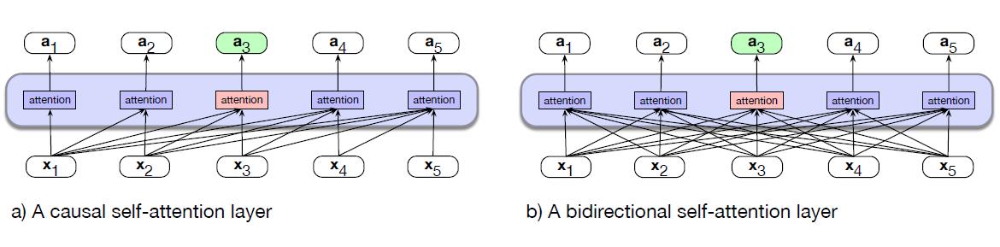
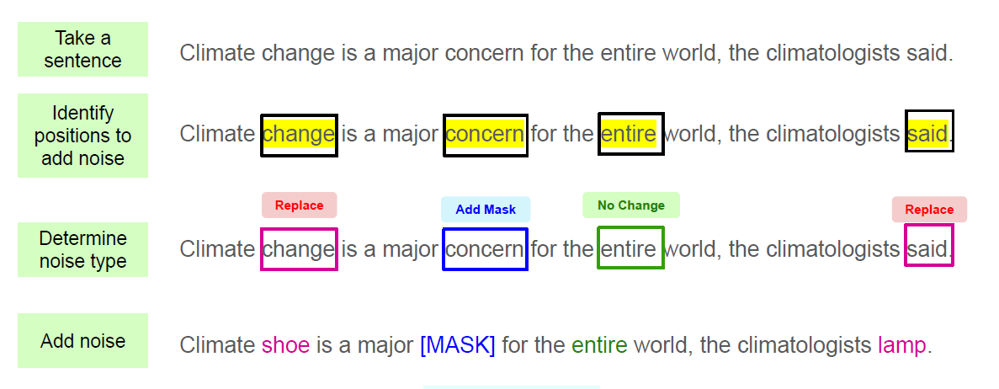
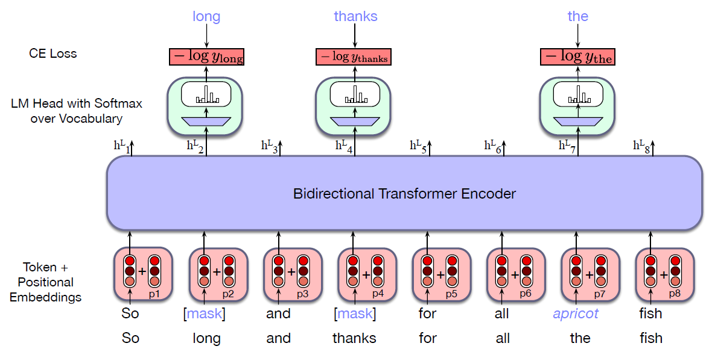
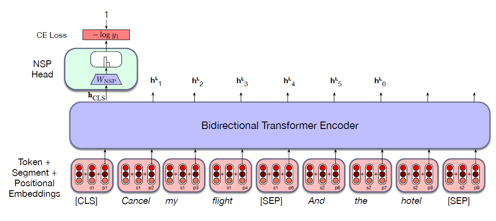
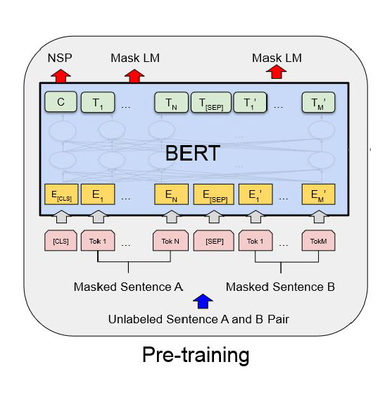

* TOC
{:toc}

## Introduction
In the previous articles, we saw how to pretrain a transformer-based language model as a causal or left-to-right language model. Here we introduce a second paradigm for pretrained language models, the bidirectional transformer encoder, and the most widely-used version, the BERT model. This model is trained via masked language modeling, where instead of predicting the following word, we mask a word in the middle and ask the model to guess the word given the words on both sides. This method thus allows the model to see both the right and left context.

## Bidirectional Transformer Encoders
In certain tasks, it is useful, when processing a token, to be able to peek at future tokens. This is especially true for sequence labeling tasks in which we want to tag each token with a label, such as the named entity tagging or POS tagging.

The focus of bidirectional encoders is on computing contextualized representations of the input tokens by attending to both the sides of the token, i.e., natural language understanding (NLU). Bidirectional encoders use self-attention to map sequences of input embeddings $(\mathbf{x}_1, \dots, \mathbf{x}_n)$ to sequences of output embeddings of the same length $(\mathbf{h}_1, \dots, \mathbf{h}_n)$, where the output vectors have been contextualized using information from the entire input sequence. These contextualized representations can then be used for classification tasks such as news categorization, etc. (here a class label is assigned to the complete input), or for sequence labeling tasks (where a class label is assigned to each token). 

  
TIP

  
The masked language models are sometimes called **encoder-only**, because they produce an encoding for each input token but generally aren't used to produce running text by decoding/sampling. That is, masked language models are not used for generation.

## Architecture for Masked Models
Bidirectional transformer language models differ in two ways from the causal transformers LMs:

1. The attention function isn't causal. In processing each token, the model attends to all inputs, both before and after the current one. 
2. The training is slightly different since we are predicting something in the middle of our text rather than at the end.

<figure markdown="0" class="figure zoomable">
<figcaption>
  <strong>Figure 1.</strong> The causal and bidirectional attention layer highlighting the attention computation at token 3.
</figure>

The implementation is very simple! We simply remove the attention masking step in the attention layer.

$$
\textbf{head} = \text{softmax}\left(\frac{\mathbf{Q}\mathbf{K}^\top}{\sqrt{d_k}} \right) \, \mathbf{V} \\
$$

The original English-only bidirectional transformer encoder model, BERT (Bidirectional Encoder Representations from Transformers), consisted of the following:

* An English-only subword vocabulary consisting of 30,000 tokens generated using the WordPiece algorithm.
* Input context window $N=512$ tokens, and model dimensionality $d=768$
* So $\mathbf{X}$, the input to the model, is of shape $[N\times d] = [512 \times 768]$.
* $L=12$ layers of transformer blocks, each with $A=12$ (bidirectional) multihead attention layers.

The resulting model has about 100M parameters.

## Training Bidirectional Encoders
We trained causal transformer language models by making them iteratively predict the next word in a text. But eliminating the causal mask in attention makes the guess-the-next-word language modeling task trivial - the answer is directly available from the context - so we're in need of a new training scheme.

The bidirectional encoders, especially BERT, is trained on two objectives:

* Masked language modelling (MLM) and 
* Next Sentence Prediction (NSP).

### Masked Language Modelling
Instead of trying to predict the next word, the model learns to perform a fill-in-the-blank task, technically called the **cloze task**. Instead of predicting which words are likely to come next in this example:

* The water of Walden Pond is so beautifully $\_\_\_$.

We're asked to predict a missing item given the rest of the sentence.

* The $\_\_\_$ of Walden Pond is so beautifully ...

More precisely, during training the model is deprived of one or more tokens of an input sequence and must generate a probability distribution over the vocabulary for each of the missing items. We then use the cross-entropy loss from each of the model's predictions to drive the learning process.

This approach can be generalized to any of a variety of methods that corrupt the training input and then asks the model to recover the original input. Examples of the kinds of manipulations that have been used include masks, substitutions, re-orderings, deletions, and extraneous insertions into the training text. The general name for this kind of training is called **denoising**: we corrupt (add noise to) the input in some way (by masking a word, or putting in an incorrect word) and the goal of the system is to remove the noise.

In masked language models training, the model is presented with a series of sentences from the training corpus in which a percentage of tokens (15% in the BERT model) have been randomly chosen to be manipulated by the masking procedure. Given an input sentence "lunch was delicious" and assume we randomly chose the 3rd token "delicious" to be manipulated.

* 80% of the time: The token is replaced with the special vocabulary token named [MASK], e.g. lunch was delicious $\to$ lunch was [MASK].
* 10% of the time: The token is replaced with another token, randomly sampled from the vocabulary based on token unigram probabilities. e.g. lunch was delicious $\to$ lunch was gasp.
* 10% of the time: the token is left unchanged. e.g. lunch was delicious $\to$ lunch was delicious. Since we are considering a fixed proportion of 15% of the tokens in each sentence to be corrupted every time, the model may find this pattern. So, to avoid this, we do this third strategy of changing nothing.

<figure markdown="0" class="figure zoomable">
<figcaption>
  <strong>Figure 2.</strong> Three strategies of corrupting the text.
</figure>

We then train the model to guess the correct token for the manipulated tokens. So each training data point is a pair of sentences: input is the sentence with manipulated tokens and output is the sentence with correct tokens. The training procedure is as follows:

1. The original input sequence is tokenized using a subword model and tokens are sampled to be manipulated.
2. Word embeddings for all of the tokens in the input are retrieved from the $\mathbf{E}$ embedding matrix and combined with positional embeddings to form the input to the transformer.
3. It is then passed through the stack of bidirectional transformer blocks, and then the language modeling head.

4. The MLM training objective is to predict the original inputs for each of the masked tokens and the cross-entropy loss from these predictions drives the training process.

<figure markdown="0" class="figure zoomable">
<figcaption>
  <strong>Figure 3.</strong> Masked language model training. Given the noisy token, the model is trained to predict the original token.
</figure>

In this example, three of the input tokens are selected, two of which are masked, and the third is replaced with an unrelated word. The probabilities assigned by the model to these three items are used as the training loss. The other 5 tokens don’t play a role in training loss.

Suppose we are given an input sentence $\mathbf{x}$. Let $M$ be the set of tokens that are manipulated. The version of the sentence with $M$ manipulated tokens be $\mathbf{x}^{\text{mask}}$, and the sequence of output vectors be $\mathbf{h}$. For a given input token $x_i$, such as the word 'long', the loss is the probability of the correct word 'long', given $\mathbf{x}^{\text{mask}}$ (as summarized in the single output vector $\mathbf{h}_i^L$).

$$
L_{\text{MLM}}(x_i) = -\log P(x_i \, | \,\mathbf{h}_i^L) 
$$

The average loss from a single training sequence $\mathbf{x}$ is then:

$$
L_{\text{MLM}} = - \frac{1}{|M|} \sum_{i \in M} \log P(x_i \, | \,\mathbf{h}_i^L)
$$

Note that only the tokens in $M$ play a role in learning; the other tokens play no role in the loss function, so in that sense BERT and its descendants are inefficient; only 15% of the input samples in the training data are actually used for training weights.

During inference, if the model is able to reconstruct the sentences over many-many-many-... examples from the test corpora, then it has got deeper understanding of the meanings of words in their context, i.e., it has understood the language. So, it can produce effective representations for each token.

### Next Sentence Prediction
An important class of applications involves determining the relationship between pairs of sentences. These include tasks like

* Paraphrase detection (detecting if two sentences have similar meanings)
* Entailment (detecting if the meanings of two sentences entail or contradict each other)
* Discourse coherence (deciding if two neighboring sentences form a coherent discourse).
* Question-answer pair.

To capture the kind of knowledge required for such applications, some models in the BERT family include a second learning objective called **Next Sentence Prediction (NSP)**.

In this task, the model is presented with pairs of sentences and is asked to predict whether each pair consists of an actual pair of adjacent sentences from the training corpus or a pair of unrelated sentences. In BERT, 50% of the training pairs consisted of positive pairs, and in the other 50% the second sentence of a pair was randomly selected from elsewhere in the corpus. The NSP loss is based on how well the model can distinguish true pairs from random pairs.

<figure markdown="0" class="figure zoomable">
<figcaption>
  <strong>Figure 4.</strong> NSP architecture and loss computation. The vectors $\mathbf{h}^L_i$ for $i=1, \dots, N$ from the final layer is the enriched representation of each token $i$ in the input text, and $\mathbf{h}_{\text{CLS}}$ is the representation of the whole input text.
</figure>

To facilitate NSP training, BERT introduces two special tokens to the input representation. After tokenizing the input with the subword model, the token [CLS] is prepended to the input sentence pair, and the token [SEP] is placed between the sentences and after the final token of the second sentence. There are actually two more special tokens, a 'First Segment' token, and a 'Second Segment' token. These tokens are added in the input stage to the word and positional embeddings.

That is, each token of the input $\mathbf{X}$ is actually formed by summing 3 embeddings: word, position, and first second segment embeddings. Let $\mathbf{h}^L_{\text{CLS}}$ be the final hidden state vector of the [CLS] token which serves as the aggregate representation of the input sentence pair. This vector is passed to an NSP head, which consists of a learned set of classification weights $\mathbf{W}_{\text{NSP}} \in \mathbb{R}^{d \times 2}$.

$$
\begin{align*}
\mathbf{z} & = \mathbf{h}^L_{\text{CLS}} \mathbf{W}_{\text{NSP}} + \mathbf{b} \\
\mathbf{p} & = \text{softmax}(\mathbf{z}) \\
\end{align*}
$$

where $p_0$ denotes the probability that second segment (the second sentence) is a random sentence (NotNext), and $p_1$ denotes the probability that second segment (the second sentence) is the actual next sentence (IsNext). Cross entropy is used to compute the NSP loss for each sentence pair presented to the model.

$$
L_{\text{NSP}} = - [y \log p_1 + (1-y) \log p_0]
$$

But since this is a 2-class softmax, it is also equivalent to:

$$
L_{\text{NSP}} = - \log p_y
$$

where $y \in \{0,1\}$ and $p_y$ is the predicted probability of the correct class.

  
WARNING

  
In Logistic regression, we just predict the single class, that is, the probability of belonging to class 1, denoted by $p$. Thus, we need to have both the terms in the loss function:
  
  $$L_{\text{LR}} = - [y \log p + (1-y) \log (1-p)] $$
  

## BERT Final Objective

In BERT, the NSP loss was used in conjunction with the MLM loss to form the final loss.

$$
L = L_{\text{MLM}} + L_{\text{NSP}}
$$

where $L_{\text{MLM}}$ is the token-level cross-entropy and $L_{\text{NSP}}$ is the sentence-level binary cross-entropy.

To train the original BERT models, pairs of text segments were selected from the training corpus according to the next sentence prediction 50/50 scheme. Pairs were sampled so that their combined length was less than the 512 token input. Tokens within these sentence pairs were then masked using the MLM approach. Then the combined loss from the MLM and NSP objectives is used as the final loss. Because this final loss is backpropagated through the entire transformer, the embeddings at each transformer layer will learn representations that are useful for predicting words from their neighbors. Since the [CLS] tokens are the direct input to the NSP classifier, their learned representations will tend to contain information about the sequence as a whole.

<figure markdown="0" class="figure zoomable">
<figcaption>
  <strong>Figure 5.</strong> BERT Pretraining
</figure>

  
NOTE

  
The MLM training and the NSP training are self-supervised learning tasks: the training data can be created using automated code, and human supervision for labels is not necessary.

Note that the special tokens [CLS], [SEP], [MASK] are added to the vocabulary and each token is assigned a static word embedding at the input stage.

If we are training a BERT-like model from scratch, we initialize embeddings (including special tokens like [CLS], [SEP]) randomly and learn them during training. Typically we start with training a tokenizer (e.g., WordPiece/BPE) and define a vocabulary including the special tokens [CLS], [SEP], and [MASK]. The pipeline is as follows:

* Raw text
   ↓
* Train tokenizer (WordPiece/BPE)
   ↓
* Get vocabulary V. Add special tokens to the vocabulary such as [PAD], [UNK], [CLS], [SEP], [MASK].
   ↓
* Map each token in the vocabulary to an id (token index).
   ↓
* Initialize embedding matrix E randomly where each row corresponds to the embedding for each token index.
   ↓
* Train model (MLM / NSP / etc.)
   ↓
* Embeddings become meaningful. Note that the initial embeddings $\mathbf{E}$ are also updated during training.

Note here we haven't used any pretrained embeddings such as Word2Vec or GloVe to start with. But if it required, we can train a Word2Vec or GloVe on our corpus, and use the embeddings learned by Word2Vec to start with. In this case $\mathbf{E}$ is fixed, it is not updated during training.