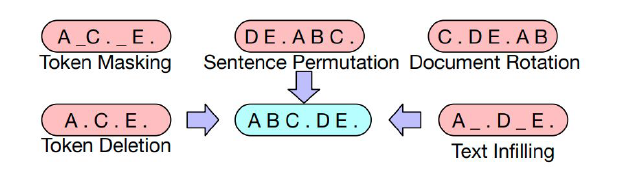

* TOC
{:toc}

## Different Models
Various popular models (variants of BERT) are created by changing the training data, architecture, and objective.

**BERT:**

* Language support: English
* Training data: Used the Books Corpus (800M words) and English Wikipedia (2,500M words).
* Architecture: Encoder of transformer
* Objective function: MLM and NSP

**Multilingual BERT (mBERT):**

* Language support: 104 languages, No English and Chinese languages.
* Training data: Entire Wikipedia dump for each language excluding user and talk pages.
* Architecture: Encoder of transformer
* Objective function: only MLM objective

The number of pages for each language will not be uniform: some languages have more resources while others have less. So, exponentially smoothed weighting of the data is done while sampling to create the training data. More weightage is given to the low-resource languages, and less weightage to the high-resource languages while sampling.

**Multilingual Representations for Indian Languages (MuRIL):**

* Language support: 17 Indian languages, and their transliterated counterparts.
* Training data: Wikipedia, Common Crawl, PMINDIA and Dakshina.
* Architecture: Encoder of transformer
* Objective function: only MLM objective

**BART:**
* Language support: English
* Training data: Not specified
* Architecture: Complete transformer architecture (large sequence to sequence model) with 12 layers of encoders and decoders.
* Objective function: Set of Noise functions to corrupt the document. Noise functions are token masking, sentence permutations, document rotation, token deletion, and text infilling.

Since some tokens are deleted in the input, we want the model to generate that token in the output. So, we need decoders as well.

<figure markdown="0" class="figure zoomable">
<figcaption>
  <strong>Figure 6.</strong> Various strategies to add noise
</figure>

**mBART:**
Multilingual Denoising Pre-training for Neural Machine Translation

* Language support: 25 (mBART25) and 50 (mBART50) languages.
* Training data: Common Crawl
* Architecture: Complete transformer architecture (large sequence to sequence model) with 12 layers of encoders and decoders.
* Objective function: Sentence permutation and word-span masking (instead of masking a single token we mask a span of words).

Study SpanBERT and Electra.
