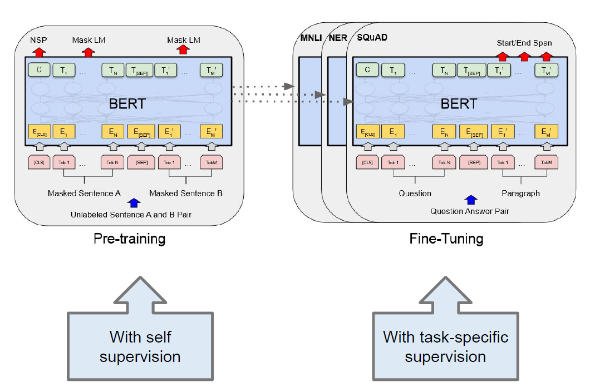
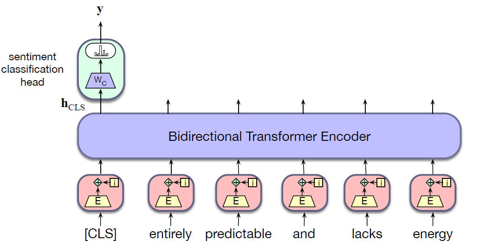

* TOC
{:toc}

## Introduction
The pretrained language models, the one especially trained with the MLM + NSP objective can be used for downstream applications. The embeddings created by these models seem to function particularly well as representations compared to the embeddings created by causal language models.

So, once the BERT model is pretrained, we can fintetune it by adding application specific circuitry (often called a special head) on top of it. The finetuning process consists of using labeled data about the application to train these additional application-specific parameters. Typically, this training will either freeze or make only minimal adjustments to the pretrained language model parameters.

<figure markdown="0" class="figure zoomable">
<figcaption>
  <strong>Figure 1.</strong> Bert Pretraining and finetuning.
</figure>

The finetuning can be done to perform downstream tasks like sequence classification, sentence-pair classification, sequence labeling, question-answering. Depending upon the task, the structure of the network differs.

## Fine-Tuning for Sequence Classification
The task of sequence classification is to classify an entire sequence of text with a single label. This set of tasks is commonly called text classification, like sentiment analysis or spam detection in which we classify a text into two or three classes (like positive or negative), as well as classification tasks with a large number of categories, like document-level topic classification.

For sequence classification, we need to represent the entire input text as a single vector. This can be done in various ways. One way is to take the sum or the mean of the last output vector from each token in the sequence. With BERT, we instead prepend a new unique token [CLS] to the start of all input sequences. The output vector in the final layer of the model for the [CLS] token represents the entire input sequence. This vector is passed as the input to a classifier head, a logistic regression or neural network classifier that makes the relevant decision.

<figure markdown="0" class="figure zoomable">
<figcaption>
  <strong>Figure 2.</strong> Sequence classification with a bidirectional transformer encoder
</figure>

Finetuning for classification involves learning a set of weights, $\mathbf{W}_c$, to map the output vector for the [CLS] token - $\mathbf{h}^L_{CLS}$ - to a set of scores over the possible classes. Assuming a three-way sentiment classification task (positive,negative, neutral) and dimensionality $d$ as the model dimension, $\mathbf{W}_c$ will be of size $[d \times 3]$. To classify a document, we pass the input text through the pretrained language model to generate $\mathbf{h}^L_{CLS}$, multiply it by $\mathbf{W}_c$, and pass the resulting vector through a softmax.

$$
\mathbf{y} = \text{softmax}(\mathbf{h}^L_{CLS} \, \mathbf{W}_c)
$$

Learning the value of $\mathbf{W}_c$ requires supervised training data consisting of input sequences labeled with the appropriate sentiment class. Training proceeds in the usual way; cross-entropy loss between the softmax output and the correct answer is used to drive the learning.

This loss can be used to not only learn the weights of the classifier, but also to update the weights for the pretrained language model itself. In practice, reasonable classification performance is typically achieved with only minimal changes to the language model parameters, often limited to updates over the final few layers of the transformer.

## Sequence Labeling
If our goal is to classify each token of the input string, then the output vector of [CLS] token is ignored, but the output of other tokens are passed to a shared linear-plus-softmax layer.

## Question-Answering Task
Given a passage and a question (for which the answer lies within the passage), the model is trained to predict the answer substring from the passage, i.e., it is trained to predict the start position and end position from the given passage.