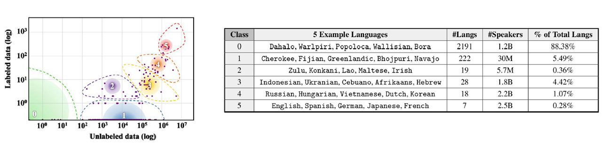
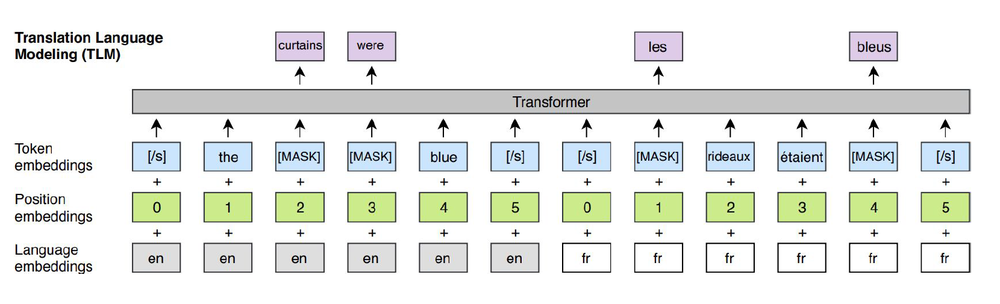
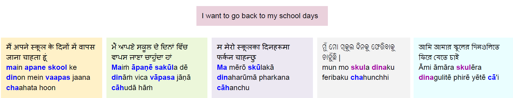
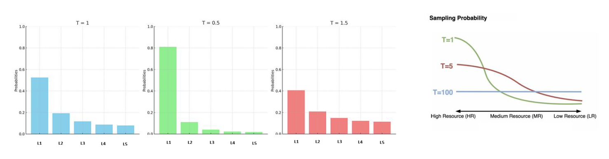

* TOC
{:toc}

## Introduction
Across the globe, there are 7000+ languages. Most of the languages in the world are low-resource languages. Only ~300 languages has Wikipedia page. Only ~100 languages are part of existing large language models.

<figure markdown="0" class="figure zoomable">
<figcaption>
  <strong>Figure 1.</strong> Language landscape
</figure>

88% of the world's languages, spoken by 1.2B people are untouched by the benefits of language technology. The majority of the globe population - roughly 95% - doesn't speak English as their primary language, and 75% of the globe population do not speak English at all. This proves that we need support for multilingualism in NLP. Can we pretrain a model to make it learn multiple languages together? Our objective is to get pretrained models that have knowledge about multiple languages.

## Translation Language Modelling
Suppose we want the model to learn both English and French. Then we create parallel data: each training input data point consists of a sentence in English and its corresponding sentence in French. These two sentences are concatenated with sentence boundary tokens.

<figure markdown="0" class="figure zoomable">
<figcaption>
  <strong>Figure 2.</strong> Multilingual translation language modelling.
</figure>

The learning is not self-supervised as it needs parallel data which requires human intervention.

## Better Multilingual Representations
**Transliteration** is the process of converting text from one writing system into another. It is often used to represent words from one language in the script of another language. For example, the Hindi word "नमस्ते" can be transliterated into English as "namaste". The main goal of transliteration is to preserve the phonetic aspects of the original word while representing it in a different script. In multilingual language modelling, we can use transliteration to represent words from different languages in a common script (say English), which can help the model learn shared representations across languages.

<figure markdown="0" class="figure zoomable">
<figcaption>
  <strong>Figure 3.</strong> Native script vs transliterated (romanized) script.
</figure>

The words in other languages that correspond to "skul" when transliterated in English get the same representation in the model. This allows the model to learn shared representations across languages, which can improve its performance on multilingual tasks. Therefore, using transliterated data to train the model is a very good choice.

## Balancing Act
Suppose there are $N$ languages, and we have datasets $\{D_1, D_2, ..., D_n\}$ from each language. The size of $D_i$ can vary significantly across languages. For example, we may have a large amount of data for English, but only a small amount for a low-resource language like Swahili. From these datasets, we need to create a dataset $D$ which comprises examples from all languages. But the imbalance in the amount of data can lead to a bias towards the language with more data. So, the model may learn to perform well on the language with more data, but perform poorly on the underrepresented language. Therefore, it is important to balance the training data while creating it. We need to adjust the sampling probability for different population subgroups (here subgroups refer to different languages or different domains).

Let $\{y_1, \dots, y_n\}$ be the number of samples in datasets $\{D_1, D_2, ..., D_n\}$ respectively. We want to create a dataset $D$ with $N$ samples which has the uniform number of samples from all languages. Since there are $n$ different languages, we need to get $\frac{N}{n}$ samples from each language. But this may disregard most of the samples from high-resource languages. On the other hand, on sampling in the following proportion:

$$
\left\{ \frac{y_1}{y}, \dots, \frac{y_n}{y} \right\}
$$

where $y = \sum_{i=1}^n y_i$, the HRLs dominate.

**Temperature sampling**:
Temperature sampling is a technique used to control the distribution of samples in the training data when creating a multilingual dataset. It involves a temperature parameter $T$, which determines the probability of selecting samples from that language during training. We sample as per the following proportion from each language.

$$
\left\{\frac{y_1}{T}, \dots, \frac{y_n}{T}\right\}
$$

where $T$ is a hyperparameter. Therefore, the probability of choosing a sample from language $i$ is:

$$
p_i = \frac{e^{\frac{y_i}{T}}}{\sum_{k=1}^n e^{\frac{y_k}{T}}}
$$

* When $T\to \infty$, the numerator and denominator become $e^0=1$. Then, the probability will be $p_i \approx \frac{1}{n}$. This gives us uniform distribution of samples from the languages.

* When $T$ is low (close to 0), then the proportion of HRLs gets amplified. We get too many samples from languages that have a lot of data. This gives us a skewed distribution of samples from the languages.

* When $T$ is between low and high, we will strike a balance between the above two scenarios. The high proportion contents are damped a little and the low proportion contents are boosted up. We would typically like to operate in this region.

<figure markdown="0" class="figure zoomable">
<figcaption>
  <strong>Figure 4.</strong> Temperature sampling
</figure>

Thus, by adjusting the temperature parameter, we can balance the data from all languages (or from different domains) during the training dataset creation process. This ensures that the model learns from all languages effectively, thereby improving the model performance on multilingual tasks.

## Challenges in Multilingual Modelling
To train a multilingual model, we need data from multiple languages, from multiple domains, and quality data. Some of the challenges in multilingual language modelling include: need for special preprocessing tools for each language, availability of only limited identification tools for toxic/adult content, etc.