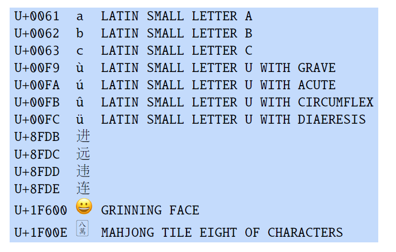
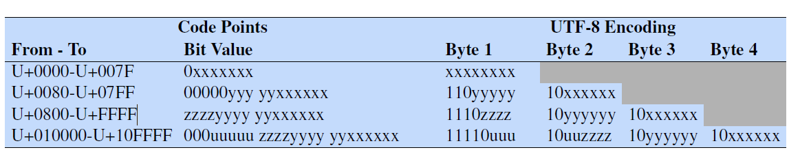

* TOC
{:toc}

## Introduction
The very first step in modern NLP is to identify the language and create tokens. Later, we find representation for these tokens. The flow is

raw input text $\to$ normalizer $\to$ Pre-tokenizer $\to$ Tokenizer $\to$ vocabulary $\to$ embeddings (static embeddings from Word2Vec, GloVe, etc. or contextual embeddings learned within the model).

**Text Normalization:**

In many scenarios, the same thing can be written in many different ways. So, in the process of tokenization, the first step is to translate non-standard text to a standard form. This process is known as text or lexical normalization. For example, transliteration is a form of normalization, or converting the input sentence "new pix coming tmrw" to "new pictures coming tomorrow" is a type of normalization. This is typically done to ensure some uniformity between different forms of the word (pics, pix, etc.).

**Pre-Tokenization:**
The input is split based on the space character and punctuation to get the individual words. These individual words are sent to the tokenizer.

**Tokenizer:**

Tokenization gives out basic units for processing. But what are the basic units? Possible answers are:

1. Words (human way)
2. Morphemes: Linguistic way, i.e., each part coming from this split has some linguistic properties such as root, prefix, suffix, etc.
3. Characters
4. Subwords
5. Superwords

## Words
* **Word types** are the number of distinct words in a corpus; if the set of words in the vocabulary is $V$, the number of types is the vocabulary size $|V|$.
* **Word instances** are the total number $N$ of running words.

"They picnicked by the pool, then lay back on the grass and looked at the stars."

If we ignore punctuation, this sentence has 14 types and 16 instances ('the' is repeated 3 times). It is shown that

$$
|V| = k N^{\beta}
$$

where $k$ and $\beta$ are positive constants, and $\beta$ will be between 0 and 1 (roughly around 0.44 to 0.56). Roughly we can say that the vocabulary size for a text goes up a little faster than the square root of its length in words.

The number of words (word types) grows without bound in English, so language models and other NLP models don't use words as their unit of processing. Instead, they use smaller units called subwords that can be recombined to model new words that our model has never seen before. To think about defining subwords, we first need to talk about units that are smaller than words: morphemes and characters.

## Morphemes: Parts of Words
Words have parts. At the level of characters, this is obvious. The word 'cats' is composed of four parts, 'c', 'a', 't', 's'. But this is also true at a more subtle level: words have parts that themselves have coherent meanings. These parts are called as Morphemes. A morpheme is a minimal meaning-bearing unit in a language. So, for example

* The word 'fox' consists of one morpheme (the morpheme fox) while the word 'cats' consists of two: the morpheme 'cat' and the morpheme '-s' that indicates plural.
* The word "undeniable" has three morphemes. `un` (prefix), `deni` (root), and `able` (suffix) whereas the word 'under' has only one morpheme.

We generally categorize morphemes into two broad classes: **roots** - the central morpheme of the word, supplying the main meaning, and **affixes** - adding 'additional' meanings of various kinds. For example, in the word 'worked', work is a root and -ed is an affix. In English, we can typically observe 1.7 morphemes per word on average.

The fact morphemes can be hard to define, and that many languages can have complex morphemes that aren't easy to break up into pieces makes it very difficult to use morphemes as a standard for tokenization cross-lingually.

## Unicode
Another option we could consider for tokenization is the level of the individual character. How do we even represent characters across languages and writing system? The Unicode standard is a method for representing text written using any character in any script of the languages of the world. English is written using Latin characters (the Latin script).

As of today, there are more than 150,000 characters and 168 different scripts supported in Unicode 16.0 including mathematical symbols, emojis, currency symbols, and more. We assign a unique id, called a code point, for each one of these 150,000 characters. The code point is an abstract representation of the character called as the Unicode representation. Each code point is a number, traditionally written in hexadecimal, from number 0 through 0x10FFFF (which is 1,114,111 in decimal). Having over a million code points means there is a lot of room for new characters.

It is traditional to represent these code points with the prefix "U+" (which just means "the following is a Unicode hex representation of a code point"). So the code point for the character 'a' is 'U+0061' which is the same as '0x0061'. Each hex digit is equivalent to 4-bit binary. So, the code point in binary is: 0000 0000 0110 0001.

<figure markdown="0" class="figure zoomable">
<figcaption>
  <strong>Figure 1.</strong> Some sample code points with its description
</figure>

Note that a code point does not specify the glyph, the visual representation of a character. Glyphs are stored in fonts. There can be an indefinite number of visual representations. For example for character 'a', different fonts like in Times Roman, Courier, or different font styles like boldface or italic. But all of them are represented by the same code point U+0061.

### UTF-8 Encoding
While the code point (the unique id) is the abstract Unicode representation of the character, we don't just stick that id in a text file. Instead, whenever we need to represent a character, we write an encoding of the character. There are many different possible encoding methods, but the encoding method called UTF-8 (Unicode Transformation Format 8) is by far the most frequent.

The Unicode representation of the word 'hello' consists of the following sequence of 5 code points:

U+0068 U+0065 U+006C U+006C U+006F

The UTF-8 encoding represents characters efficiently (using fewer bytes on average) by writing some characters using fewer bytes and some using more bytes. UTF-8 is thus a variable-length encoding.

For `h`, the corresponding bit sequence for the code point U+0068 is `0000 0000 0110 1000`. This is encoded in one-byte bit sequence as `0110 1000`, which is 104 in decimal. Thus, the UTF-8 encoding of hello (in decimal) is: 

`hello` $\to$ [104, 101, 108, 108, 111]

Here each character is represented by a single byte. We can represent a total of 256 unique characters with a single byte ($2^8 = 256$). The first bit is reserved, so we use a byte to represent 128 unique characters (represented by 00 to 7F).

* For example, the character `h` is represented as 104 in decimal, 68 (in hex), and 0110 1000 in bit sequence.

The first 127 characters (ASCII) are encoded in one-byte in UTF-8 encoding. Code points $\geq 128$ are encoded as a sequence of two, three, or four bytes.

* For example: the character `é` is mapped to a code point of U+00E9. The bit sequence is `0000 0000 1110 1001`. The UTF-8 encoding of this code point is `1100 0011 1010 1001` (the rule is given below). This is [195, 169] (in decimal).

We can represent a total of $2^{16} = 65,536$ unique characters with two bytes. But some bits are reserved, which allows us to represent only 2047-128 = 1919 unique characters with two bytes.

So, in total we have [0 to 127] (one byte) + [128 to 2047] (two-byte) + [2048 to 65,535] (three-byte) + [65,536 to 1,114,111] unique values to assign to a character. The same ranges given in hex as follows:

<figure markdown="0" class="figure zoomable">
<figcaption>
  <strong>Figure 2.</strong> Mapping from Unicode code point to the variable length UTF-8 encoding.
</figure>

Most characters in European, Middle Eastern, and African scripts map to two bytes, most Chinese, Japanese, and Korean characters map to three bytes, and rarer CJKV characters and emojis and some symbols map to 4 bytes.