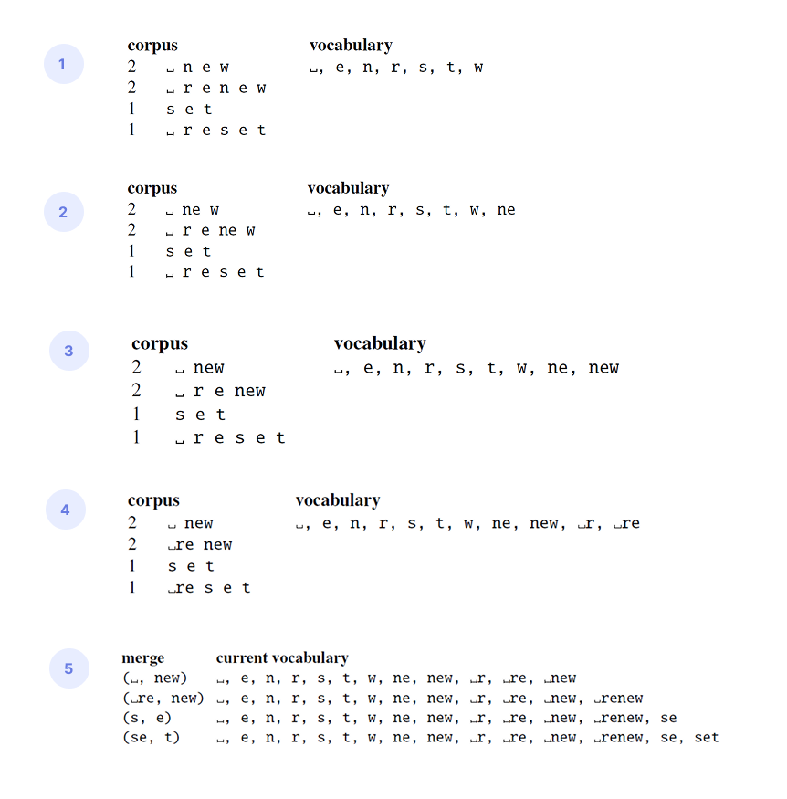
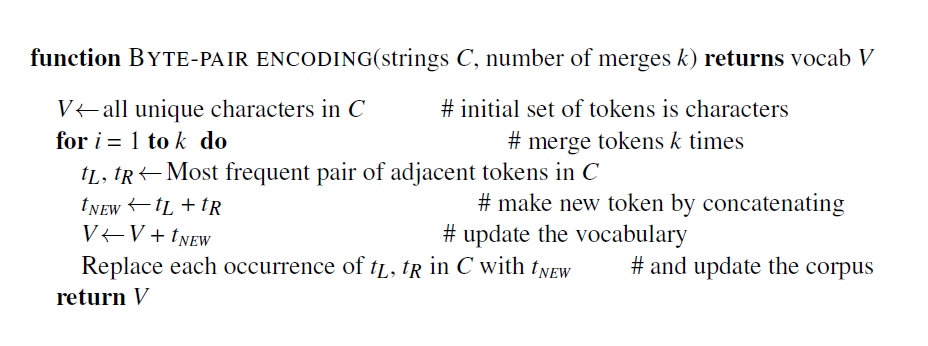

* TOC
{:toc}

## Subword Tokenization: Byte-Pair Encoding
Tokenization is the process of segmenting the running input text into tokens.

We've seen three candidates for tokens: words, morphemes and characters. But each has problems as a unit.

* Words and morphemes seem approximately at the right level for NLP processing, since they tend to capture semantics, but they are challenging to define formally. We end up with a large vocabulary, and with the possibility of unknown token problem (because of new words or spelling errors, etc.). It is difficult to scale in multilingual setting (7000+ languages across the globe).

* Characters are clearer to define. Vocabulary size will be small, and it solves the unknown token problem, but it is too small a unit to choose for tokens. The length of the text will become really long that existing architectures cannot handle. For example, a sentence with 200 characters has 200 token embeddings. And also, it is difficult to capture the word level meaning.

For the text "learning tokenization", there are 2 words and 21 characters.

Is there something between character and word level? In practice, we use a data-driven approach to define tokens that will generally result in units about the size of morphemes or words, but occasionally use units as small as characters. Such subword tokenization algorithms also eliminate the problem of unknown words. Every unseen word can be represented by some sequence of known subword units.

For example, if we had happened not to ever see the word 'lower', when it appears we could segment it successfully into 'low' and 'er' which we had already seen.

The popular subword tokenization algorithms used in modern language models are:

1. Byte pair encoding (BPE)
2. Word Piece
2. Unigram language modeling (ULM)
4. Sentence Piece

## BPE Algorithm
The BPE algorithm has two parts: a trainer and an encoder:

1. In the token training phase we take a raw training corpus (usually roughly pre-separated into words, for example by whitespace) and induce a vocabulary, a set of tokens.
2. Then a token encoder takes a raw test sentence and encodes it into the tokens in the vocabulary that were learned during training.

### BPE Training
The BPE training algorithm iteratively merges frequent neighboring tokens to create longer and longer tokens. The algorithm begins with a vocabulary that is just the set of all individual characters (including punctuation and whitespace characters). It then examines the training corpus, and finds the two characters that are most frequently adjacent.

Imagine our original corpus is

$$
\text{set}\_ \text{new} \_ \text{new} \_ \text{renew} \_\text{reset} \_ \text{renew}
$$

where $\_$ indicates a whitespace.

1. First, we'll break up the corpus into words, with leading whitespace, together with their counts; no merges will be allowed to go beyond these word boundaries. This step is called as **pre-tokenization**. The result looks like the following list of 4 words and a starting vocabulary with 7 base characters. We then rewrite the corpus using the tokens in the vocabulary (each character is a token in the start).

2. Then, we count all pairs of adjacent symbols: the most frequent is the pair `n e` because it occurs in new (frequency of 2) and renew (frequency of 2) for a total of 4 occurrences. We then merge these symbols, add a new merged token `ne` to the vocabulary, and replace every adjacent `n e` in the corpus with the new token `ne`.

3. Now the most frequent pair is `ne w` (total count=4), which we merge.

4. Next `_ r` (total count of 3) get merged to `_r`, and then `_r e` (total count 3) gets merged to `_re`.

<figure markdown="0" class="figure zoomable">
<figcaption>
  <strong>Figure 1.</strong> BPE training iteration
</figure>

The algorithm continues to count and merge,  creating new longer and longer character strings, until $k$ merges have been done creating $k$ novel tokens; $k$ is thus a parameter of the algorithm. The resulting vocabulary consists of the original set of characters plus $k$ new symbols.

<figure markdown="0" class="figure zoomable">
<figcaption>
  <strong>Figure 4.</strong> BPE training algorithm. Here $C$ is the set of strings from corpus that we got from pre-tokenization (after splitting by whitespace).
</figure>

Note that the algorithm does not merge across word boundaries; merges are only allowed within the strings.

The algorithm also takes a target vocabulary size as the input; typically it will be 32k, 64k, 128k, etc. The BPE algorithm is run till our desired vocabulary budget is reached, thus the BPE allows us to have a controlled vocabulary size.

Suppose we did 256k merges, and our vocabulary approximately has 256k tokens. Now, due to some limitations, say we need to reduce the size of the vocabulary to only 64k tokens. Then we can simply take the top 64k merge rules from the learned merge rules; we don't have to rerun the BPE to get the vocabulary.

### BPE Encoder (Inference)
Once we've learned our vocabulary, the BPE encoder is used to tokenize a test sentence. The encoder just runs on the test data the merges we have learned from the training data. It runs them greedily, **in the order we learned** them. Thus, the frequencies in the test data don't play a role, just the frequencies in the training data. Suppose our learned merge rules are:

* `n e` $\to$ `ne`
* `ne w` $\to$ `new`
* `_ r` $\to$ `_r`
* `_r e` $\to$ `_re`
* `_ new` $\to$ `_new`
* `_re new` $\to$ `_renew`
* `s e` $\to$ `se`
* `se t` $\to$ `set`

with a vocabulary set as mentioned in (5) in the figure above. Given a test sentence, we first segment each **word** in the test sentence into characters. For example, 

1. The word "newly" is segmented into `n e w l y`.
2. Then we apply the first rule: replace every instance of `n e` with `ne` which then becomes `ne w l y`
3. Then the second rule: replace every instance of `ne w` with `new` which then becomes `new l y`
4. The characters `l` and `y` are not present in our vocabulary. So, they are represented by the unknown token. Thus, the word is tokenized as `new UNK UNK` (3 tokens). In real settings, this is very rare, because BPE is run with tens of thousands of merges on a very large input corpus, to produce vocabulary sizes of 50k, 100k, or even 200k tokens.

The result is that most words can be represented as single tokens, and only the rarer words (and unknown words) will have to be represented by multiple tokens.

  
NOTE

  
For multilingual systems, the tokens are often dominated by English, leaving fewer tokens for other languages.

When working with existing models in NLP, we start with specifying the tokenizer. On loading it, the learned merge rules and vocabulary are loaded into the memory. Then, we feed in the raw text to get it tokenized as per the learned merge rules. 

## BPE in Practice
We normally run BPE on the individual bytes of UTF-8-encoded text. That is, we take a Unicode representations of text as a series of code points, encode it in bytes using UTF-8, and we treat each of these individual bytes as the input to BPE.

For example, for the word

`hello` $\to$ U+0068 U+0065 U+006C U+006C U+006F (code points) $\to$ [104, 101, 108, 108, 111] (UTF-8 encoded, in decimal).

This is passed as input to the BPE algorithm. When two bytes are merged during BPE training, a new unique token ID (an integer) is assigned. Suppose BPE finds `l l` to be a frequent pair, then we create a new token `ll` and assign a new id, say 256. Now sequence becomes: [104, 101, 256, 111]. The token 256 internally corresponds to (108, 108).

The character `é` is represented by two bytes in the UTF-8 encoding [195, 169]. This is passed as two different tokens to the BPE.

* If BPE learns that they occur adjacent frequently, then we merge and assign a new token id, say 300, which corresponds to (195, 169).
* If BPE doesn't merge them, it becomes two tokens in the vocabulary, but still correctness is preserved. When we use UTF-8 decode, we can still reconstruct the character exactly.

The sentence "Anyhow, she's seen Jane's 224124 flowers" is first split by whitespace:

`Anyhow,` `_she's` `_seen` `_Jane's` `_224124` `_flowers`

Each word is then converted to a sequence of token ids.

* `Anyhow,` $\to$ [65, 110, 121, 104, 111, 119, 44]
* `_she's` $\to$ [95, 115, 104, 101, 39, 115]

These are UTF8 byte values for each character. The vocabulary set consists of token ids [0 to 255]. BPE algorithm is run on these tokens, and a new vocabulary set is created.

The model is then trained with this fixed vocabulary set of tokens. During inference, the model predicts these tokens in sequence. These tokens are mapped back to the byte-level sequence (for e.g., id 300 is mapped to byte values [195, 169]), and then passed to a UTF8 decoder to construct the sentence.

### Tokenizer Simulation

Use [tokenizer](https://tiktokenizer.vercel.app/) to see the number of tokens in a given sentence as defined by the BPE tokenizer in large systems like OpenAI GPT4o. For example, the sentence "hello! I am Bharath" is tokenized as

[24912 (`hello`), 0(`!`), 357(`_I`), 939 (`_am`), 99038 (`_Bhar`), 725 (`ath`)] by GPT-4o.

with the token id for each of the subwords.

  
NOTE

  
Current NLP models are built upon the paradigm of pretraining + fine-tuning. In the pretraining phase, typically the vocabulary is fixed after tokenization. In downstream tasks, same vocabulary is used. There are some adaptation techniques to expand the vocabulary if needed during fine-tuning, but this is generally avoided by including such data in pretraining itself.

