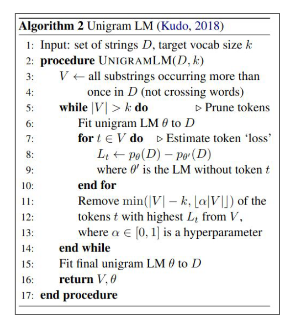
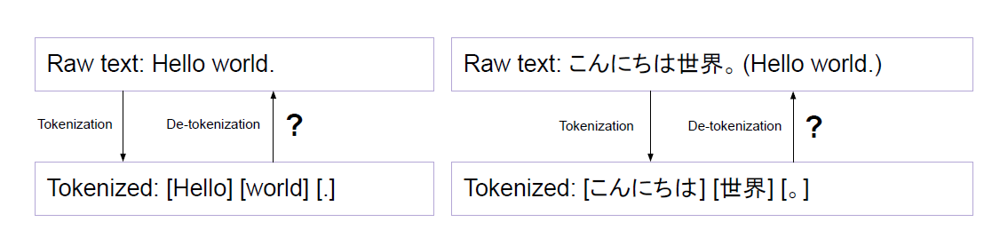
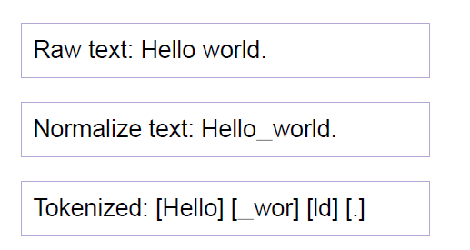

* TOC
{:toc}


## Introduction
Compared to BPE and WordPiece, Unigram works in the other direction: it starts from a big base vocabulary and removes tokens from it until it reaches the desired vocabulary size. There are several options to use to build that base vocabulary: we can take the most common substrings from pre-tokenized words, or apply BPE on the initial corpus with a large vocabulary size.

## Training Algorithm
At each step of the training, the Unigram algorithm computes a loss over the corpus given the current vocabulary. Then, for each symbol in the vocabulary, the algorithm computes how much the overall loss would increase if the symbol was removed, and looks for the symbols that would increase it the least. Those symbols have a lower effect on the overall loss over the corpus, so in a sense they are “less needed” and are the best candidates for removal.

This is all a very costly operation, so we don't just remove the single symbol associated with the lowest loss increase, but the $\alpha |V|$ (where $\alpha$ is a hyperparameter we can control, between 0 and 1) percent of the tokens associated with the lowest loss increase. This process is then repeated until the vocabulary has reached the desired size.

<div class="admonition note">
  <p class="admonition-title">NOTE</p>
  <p>Note that we never remove the base characters, to make sure any word can be tokenized.</p>
</div>

Suppose our training corpus has these words with the frequency:


* `_hug`: 10
* `_ pug`: 5
* `_pun`: 12
* `_bun`: 4
* `_hugs`: 5

**Step 1:**

We can start with an initial vocabulary with every possible subword (including the whole word). But at times, we ignore the rare subwords, and start with lesser size (but of course greater than our desired final size). Say, we want our final vocab to be of size 15, so let's start with a vocabulary of 20 tokens. We consider all the base characters and the top frequent subwords.


**Step 2:**

Compute the frequency of each entry in the vocab. The considered subwords and its frequency are as given below. For example, `ug` is present in `hug`, `pug`, and `hugs`, so it has a frequency of 20 in our corpus.

```
'▁': 36,
 'h': 15,
 'u': 36,
 'g': 20,
 'p': 17,
 'n': 16,
 'b': 4,
 's': 5,
 'ug': 20,
 '▁p': 17,
 '▁pu': 17,
 'pu': 17,
 'un': 16,
 '▁h': 15,
 '▁hu': 15,
 '▁hug': 15,
 'hu': 15,
 'hug': 15,
 '▁pun': 12,
 'pun': 12
 ```

**Step 3:**

Compute the probability of each of these subwords. The probability of a given token is its frequency (the number of times we find it) in the corpus, divided by the sum of all frequencies of all tokens in the vocabulary (to make sure the probabilities sum up to 1).

For example, the sum of all frequencies is 335. Then, the probability of `ug` is $\frac{20}{335} = 0.059$

**Step 4:**

Now, to tokenize a given word, we look at all the possible segmentations and compute the probability of each according to the Unigram model. A Unigram model is a type of language model that considers each token to be independent of the tokens before it. That is, 
$$
p(w_1 \, w_2 \, w_3) = p(w_1) \cdot p(w_2) \cdot p(w_3)
$$

Since all tokens are considered independent, the joint probability is just the product of the probability of each token.

The possible segmentations for `_pug` are [`_`, `p`, `u`, `g`], [`_p`, `u`, `g`], [`_`, `p`, `ug`], etc. We look at all the segmentations that we have considered in our vocab.

For example: The probability of [`_`, `p`, `u`, `g`] is:

* P([`_`, `p`, `u`, `g`])  = $\frac{36}{335} \cdot \frac{17}{335} \cdot \frac{36}{335} \cdot \frac{20}{335} = 3.4 \times 10^{-5}$

We calculate the probability of each segmentation, choose the one that has the highest probability (more likely to occur). It turns out that the segmentation [`_pu`, `g`] has the highest probability. So `_pug` will be tokenized as [`_pu`, `g`].

<div class="admonition note">
  <p class="admonition-title">NOTE</p>
  <p>When there is a tie in probability between two different segmentations to select, the one encountered first will be chosen. In a larger corpus, equality cases will be rare.</p>
</div>

In general, tokenizations with the least tokens possible will have the highest probability (because of that division by 335 repeated for each token), which corresponds to what we want intuitively: to split a word into the least number of tokens possible.

**Step 5:**

Tokenize every word in the corpus using the current vocabulary and the Unigram model. Each word in the corpus is segmented as per the highest unigram probability and the corresponding probability is assigned as the score.

The tokenization of each word with their respective scores is:

```
"_hug": ["_hug"] (score 0.0447)
"_pug": ["_pu", "g"] (score 0.0030)
"_pun": ["_pu", "n"] (score 0.0024)
"_bun": ["_", "b" "un"] (score 0.0000612)
"_hugs": ["_hug", "s"] (score 0.0006)
```

**Step 6:**

Calculate the loss on the training corpus, which is the sum of the negative log likelihood of all the scores, $\sum_{\text{word} \in \text{corpus}}-\log(P(\text{word}))$, of all words in the corpus. So the loss is:

$$
\begin{align*}
\text{likehood} &= (0.0447)^{10} + (0.0030)^5 + (0.0024)^{12} + (0.0000612)^4 + (0.0006)^5 \\ 
L = -\ln \text{likehood} & = 10 * (-\ln(0.0447)) + 5 * (-\ln(0.0030)) + 12 * (-\ln(0.0024)) + 4 * (-\ln(0.0000612)) + 5 * (-\ln(0.0006)) = 211.4 \\
\end{align*}
$$

So, we have to keep the loss $L$ as low as possible.

**Step 7:** Pruning

Now we need to compute how removing each token in the vocab affects the loss. Tokens that do not contribute much likelihood are iteratively removed. This is rather tedious, so we'll just do it for two tokens here. Let's consider the tokens `_pu` and `_hug`.

* Remove `_pu` from the vocab and repeat the steps. We observe that removing `_pu` doesn't affect the loss much. The current segmentation of [`_pu`, `g`] will be changed to [`_p`, `ug`], and [`_pu`, `n`] to [`_pun`]. The loss on the corpus remains the same.

* Remove `_hug` from the vocab and repeat the steps. We observe that removing `_hug` increases the loss by 33.45.

Therefore, the token `_pu` will probably be removed from the vocabulary, but not `_hug`.

In practice, we don't remove just a token per iteration. We usually remove 10 or 20 percent of the tokens with the lowest loss increase. The algorithm of 

<figure markdown="0" class="figure zoomable">
<figcaption>
  <strong>Figure 1.</strong> Unigram LM subword tokenization algorithm
</figure>

* For the word `_hug`: $L_t = -33.45$
* For the word `_pu`: $L_t = 0$

The one with the highest $L_t$ is removed.

## Encoder
Once the vocab is pruned and reached the desired size, we fix the vocab. To tokenize some new text, we just need to pre-tokenize it, and re-apply steps 4 and 5 for each word.

For example, the text "This is the Hugging Face course." can be tokenized to [`▁This`, `▁is`, `▁the`, `▁Hugging`, `▁Face`, `▁`, `c`, `ou`, `r`, `s`, `e`, `.`].

## SentencePiece Algorithm
Observe the following:

<figure markdown="0" class="figure zoomable">

</figure>

**Observations:**

1. Raw text and tokenized sequences are not reversible. Tokenized sequences do not preserve the necessary information to restore the original sentence.

A standard English tokenizer would segment the text "Hello world." into three tokens. The information that there is a space between "Hello" and "world", and no space between "World" and "." is dropped from the tokenized sequence.

* If we were to de-tokenize this text, we get `Helloworld.`. This is not exactly the same as the input text.

* We may add space between each token while de-tokenizing them, then we get `Hello world .` which is again not the same as the input text.

2. De-tokenization process are language dependent.

Adding space between the tokens in the de-tokenizing step doesn't work for other languages because not all languages use spaces to separate words. Maintaining language-specific rules are expensive. So, how can we achieve **language-independent** lossless de-tokenization? SentencePiece addresses this with the objective that:

```
DECODE(ENCODE(NORMALIZE( text ))) = NORMALIZE(text)
```

SentencePiece algorithm follows the below procedure

1. **Normalize**
a. Treat the input text just as a sequence of Unicode characters.
b. NFKC-based normalization is applied.
c. Whitespace is also handled as a normal symbol. White Spaces are replaced with ▁ (U+2581) Unicode code point.

2. **Encode**: Uses BPE or Unigram LM algorithm for segmentation.
3. **Decode**: Generated tokens are just merged.

<figure markdown="0" class="figure zoomable">

</figure>

Since the whitespace is preserved in the segmented text, we can de-tokenize the text without any ambiguities. This feature makes it possible to perform de-tokenization without relying on language-specific resources.

The example that we saw in unigram LM is from the XLNetTokenizer. The XLNetTokenizer uses SentencePiece which is why the `_` character is included. To decode with SentencePiece, concatenate all the tokens and replace `_` with a space.

**Pros of SentencePiece:**

SentencePiece trains from raw sentences.

Previous sub-word algorithms assume that the input sentences are pre-tokenized. This constraint was required for efficient training, but makes the preprocessing complicated as we have to run language dependent pre-tokenizers in advance. The SentencePiece trains the model from raw sentences. This is useful for training the tokenizer and detokenizer for other languages as well where no explicit spaces exist between words.

## Summary

1. BPE (Expansion)
* Starts with small base character vocabulary
* Merge most frequent pairs

2. WordPiece (Expansion)
* Starts with nearly similar base as BPE
* Merge pairs based on scores

3. Unigram (Reduction)
* Starts with large vocabulary
* Remove tokens based on unigram loss

In practice, we represent each character by its Unicode code point. There are in total 149K Unicode code points (characters from all the world languages). This is a very large set to be considered as a base vocabulary for BPE or WordPiece. So, we encode these code points using UTF-8 encoding. UTF-8 can represent all Unicode code points in 1-4 Bytes.


