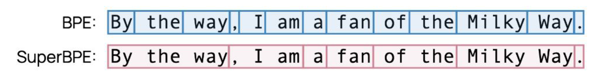

* TOC
{:toc}

## ByteT5
Towards a Token-Free Future with Pre-trained Byte-to-Byte Models

ByteT5 is a token-free method. For any task in NLP, we give input to the model, hope that the model can understand it, and processes it accordingly to give us the output. Nowhere it is mentioned to tokenize the text. In general, the text data is generally stored as a sequence of bytes. Thus, feeding byte sequences directly into the model (such as a sequence-to-sequence model) enables the processing of arbitrary text sequences.

UTF-8 bytes are fed directly into the model without any text preprocessing.

It is found out that the ByT5 performs the best when the depth of the encoder and decoder stacks are decoupled. It benefits significantly from a heavier encoder i.e., number of encoder layers to be 3 times more than that of the number of decoder layers.

## BPE Dropout
Byte Pair Encoding (BPE) dropout is a regularization technique designed to make subword tokenization more robust. Instead of always splitting a word into the same sequence of tokens, it introduces stochasticity during the model training phase.

In standard BPE, the merge rules are learnt using frequency from a corpus. While learning the merge rules:

1. We compute frequencies over the corpus.
2. Pick the most frequent pair.
3. Always add this rule to the merge list
4. Always update the corpus deterministically (replace all occurrences of that pair in the corpus).

After that, during training data tokenization, we apply these rules in fixed order (during both model training and inference). It has no randomness; Same word $\to$ same segmentation (always). Thus, it is deterministic.

In BPE-dropout, we use the same process to learn the merge rules and vocab. But during tokenization (only during model training), each merge is skipped with probability $p$. For each merge,

* We apply the merge with probability $1-p$
* We skip it with probability $p$

**A Simple Example:**

Imagine we have a tiny BPE vocabulary that contains these merge rules in order:
1. `a` + `b` $\rightarrow$ `ab`
2. `ab` + `l` $\rightarrow$ `abl` 
3. `e` + `d` $\rightarrow$ `ed`.

Let’s tokenize the word `abled`.

**Standard BPE (Deterministic):**

* Step 1: Merge `a` + `b` $\rightarrow$ `ab` (Result: `ab`, `l`, `e`, `d`)
* Step 2: Merge `ab` + `l` $\rightarrow$ `abl` (Result: `abl`, `e`, `d`)
* Step 3: Merge `e` + `d` $\rightarrow$ `ed` (Result: `abl`, `ed`)

Final Tokens: [`abl`, `ed`]

**BPE-Dropout (Stochastic):**

Now, let's assume a dropout rate where the first merge (`a` + `b`) is randomly dropped.

* Step 1: Merge `a` + `b`? Dropped. (Result remains: `a`, `b`, `l`, `e`, `d`)
* Step 2: Merge `ab` + `l`? Impossible, because `ab` was never formed.
* Step 3: Merge `e` + `d`? Accepted. (Result: `a`, `b`, `l`, `ed`)

Final Tokens: [`a`, `b`, `l`, `ed`]

By dropping that one early merge, the model is forced to process the word using smaller, more granular pieces. In another training iteration, the dropout might skip the `e` + `d` merge instead, resulting in [`abl`, `e`, `d`]. As a result, each time the same word can be segmented differently. This allows the model to see multiple valid subword segmentations of the same word, thereby improving the robustness of the model.

BPE-dropout is typically used only during model training. Once the NLP model is trained, during model inference, we disable the BPE dropout ($p=0$), i.e., fall back to the standard BPE, to ensure the tokenization is consistent and deterministic for the best performance. 

## Overlap based BPE (OBPE)
BPE for multilingual setup

When our collection has text from different languages, the languages that have more examples will get more preference in the BPE based techniques (i.e., they get a place in the merge rules and vocab) because words from these languages will have higher frequencies, whereas the words from low-resource languages will not get a chance to be part of the vocab. OBPE addresses this issue.

## SuperBPE
Space Travel for Language Models

Why limit to subword level tokenization?

Vanilla BPE use whitespace for pre-tokenization. As a result multi-word expressions, i.e., phrases with single meaning such as By the way, New Delhi, at the time of, on the other hand, like any other, cannot come together. Such words are known as super words. SuperBPE addresses this, it moves beyond words, for e.g., it considers `_by_the_way` as a single token.

<figure markdown="0" class="figure zoomable">

</figure>

How? It is a 2-stage process.

1. Train a standard BPE algorithm till transition point $t < T$ (vocab size): We have a corpus. We pre-tokenize and train a standard BPE algorithm till achieving a vocab of size $t$.
2. Train BPE without pre-tokenization or whitespace restriction: Then, we take the same data, remove the whitespace, and continue training the BPE. Further processing discover super words as a single token.

## Tokenizer Evaluation
How do we evaluate the quality of the tokenizer?

**Intrinsic:**

* Simple and easy
* Does not require model training
* Challenging: "No one metric"

One of the popular metrics is fertility. Fertility is:

$$
\text{fertility} = \frac{\text{no. of words after segmentation}}{\text{no. of words before segmentation}}
$$

If the word "unhappiness" is split into [`un`, `happi`, `ness`], then the fertility is $\frac{3}{1}$. We typically compute this for the whole corpus, so it is no. of tokens in the corpus divided by the number of words in the corpus. This gives us information about the average number of tokens a word is getting split into.

We want the fertility of a tokenizer to be as low as possible. Lesser split gives us lesser tokens, allowing us to fit more content in the context window of the language models.

**Extrinsic:**

* Through language model training and downstream performance evaluation: We learn a vocab, then we train a downstream model using that vocab, and assess the model performance using task-specific metrics such as perplexity, accuracy, F1, etc.

