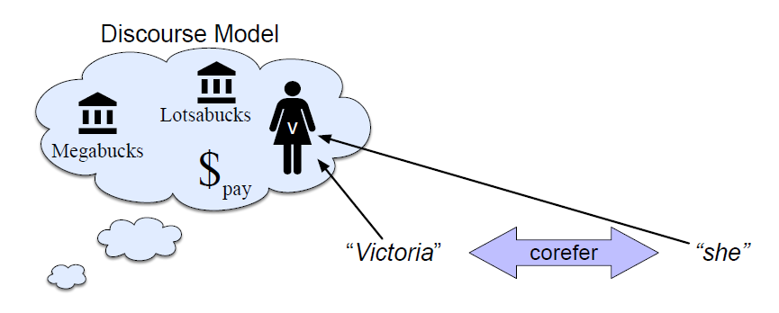
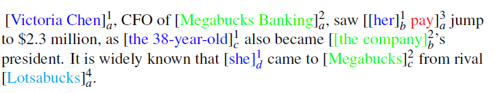

* TOC
{:toc}

## Introduction
An important component of language processing is knowing who is being talked about in a text.

> **Victoria Chen**, CFO of Megabucks Banking, saw **her** pay jump to $2.3 million, as the **38-year-old** became the company’s president. It is widely known that **she** came to Megabucks from rival Lotsabucks.

Each of the bold phrases in this passage is used by the writer to refer to a person named Victoria Chen. All these words are referring to the same entity.

* We call linguistic expressions like _her_ or _Victoria Chen_ **mentions** or **referring expressions**, and
* The discourse entity that is referred to (Victoria Chen) the **referent**. The entities could be persons, events, etc.

Two or more referring expressions that are used to refer to the same discourse entity are said to **corefer**; thus, _Victoria Chen_ and _she_ corefer in the above passage (they both refer to the same entity).

Mentions can also be nested. For example the mention _her_ is syntactically part of another mention, her pay, referring to a completely different discourse entity

## Discourse Model
NLP systems (and humans) interpret linguistic expressions with respect to a discourse model. A discourse model is a mental model that the understander builds incrementally when interpreting a text, containing representations of the entities referred to in the text, as well as properties of the entities and relations among them.

<figure markdown="0" class="figure zoomable">
<figcaption>
  <strong>Figure 1.</strong> A discourse model
</figure>

**Anaphora:**

Reference in a text to an entity that has been previously introduced into the discourse is called anaphora, and the referring expression used is said to be an anaphor, or anaphoric. In the Victoria passage, the pronouns she and her and 38-year-old are therefore anaphoric to Victoria Chen.

Lotsabucks is non-anaphoric as it is not referring to any entity that has come before in the text.

**Antecedent:**

The anaphor corefers with a prior mention (in this case Victoria Chen) that is called the antecedent. Victoria Chen is the antecedant for she, her, 38-year-old.

**Singleton:**
An entity that has only a single mention in a text singleton (like Lotsabucks) is called a singleton.

## Linguistic Properties of the Coreference Relation
Let's look at the linguistic properties of the antecedant/anaphor pair.

The algorithm for coreference resolution first identifies all the possible mentions. The next step is to pick any two mentions and check if they are coreferent. In a given text, assume there are $n$ mentions. Then, we need to check coreference for $nC_2$ pairs. The number of checks will then be of order $n^2$, which may not be feasible.

In practice, we use some heuristics to eliminate some checks in advance. For example, we can put the following constraints on the coreference relation:

**Number Agreement:**

Referring expressions and their referents must generally agree in number; she/her/he/him/his/it are singular, we/us/they/them are plural, and you is unspecified for number. So, a plural antecedent like _the chefs_ cannot
generally corefer with a singular anaphor like _she_.

> Mary had two little lambs. They were cute.

There are three mentions here: Mary, lambs, they. Here they cannot refer to Mary, as 'they' is plural and Mary is singular. They must refer to the two little lambs.

**Gender Agreement:**

Anaphor must agree with the grammatical gender of their antecedent.

> The librarian issues a new book. It was new.

There are three mentions here: The librarian, a new book, it. And we know, it cannot refer to the librarian.

**Person and Case Agreement:**

English distinguishes between first, second, and third person. A pronoun's antecedent must agree with the pronoun in person. For example, a third person pronoun (he, she, they, him, her, them, his, her, their) must have a third person antecedent (one of the above or any other noun phrase).

> You and I will meet the TAs together. They will come at 3pm.

Here you is a second person, I is the first person, and they is the third person. So, they must refer to the TAs. {They, I}, {they, you}, or {they, you and I} are not possible.

**Syntactic Constraints:**

The syntactic properties of referring expressions can often determine their antecedant. For example, reflexive pronouns like himself and herself corefer with the subject of the most immediate clause that contains them, whereas non-reflexives cannot corefer with this subject.

* Janet bought herself a bottle of fish sauce. [herself=Janet]
* Janet bought her a bottle of fish sauce. [her $\ne$ Janet]

**Selection restrictions:**

Many other kinds of semantic knowledge can play a role in referent preference. For example, the selectional restrictions that a verb places on its arguments can help eliminate referents.

> I ate the soup in my new bowl after cooking it for hours
I picked up the book and sat in a chair. It broke.

There are two possible referents for it, the soup and the bowl. The verb cook, however, requires that its direct object denote something edible, and this constraint can rule out bowl as a possible referent.

In the second sentence, a book cannot be broken. So, _it_ must refer to chair.

## Types of Coreferences

**Exophora:**

> What is **this**?

Here this is a pronoun, but it is not referring to anything before it. The meaning of 'this' should be understood from the context of utterance.

**Anaphora:**

Referring expressions that come after their referents. I used to have the keys. But I lost **it**.

**Cataphora:**

Referring expressions that come before their referents.

> Even before **she** saw it, Dorothy had been thinking about the Emerald City every day.

When we process text from left to right, we can only resolve anaphoric references, but not cataphoric ones. Cataphoric references can be resolved with bi-directional processing.

Different tasks that we are interested in:

1. Anaphora resolution: determine the antecedant of an anaphor.
2. Coreference resolution: identify all coreference chains.

NOTE: If our coreference resolution algorithm detects any of the preceding entries in the coreference chain as the antecedant, it is considered as the correct prediction.

## Coreference Tasks

Coreference resolution is the task of determining whether two mentions corefer, that is, they refer to the same entity in the discourse model. We can formulate the task of coreference resolution as follows:

Given a text $T$, find all entities and the coreference links between them. We evaluate our task by comparing the links our system creates with those in human-created gold coreference annotations on $T$. This task helps us with processing the text/documents, especially in question answering and machine translation systems.

The set of coreferring expressions is often called a **coreference chain** or a **cluster**. Superscript numbers are for each coreference chain (cluster), and subscript letters are for individual mentions in the cluster:

<figure markdown="0" class="figure zoomable">
<figcaption>
  <strong>Figure 2.</strong> An annotated dataset for coreference resolution task
</figure>

A coreference resolution algorithm would need to find at least four coreference chains, corresponding to the four entities in the discourse model.

1. {Victoria Chen, her, the 38-year-old, She}
2. {Megabucks Banking, the company, Megabucks}
3. {her pay}
4. {Lotsabucks}

The input to the system is the raw text of articles, and the system must detect mentions and then link them into clusters.

### Winograd Schema Challenge

Contains a pair of sentences that differ in a single word or phrase and a coreference question. For example:

* Sentence 1: The trophy didn't fit into the suitcase because it was too _large_. What was too large?
* Sentence 2: The trophy didn't fit into the suitcase because it was too _small_. What was too small?

Answering these questions requires commonsense reasoning ability.

## Evaluation of Coreference Algorithms
We evaluate coreference algorithm models - theoretically, comparing a set of hypothesis chains or clusters $H$ produced by the system against a set of gold or reference chains or clusters $R$ from a human labeling, and reporting precision and recall.

Now, we have two groups of sets. There are a wide variety of methods for comparing them. $B^3$ is one of such popular metrics that is mention-based rather than link-based.

For each mention in the reference chain (ground truth chain), we compute a precision and recall, and then we take a weighted sum over all $N$ mentions to compute a precision and recall for the entire task to assess the model performance. For a given mention $i$, let $R$ be the reference chain that includes $i$, and $H$ the hypothesis chain that has $i$. The set of correct mention in $H$ is $H \cap R$.

* Precision for mention $i$ is thus $\frac{|H \cap R|}{|H|}$
* Recall for mention $i$ is thus $\frac{|H \cap R|}{|R|}$

The total precision is the weighted sum of the precision for mention $i$, weighted by a weight $w_i$. The total recall is the weighted sum of the recall for mention $i$, weighted by a weight $w_i$.

$$
\begin{align*}
\text{Precision} & = \sum_{i=1}^N w_i \frac{\text{# of correct mentions in hypothesis chain containing entity } i}{\text{# of mentions in hypothesis chain containing entity } i} \\
\text{Recall} & = \sum_{i=1}^N w_i \frac{\text{# of correct mentions in hypothesis chain containing entity } i}{\text{# of mentions in reference chain containing entity } i} \\
\end{align*}
$$

The weight $w_i$ for each entity can be set to different values to produce different versions of the algorithm.

A problem with this approach is when we have singleton entries. 

* If $R$ has only one element, then we most likely get a recall of 1 for that mention $i$, which is quite high.
* If $H$ has only one element, then we most likely get a precision of 1 for that mention $i$, which is quite high.
